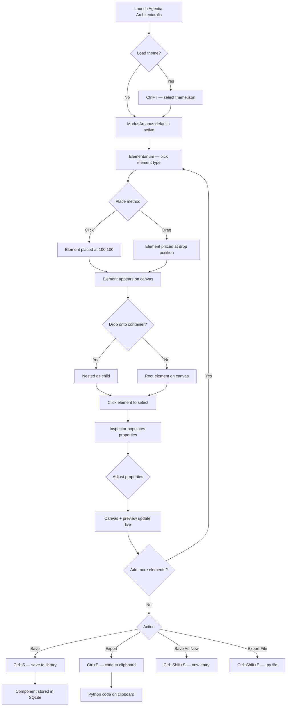

# Agentia Architecturalis
### A PyQt6 visual UI component designer for the Tower
### jurisdiction. Place widgets on a canvas, configure their
### properties, preview the result as real rendered widgets,
### save designs to a versioned library, and export clean
### Python/PyQt6 code ready for integration.

---

## Keyboard & Shortcut Reference

╭─────────────────┬─────────────────────────────────────────╮
│ Key / Shortcut  │ Action                                  │
├┄┄┄┄┄┄┄┄┄┄┄┄┄┄┄┄┄┼┄┄┄┄┄┄┄┄┄┄┄┄┄┄┄┄┄┄┄┄┄┄┄┄┄┄┄┄┄┄┄┄┄┄┄┄┄┄┄┄┄┤
│ q               │ Exire — quit application                │
│ Ctrl+S          │ Sigillare — save to library             │
│ Ctrl+Shift+S    │ Sigillare Novum — save as new entry     │
│ Ctrl+E          │ Exportare — export code to clipboard    │
│ Ctrl+Shift+E    │ Exportare Filum — export code to file   │
│ Ctrl+Z          │ Revocare — undo                         │
│ Ctrl+Shift+Z    │ Restituere — redo                       │
│ Ctrl+N          │ Novum — new blank canvas                │
│ Ctrl+T          │ Thema — load a theme.json               │
│ Ctrl+P          │ Specularium — toggle live preview       │
│ Ctrl+D          │ Duplicare — duplicate selected element  │
│ Delete          │ Dissolvere — remove selected element    │
│ Ctrl+scroll     │ Zoom canvas in/out                      │
╰─────────────────┴─────────────────────────────────────────╯

---

## Features

╭──────────────────────┬───────────────────────────┬──────────────────────┬─────────╮
│ Feature              │ Description               │ How to Trigger       │ Status  │
├┄┄┄┄┄┄┄┄┄┄┄┄┄┄┄┄┄┄┄┄┄┄┼┄┄┄┄┄┄┄┄┄┄┄┄┄┄┄┄┄┄┄┄┄┄┄┄┄┄┄┼┄┄┄┄┄┄┄┄┄┄┄┄┄┄┄┄┄┄┄┄┄┄┼┄┄┄┄┄┄┄┄┄┤
│ Element Palette      │ 28 element types in 7     │ Left panel; click    │ Working │
│                      │ collapsible categories    │ or drag onto canvas  │         │
├┄┄┄┄┄┄┄┄┄┄┄┄┄┄┄┄┄┄┄┄┄┄┼┄┄┄┄┄┄┄┄┄┄┄┄┄┄┄┄┄┄┄┄┄┄┄┄┄┄┄┼┄┄┄┄┄┄┄┄┄┄┄┄┄┄┄┄┄┄┄┄┄┄┼┄┄┄┄┄┄┄┄┄┤
│ Design Canvas        │ QGraphicsScene surface    │ Centre panel; drag   │ Working │
│                      │ with grid, snap, zoom     │ elements, click to   │         │
│                      │                           │ select               │         │
├┄┄┄┄┄┄┄┄┄┄┄┄┄┄┄┄┄┄┄┄┄┄┼┄┄┄┄┄┄┄┄┄┄┄┄┄┄┄┄┄┄┄┄┄┄┄┄┄┄┄┼┄┄┄┄┄┄┄┄┄┄┄┄┄┄┄┄┄┄┄┄┄┄┼┄┄┄┄┄┄┄┄┄┤
│ Container Nesting    │ Drop elements inside      │ Drag child onto a    │ Working │
│                      │ containers; auto-layout   │ container element    │         │
├┄┄┄┄┄┄┄┄┄┄┄┄┄┄┄┄┄┄┄┄┄┄┼┄┄┄┄┄┄┄┄┄┄┄┄┄┄┄┄┄┄┄┄┄┄┄┄┄┄┄┼┄┄┄┄┄┄┄┄┄┄┄┄┄┄┄┄┄┄┄┄┄┄┼┄┄┄┄┄┄┄┄┄┤
│ Property Inspector   │ Context-sensitive editor  │ Right upper panel;   │ Working │
│                      │ with token color pickers  │ auto-populates on    │         │
│                      │                           │ element selection    │         │
├┄┄┄┄┄┄┄┄┄┄┄┄┄┄┄┄┄┄┄┄┄┄┼┄┄┄┄┄┄┄┄┄┄┄┄┄┄┄┄┄┄┄┄┄┄┄┄┄┄┄┼┄┄┄┄┄┄┄┄┄┄┄┄┄┄┄┄┄┄┄┄┄┄┼┄┄┄┄┄┄┄┄┄┤
│ Live Preview         │ Real PyQt6 widgets from   │ Right lower panel;   │ Working │
│                      │ the design tree, skinned  │ auto-updates 200ms   │         │
│                      │ by active theme           │ after any change     │         │
├┄┄┄┄┄┄┄┄┄┄┄┄┄┄┄┄┄┄┄┄┄┄┼┄┄┄┄┄┄┄┄┄┄┄┄┄┄┄┄┄┄┄┄┄┄┄┄┄┄┄┼┄┄┄┄┄┄┄┄┄┄┄┄┄┄┄┄┄┄┄┄┄┄┼┄┄┄┄┄┄┄┄┄┤
│ Theme Loading        │ Load Bureau I theme.json  │ Ctrl+T; file dialog  │ Working │
│                      │ to skin preview + canvas  │                      │         │
├┄┄┄┄┄┄┄┄┄┄┄┄┄┄┄┄┄┄┄┄┄┄┼┄┄┄┄┄┄┄┄┄┄┄┄┄┄┄┄┄┄┄┄┄┄┄┄┄┄┄┼┄┄┄┄┄┄┄┄┄┄┄┄┄┄┄┄┄┄┄┄┄┄┼┄┄┄┄┄┄┄┄┄┤
│ Component Library    │ SQLite library: save,     │ Ctrl+S to save;      │ Working │
│                      │ load, fork, version       │ Ctrl+Shift+S new     │         │
├┄┄┄┄┄┄┄┄┄┄┄┄┄┄┄┄┄┄┄┄┄┄┼┄┄┄┄┄┄┄┄┄┄┄┄┄┄┄┄┄┄┄┄┄┄┄┄┄┄┄┼┄┄┄┄┄┄┄┄┄┄┄┄┄┄┄┄┄┄┄┄┄┄┼┄┄┄┄┄┄┄┄┄┤
│ Code Generation      │ Clean Python/PyQt6 code   │ Ctrl+E clipboard;    │ Working │
│                      │ with token constants      │ Ctrl+Shift+E file    │         │
├┄┄┄┄┄┄┄┄┄┄┄┄┄┄┄┄┄┄┄┄┄┄┼┄┄┄┄┄┄┄┄┄┄┄┄┄┄┄┄┄┄┄┄┄┄┄┄┄┄┄┼┄┄┄┄┄┄┄┄┄┄┄┄┄┄┄┄┄┄┄┄┄┄┼┄┄┄┄┄┄┄┄┄┤
│ Undo / Redo          │ Canvas state snapshots    │ Ctrl+Z / Ctrl+Sh+Z   │ Working │
├┄┄┄┄┄┄┄┄┄┄┄┄┄┄┄┄┄┄┄┄┄┄┼┄┄┄┄┄┄┄┄┄┄┄┄┄┄┄┄┄┄┄┄┄┄┄┄┄┄┄┼┄┄┄┄┄┄┄┄┄┄┄┄┄┄┄┄┄┄┄┄┄┄┼┄┄┄┄┄┄┄┄┄┤
│ Duplicate            │ Clone the selected elem   │ Ctrl+D               │ Working │
├┄┄┄┄┄┄┄┄┄┄┄┄┄┄┄┄┄┄┄┄┄┄┼┄┄┄┄┄┄┄┄┄┄┄┄┄┄┄┄┄┄┄┄┄┄┄┄┄┄┄┼┄┄┄┄┄┄┄┄┄┄┄┄┄┄┄┄┄┄┄┄┄┄┼┄┄┄┄┄┄┄┄┄┤
│ Delete               │ Remove selected element   │ Delete key           │ Working │
├┄┄┄┄┄┄┄┄┄┄┄┄┄┄┄┄┄┄┄┄┄┄┼┄┄┄┄┄┄┄┄┄┄┄┄┄┄┄┄┄┄┄┄┄┄┄┄┄┄┄┼┄┄┄┄┄┄┄┄┄┄┄┄┄┄┄┄┄┄┄┄┄┄┼┄┄┄┄┄┄┄┄┄┤
│ Zoom                 │ Canvas zoom 25% to 400%   │ Ctrl+scroll wheel    │ Working │
├┄┄┄┄┄┄┄┄┄┄┄┄┄┄┄┄┄┄┄┄┄┄┼┄┄┄┄┄┄┄┄┄┄┄┄┄┄┄┄┄┄┄┄┄┄┄┄┄┄┄┼┄┄┄┄┄┄┄┄┄┄┄┄┄┄┄┄┄┄┄┄┄┄┼┄┄┄┄┄┄┄┄┄┤
│ Grid & Snap          │ Dotted grid, 16px snap    │ Built-in; toggleable │ Working │
╰──────────────────────┴───────────────────────────┴──────────────────────┴─────────╯

---

## Usage Flowchart



---

## Vision & Purpose

Agentia Architecturalis is a visual sandbox for composing
PyQt6 user interface panels without writing code. It
replaces the Fenestrarium. The Wizard works spatially —
dragging widgets onto a canvas, nesting them in containers,
configuring colors and layout through an inspector — and
sees the result rendered as real PyQt6 widgets in real time.
When the design is ready, the tool exports clean Python code
that references theme token constants rather than hardcoded
hex values, making it immediately integration-ready for any
Tower application.

---

## File & Folder Map

```
AgentiaArchitecturalis/
├── __init__.py              — package marker
├── __main__.py              — entry point
├── app.py                   — main window, shortcuts, wiring
├── canvas.py                — QGraphicsScene design canvas
├── palette.py               — Elementarium (categorized palette)
├── inspector.py             — property editor for selection
├── preview.py               — Specularium live preview
├── library.py               — Component Library (SQLite CRUD)
├── codegen.py               — Python/PyQt6 code generation
├── theme_loader.py          — theme.json consumer + QSS
├── schema.py                — TypedDict serialization format
├── constants.py             — element registry, defaults
├── workers.py               — QRunnable for background IO
├── elements/
│   ├── base.py              — CanvasElement ABC
│   ├── factory.py           — type string → element constructor
│   ├── containers.py        — QFrame, QGroupBox, QSplitter, QTabWidget
│   ├── inputs.py            — QLineEdit, QComboBox, QSlider, QSpinBox
│   ├── displays.py          — QLabel variants, QProgressBar
│   ├── buttons.py           — arcane button variants, toggle
│   ├── tables.py            — QTableView/QTableWidget
│   ├── text.py              — QTextEdit
│   ├── decorative.py        — Separator, Spacer, RuleLine
│   └── composite.py         — TopBar, StatusBar, ControlPanel,
│                               SectionHeader, SwatchStrip
├── storage/
│   └── component_library.db — created on first run
├── exports/
│   └── generated_panel.py   — last exported code file
└── tests/
    ├── test_canvas.py
    ├── test_codegen.py
    ├── test_library.py
    ├── test_theme_loader.py
    ├── test_elements.py
    └── test_integration.py
```

---

## Features & Functions

### Element Palette (Elementarium)

The left panel lists all available element types in seven
collapsible categories: Receptacula (containers), Ingressus
(inputs), Ostensio (displays), Actiones (buttons), Tabulae
(tables), Ornamentum (decorative), and Composita (pre-built
ModusArcanus patterns like TopBar and StatusBar). Each
element button can be clicked to place at a default position
or dragged onto the canvas at a specific location.

### Design Canvas (Tabula Designandi)

The centre panel is a QGraphicsScene with a 16-pixel dotted
grid. Elements appear as labeled bounding boxes showing
their type and variable name. They can be moved by dragging
and selected by clicking. Dropping an element onto a
container (QFrame, QGroupBox, ControlPanel) nests it as a
child. Zoom via Ctrl+scroll (25% to 400%). Snap-to-grid
aligns elements to the 16px grid.

### Property Inspector (Inspectorium)

When an element is selected on the canvas, the right upper
panel populates with that element's configurable properties.
These vary by type — a QFrame shows NOMEN (variable name),
AMPLITUDO (width/height), COLORES (BG and border as token
dropdowns), DISPOSITIO (layout type, spacing, padding,
alignment), and MARGINES. A QLabel shows text content, font
size, bold toggle, and micro-label mode. All changes apply
immediately to the canvas and preview.

Color properties are token dropdowns (c_bg, c_panel,
c_gold, etc.) — never raw hex values. The tokens resolve to
the active theme at render time.

### Live Preview (Specularium Vivum)

The right lower panel renders the current canvas
composition as real PyQt6 widgets, skinned by the active
theme's QSS. It rebuilds 200ms after any design change.
The preview is non-interactive — the Wizard observes the
result but does not click widgets here.

### Theme Loading

Ctrl+T opens a file dialog to select a theme.json from
Bureau I. The file is validated for all ten required token
keys. If valid, the QSS is regenerated and applied to the
entire application. If invalid, the status bar reports the
specific missing key and ModusArcanus defaults remain
active. The canvas and preview continue functioning
regardless — no design data is lost on theme failure.

### Component Library (Armarium)

Ctrl+S saves the current canvas to the SQLite component
library. A dialog asks for name, category (panel, dialog,
toolbar, card, composite, fragment), and optionally
description and tags. A preview thumbnail is captured
automatically. Saving an already-loaded design increments
its version. Ctrl+Shift+S saves as a new entry (fork).

The library supports load, fork, version history, archive
(soft-delete), and search by name/description/tags.

### Code Generation (Promulgatio)

Ctrl+E traverses the design tree and emits a complete
Python module: imports (only the widget classes actually
used), a class definition inheriting QFrame, widget
instantiation with properties set via token constants, and
layout assembly. The code references C_GOLD, C_PANEL, etc.
— not hardcoded hex values. The generated code is validated
via ast.parse() before export. If the parse fails, the code
is not copied and the error is reported.

Ctrl+Shift+E writes the code to `exports/generated_panel.py`
instead of the clipboard.

### Undo / Redo

Every canvas mutation (add, remove, duplicate, property
change via deserialization) pushes a serialized snapshot to
the undo stack (max 50 entries). Ctrl+Z restores the
previous state. Ctrl+Shift+Z re-applies.

---

## Logic

The application is event-driven with three main signal
chains.

The palette emits `element_clicked` when a type is
clicked, which calls `canvas.add_element_by_type()`. The
canvas creates a CanvasElement via the factory, places it
as a QGraphicsRectItem, and emits `design_changed`. This
triggers the preview to schedule a rebuild — it
deserializes all canvas elements, instantiates real PyQt6
widgets from each, applies the active theme QSS, and
displays them.

When the Wizard clicks an element on the canvas,
`element_selected` fires and the inspector populates with
that element's configurable properties. Inspector changes
call `update_property()` on the element and emit
`property_changed`, which triggers `design_changed` again.

Code generation walks the design tree recursively. Each
CanvasElement subclass implements `generate_code()`,
returning Python source lines. The codegen module wraps
these in a class definition with appropriate imports and
header.

The component library is a simple SQLite CRUD layer. Design
state is serialized as JSON (DesignDocument schema) and
stored in the `design_json` column. Thumbnails are PNG
blobs captured from the preview widget.

---

## Input / Output & File Types

```
Input
  ├── theme.json — Bureau I ratified palette (optional)
  │   loaded via Ctrl+T file dialog
  └── component_library.db — SQLite, loaded designs
      at storage/component_library.db

Output
  ├── component_library.db — SQLite, saved designs
  │   with thumbnails and version history
  ├── exports/generated_panel.py — exported Python code
  └── clipboard — Python code via Ctrl+E
```
