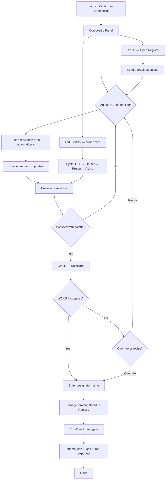

# Codexium Chromaticus
### A PyQt6 color theme governance tool for the Tower
### jurisdiction. Compose palettes from a background/foreground
### pair, audit them for accessibility compliance, ratify them
### with a cryptographic seal, and export them as the canonical
### theme.json contract consumed by every Tower application.

---

## Keyboard & Shortcut Reference

╭─────────────────┬─────────────────────────────────────────╮
│ Key / Shortcut  │ Action                                  │
├┄┄┄┄┄┄┄┄┄┄┄┄┄┄┄┄┄┼┄┄┄┄┄┄┄┄┄┄┄┄┄┄┄┄┄┄┄┄┄┄┄┄┄┄┄┄┄┄┄┄┄┄┄┄┄┄┄┄┄┤
│ q               │ Exire — quit application                │
│ Ctrl+R          │ Ratificare — ratify current palette     │
│ Ctrl+E          │ Promulgare — export ratified palette    │
│ Ctrl+S          │ Sigillare — save working state          │
│ Ctrl+Z          │ Revocare — undo last base pair change   │
│ Ctrl+Shift+Z    │ Restituere — redo                       │
│ Ctrl+G          │ Registrum — toggle registry drawer      │
│ Ctrl+Shift+V    │ Visio — cycle vision simulation         │
│ Ctrl+1          │ Focus Compositio panel                  │
│ Ctrl+2          │ Focus Scrutinium panel                  │
│ Ctrl+3          │ Focus preview panel                     │
│ F1              │ Auxilium — help                         │
╰─────────────────┴─────────────────────────────────────────╯

---

## Features

╭──────────────────────┬───────────────────────────┬──────────────────────┬─────────╮
│ Feature              │ Description               │ How to Trigger       │ Status  │
├┄┄┄┄┄┄┄┄┄┄┄┄┄┄┄┄┄┄┄┄┄┄┼┄┄┄┄┄┄┄┄┄┄┄┄┄┄┄┄┄┄┄┄┄┄┄┄┄┄┄┼┄┄┄┄┄┄┄┄┄┄┄┄┄┄┄┄┄┄┄┄┄┄┼┄┄┄┄┄┄┄┄┄┤
│ Hex Input            │ Type a hex color directly │ Click hex field,     │ Working │
│                      │ or use the color picker   │ type or click ◈      │         │
├┄┄┄┄┄┄┄┄┄┄┄┄┄┄┄┄┄┄┄┄┄┄┼┄┄┄┄┄┄┄┄┄┄┄┄┄┄┄┄┄┄┄┄┄┄┄┄┄┄┄┼┄┄┄┄┄┄┄┄┄┄┄┄┄┄┄┄┄┄┄┄┄┄┼┄┄┄┄┄┄┄┄┄┤
│ OKLAB Sliders        │ Adjust L, a, b axes for   │ Drag sliders under   │ Working │
│                      │ perceptual color control  │ each hex input       │         │
├┄┄┄┄┄┄┄┄┄┄┄┄┄┄┄┄┄┄┄┄┄┄┼┄┄┄┄┄┄┄┄┄┄┄┄┄┄┄┄┄┄┄┄┄┄┄┄┄┄┄┼┄┄┄┄┄┄┄┄┄┄┄┄┄┄┄┄┄┄┄┄┄┄┼┄┄┄┄┄┄┄┄┄┤
│ Token Derivation     │ 10 tokens computed from   │ Automatic on any     │ Working │
│                      │ BG/FG base pair in OKLAB  │ base pair change     │         │
├┄┄┄┄┄┄┄┄┄┄┄┄┄┄┄┄┄┄┄┄┄┄┼┄┄┄┄┄┄┄┄┄┄┄┄┄┄┄┄┄┄┄┄┄┄┄┄┄┄┄┼┄┄┄┄┄┄┄┄┄┄┄┄┄┄┄┄┄┄┄┄┄┄┼┄┄┄┄┄┄┄┄┄┤
│ Contrast Matrix      │ WCAG 2.1 + APCA ratios    │ Automatic; see       │ Working │
│                      │ for all token pairs       │ Scrutinium panel     │         │
├┄┄┄┄┄┄┄┄┄┄┄┄┄┄┄┄┄┄┄┄┄┄┼┄┄┄┄┄┄┄┄┄┄┄┄┄┄┄┄┄┄┄┄┄┄┄┄┄┄┄┼┄┄┄┄┄┄┄┄┄┄┄┄┄┄┄┄┄┄┄┄┄┄┼┄┄┄┄┄┄┄┄┄┤
│ Vision Simulation    │ Deuteranopia, protanopia, │ Ctrl+Shift+V to      │ Working │
│                      │ achromatopsia overlays    │ cycle, or click      │         │
│                      │                           │ buttons in topbar    │         │
├┄┄┄┄┄┄┄┄┄┄┄┄┄┄┄┄┄┄┄┄┄┄┼┄┄┄┄┄┄┄┄┄┄┄┄┄┄┄┄┄┄┄┄┄┄┄┄┄┄┄┼┄┄┄┄┄┄┄┄┄┄┄┄┄┄┄┄┄┄┄┄┄┄┼┄┄┄┄┄┄┄┄┄┤
│ Luminance Ladder     │ Bar chart of all token    │ Automatic; see       │ Working │
│                      │ lightness values sorted   │ Sequentia Luminis    │         │
├┄┄┄┄┄┄┄┄┄┄┄┄┄┄┄┄┄┄┄┄┄┄┼┄┄┄┄┄┄┄┄┄┄┄┄┄┄┄┄┄┄┄┄┄┄┄┄┄┄┄┼┄┄┄┄┄┄┄┄┄┄┄┄┄┄┄┄┄┄┄┄┄┄┼┄┄┄┄┄┄┄┄┄┤
│ Live Preview         │ Real ModusArcanus widgets │ Automatic; right     │ Working │
│                      │ reskinned in real time    │ panel (Specularium)  │         │
├┄┄┄┄┄┄┄┄┄┄┄┄┄┄┄┄┄┄┄┄┄┄┼┄┄┄┄┄┄┄┄┄┄┄┄┄┄┄┄┄┄┄┄┄┄┄┄┄┄┄┼┄┄┄┄┄┄┄┄┄┄┄┄┄┄┄┄┄┄┄┄┄┄┼┄┄┄┄┄┄┄┄┄┤
│ Ratification         │ SHA-256 seal + Latin name │ Ctrl+R               │ Working │
│                      │ assigned to the palette   │                      │         │
├┄┄┄┄┄┄┄┄┄┄┄┄┄┄┄┄┄┄┄┄┄┄┼┄┄┄┄┄┄┄┄┄┄┄┄┄┄┄┄┄┄┄┄┄┄┄┄┄┄┄┼┄┄┄┄┄┄┄┄┄┄┄┄┄┄┄┄┄┄┄┄┄┄┼┄┄┄┄┄┄┄┄┄┤
│ Export               │ Write theme.json, .qss,   │ Ctrl+E               │ Working │
│                      │ and .md palette card      │                      │         │
├┄┄┄┄┄┄┄┄┄┄┄┄┄┄┄┄┄┄┄┄┄┄┼┄┄┄┄┄┄┄┄┄┄┄┄┄┄┄┄┄┄┄┄┄┄┄┄┄┄┄┼┄┄┄┄┄┄┄┄┄┄┄┄┄┄┄┄┄┄┄┄┄┄┼┄┄┄┄┄┄┄┄┄┤
│ Chromatic Registry   │ SQLite history of all     │ Ctrl+G to toggle     │ Working │
│                      │ ratified palettes         │ drawer; Load/Exp     │         │
├┄┄┄┄┄┄┄┄┄┄┄┄┄┄┄┄┄┄┄┄┄┄┼┄┄┄┄┄┄┄┄┄┄┄┄┄┄┄┄┄┄┄┄┄┄┄┄┄┄┄┼┄┄┄┄┄┄┄┄┄┄┄┄┄┄┄┄┄┄┄┄┄┄┼┄┄┄┄┄┄┄┄┄┤
│ Undo / Redo          │ Revert base pair changes  │ Ctrl+Z / Ctrl+Sh+Z   │ Working │
├┄┄┄┄┄┄┄┄┄┄┄┄┄┄┄┄┄┄┄┄┄┄┼┄┄┄┄┄┄┄┄┄┄┄┄┄┄┄┄┄┄┄┄┄┄┄┄┄┄┄┼┄┄┄┄┄┄┄┄┄┄┄┄┄┄┄┄┄┄┄┄┄┄┼┄┄┄┄┄┄┄┄┄┤
│ Gamut Clipping       │ Marks tokens that fell    │ Automatic; ⌬ icon    │ Working │
│                      │ outside sRGB and were     │ in swatch strip      │         │
│                      │ clamped                   │                      │         │
╰──────────────────────┴───────────────────────────┴──────────────────────┴─────────╯

---

## Usage Flowchart



---

## Vision & Purpose

Auctoritas Spectralis is the color authority for the entire
Tower jurisdiction. It exists because a multi-tool ecosystem
sharing one aesthetic language needs a single source of truth
for its palette. The Wizard composes a palette from two input
colors, the system derives a full ten-token hierarchy in
perceptual color space, audits it for accessibility, and
exports it as a ratified contract that every downstream
application consumes.

---

## File & Folder Map

```
AuctoritasSpectralis/
├── __init__.py              — package marker
├── __main__.py              — entry point
├── app.py                   — main window, shortcuts, wiring
├── compositio.py            — signal orchestration pipeline
├── derivatio.py             — OKLAB token derivation engine
├── scrutinium.py            — WCAG/APCA contrast + CVD sim
├── ratificatio.py           — seal generation logic
├── promulgatio.py           — export engine (json, qss, md)
├── auto_render.py           — QSS generation + debounced apply
├── registry.py              — SQLite Chromatic Registry
├── designator_gen.py        — Latin compound name suggestion
├── schema.py                — TypedDict definitions
├── constants.py             — ModusArcanus defaults, token names
├── workers.py               — QRunnable for background IO
├── widgets/
│   ├── hex_input.py         — validated hex input + picker
│   ├── forge_panel.py       — Compositio UI assembly
│   ├── contrast_grid.py     — Scrutinium matrix widget
│   ├── sequence_viewer.py   — luminance ladder bar chart
│   ├── vision_overlay.py    — CVD toggle buttons
│   ├── preview_panel.py     — Specularium Vivum
│   └── registry_drawer.py   — collapsible registry table
├── storage/
│   └── chromatic_registry.db — created on first run
├── exports/
│   ├── theme.json           — Tower canonical contract
│   ├── theme.qss            — Qt stylesheet
│   └── theme.md             — human-readable palette card
└── tests/
    ├── test_derivatio.py
    ├── test_scrutinium.py
    ├── test_ratificatio.py
    ├── test_registry.py
    ├── test_promulgatio.py
    └── test_integration.py
```

---

## Features & Functions

### Palette Composition (Compositio)

The left panel contains two input groups — FUNDUS
(background) and SCRIPTURA (foreground). Each group has a
hex text field with a color picker button and three OKLAB
sliders for lightness (L), green-red (a), and blue-yellow
(b). Adjusting either the hex field or the sliders updates
the other in sync. Any change triggers the full derivation
pipeline.

### Token Derivation

When the base pair changes, `derivatio.py` computes all
ten tokens in OKLAB perceptual space: BG and FG pass
through as identity tokens, and the remaining eight are
derived by scaling lightness, desaturating chroma, shifting
hue, or rotating to fixed target angles. Crimson and teal
are always positioned at fixed hue/lightness values
regardless of input. The swatch strip below the sliders
shows all ten tokens with their hex values and a clipping
indicator if any token was clamped to sRGB gamut.

### Contrast Auditing (Scrutinium)

The centre panel shows a matrix of WCAG 2.1 contrast ratios
for every foreground token against every background token.
Cells are color-coded: teal for AAA pass, gold for AA-only,
red for fail. Below the matrix: overall AA/AAA pass/fail
status and minimum APCA Lc value.

### Vision Simulation

Three CVD modes are available: deuteranopia (red-green,
most common), protanopia (red-green, blue-shifted), and
achromatopsia (total color blindness). When active, the
entire interface and all token displays show the simulated
colors. The contrast audit always runs on the true
(unsimulated) tokens.

### Live Preview (Specularium Vivum)

The right panel renders real PyQt6 widgets — section
header, body text, buttons (primary/confirm/destructive),
slider, combobox, input field, and status line — all
skinned by the current palette via live QSS application
with 150ms debounce.

### Ratification

Ctrl+R opens the ratification flow. If any token pair fails
WCAG AA, a dialog lists the failures and offers Override or
Revise. On proceed, the system suggests a two-word Latin
designator based on the foreground's hue family and the
background's lightness level. The Wizard can accept or edit
the name. A SHA-256 seal is computed over the canonical
token JSON, timestamp, and designator, then stored in the
SQLite registry alongside all token values and audit
metrics.

### Export (Promulgatio)

Ctrl+E writes three files to the `exports/` directory:
`theme.json` (the Tower canonical contract with full
schema), `theme.qss` (a complete Qt stylesheet), and
`theme.md` (a human-readable palette card with designator,
seal hash, token list, and compliance status).

### Chromatic Registry

Ctrl+G toggles a bottom drawer showing all ratified
palettes. Each row shows the designator, seal date, AA/AAA
pass status, and action buttons to load the palette back
into Compositio or export it.

---

## Logic

The application is a reactive pipeline. The Compositio
orchestrator (`compositio.py`) connects the forge panel's
`palette_changed` signal to `derivatio.py`, which derives
tokens and emits them to `scrutinium.py` for auditing and
to `auto_render.py` for QSS generation. The auto-renderer
debounces at 150ms and applies the QSS to the entire
QApplication, which reskins all widgets including the
preview panel. The preview panel is not independently
rendered — it inherits the global stylesheet and updates
passively.

Undo/redo operates on a stack of (bg_hex, fg_hex) tuples.
Each base pair change pushes to the stack. Undo pops and
reloads the previous pair into the forge, which triggers
the full pipeline again.

The registry is a SQLite database with three tables:
`chromatic_registry` (palette entries), `seal_log`
(immutable seal records), and `export_log` (export events).

---

## Input / Output & File Types

```
Input
  ├── User input — hex values or OKLAB slider positions
  └── Registry — SQLite DB at storage/chromatic_registry.db

Output
  ├── exports/theme.json — Tower canonical theme contract
  │   (JSON, ThemePackage schema)
  ├── exports/theme.qss — Qt stylesheet for all widgets
  ├── exports/theme.md — human-readable palette card
  └── storage/chromatic_registry.db — ratified palette
      history (SQLite)
```
