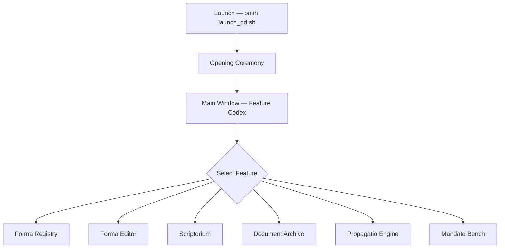
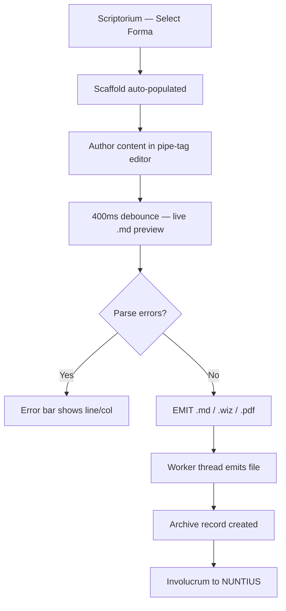
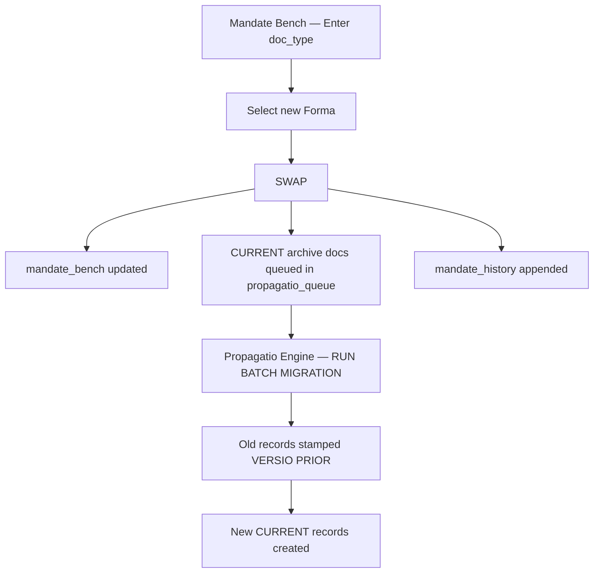
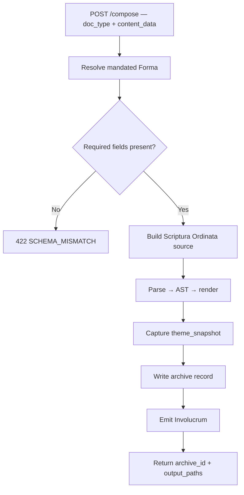

# DepartamentumDocumentalis
### Departamentum Documentalis is the Template Sovereignty Engine of the
### Exocognii suite. It governs document standards via a SQLite-backed
### Forma registry and the TEXTUS MANDATUM ORDINATIO decree table, and
### composes documents against those mandates via a Scriptura Ordinata
### editor and a FastAPI /compose endpoint.

---

## Features

```
╭─────────────────────────┬──────────────────────────────────┬──────────────────────────────────┬───────────╮
│ Feature                 │ Description                      │ How to Trigger                   │ Status    │
├┄┄┄┄┄┄┄┄┄┄┄┄┄┄┄┄┄┄┄┄┄┄┄┄┄┼┄┄┄┄┄┄┄┄┄┄┄┄┄┄┄┄┄┄┄┄┄┄┄┄┄┄┄┄┄┄┄┄┄┄┼┄┄┄┄┄┄┄┄┄┄┄┄┄┄┄┄┄┄┄┄┄┄┄┄┄┄┄┄┄┄┄┄┄┄┼┄┄┄┄┄┄┄┄┄┄┄┤
│ Forma Registry          │ Browse, filter, and manage       │ Select Forma Registry from       │ Working   │
│                         │ Formae by name, doc_type,        │ left rail.                       │           │
│                         │ and status.                      │                                  │           │
├┄┄┄┄┄┄┄┄┄┄┄┄┄┄┄┄┄┄┄┄┄┄┄┄┄┼┄┄┄┄┄┄┄┄┄┄┄┄┄┄┄┄┄┄┄┄┄┄┄┄┄┄┄┄┄┄┄┄┄┄┼┄┄┄┄┄┄┄┄┄┄┄┄┄┄┄┄┄┄┄┄┄┄┄┄┄┄┄┄┄┄┄┄┄┄┼┄┄┄┄┄┄┄┄┄┄┄┤
│ Forma Editor            │ Create and edit Forma            │ Select Forma Editor or           │ Working   │
│                         │ constitutions: fields, types,    │ double-click a Forma in          │           │
│                         │ Chromaticum, output targets.     │ Registry.                        │           │
├┄┄┄┄┄┄┄┄┄┄┄┄┄┄┄┄┄┄┄┄┄┄┄┄┄┼┄┄┄┄┄┄┄┄┄┄┄┄┄┄┄┄┄┄┄┄┄┄┄┄┄┄┄┄┄┄┄┄┄┄┼┄┄┄┄┄┄┄┄┄┄┄┄┄┄┄┄┄┄┄┄┄┄┄┄┄┄┄┄┄┄┄┄┄┄┼┄┄┄┄┄┄┄┄┄┄┄┤
│ Scriptorium             │ Scriptura Ordinata pipe-tag      │ Select Scriptorium from          │ Working   │
│                         │ editor with 400ms live .md       │ left rail.                       │           │
│                         │ preview. Emit .md/.wiz/.pdf.     │                                  │           │
├┄┄┄┄┄┄┄┄┄┄┄┄┄┄┄┄┄┄┄┄┄┄┄┄┄┼┄┄┄┄┄┄┄┄┄┄┄┄┄┄┄┄┄┄┄┄┄┄┄┄┄┄┄┄┄┄┄┄┄┄┼┄┄┄┄┄┄┄┄┄┄┄┄┄┄┄┄┄┄┄┄┄┄┄┄┄┄┄┄┄┄┄┄┄┄┼┄┄┄┄┄┄┄┄┄┄┄┤
│ Document Archive        │ Full production history with     │ Select Document Archive from     │ Working   │
│                         │ status badges and theme_snapshot.│ left rail.                       │           │
├┄┄┄┄┄┄┄┄┄┄┄┄┄┄┄┄┄┄┄┄┄┄┄┄┄┼┄┄┄┄┄┄┄┄┄┄┄┄┄┄┄┄┄┄┄┄┄┄┄┄┄┄┄┄┄┄┄┄┄┄┼┄┄┄┄┄┄┄┄┄┄┄┄┄┄┄┄┄┄┄┄┄┄┄┄┄┄┄┄┄┄┄┄┄┄┼┄┄┄┄┄┄┄┄┄┄┄┤
│ Propagatio Engine       │ Retroactive migration queue.     │ Select Propagatio Engine →       │ Working   │
│                         │ Re-emits docs against updated    │ RUN BATCH MIGRATION.             │           │
│                         │ Formae. Stamps VERSIO PRIOR.     │                                  │           │
├┄┄┄┄┄┄┄┄┄┄┄┄┄┄┄┄┄┄┄┄┄┄┄┄┄┼┄┄┄┄┄┄┄┄┄┄┄┄┄┄┄┄┄┄┄┄┄┄┄┄┄┄┄┄┄┄┄┄┄┄┼┄┄┄┄┄┄┄┄┄┄┄┄┄┄┄┄┄┄┄┄┄┄┄┄┄┄┄┄┄┄┄┄┄┄┼┄┄┄┄┄┄┄┄┄┄┄┤
│ Mandate Bench           │ TEXTUS MANDATUM ORDINATIO        │ Select Mandate Bench. Enter      │ Working   │
│                         │ governance. SWAP mandates,       │ doc_type, select Forma,          │           │
│                         │ append-only history log.         │ click SWAP.                      │           │
├┄┄┄┄┄┄┄┄┄┄┄┄┄┄┄┄┄┄┄┄┄┄┄┄┄┼┄┄┄┄┄┄┄┄┄┄┄┄┄┄┄┄┄┄┄┄┄┄┄┄┄┄┄┄┄┄┄┄┄┄┼┄┄┄┄┄┄┄┄┄┄┄┄┄┄┄┄┄┄┄┄┄┄┄┄┄┄┄┄┄┄┄┄┄┄┼┄┄┄┄┄┄┄┄┄┄┄┤
│ FastAPI Service         │ /compose endpoint on port 8733   │ Automatic on launch.             │ Working   │
│                         │ for programmatic document        │ POST http://localhost:8733       │           │
│                         │ composition.                     │ /compose                         │           │
├┄┄┄┄┄┄┄┄┄┄┄┄┄┄┄┄┄┄┄┄┄┄┄┄┄┼┄┄┄┄┄┄┄┄┄┄┄┄┄┄┄┄┄┄┄┄┄┄┄┄┄┄┄┄┄┄┄┄┄┄┼┄┄┄┄┄┄┄┄┄┄┄┄┄┄┄┄┄┄┄┄┄┄┄┄┄┄┄┄┄┄┄┄┄┄┼┄┄┄┄┄┄┄┄┄┄┄┤
│ Opening Ceremony        │ Letter-by-letter title           │ Automatic on launch.             │ Working   │
│                         │ animation, Devoted Absurd        │                                  │           │
│                         │ loading texts, aurum progress.   │                                  │           │
├┄┄┄┄┄┄┄┄┄┄┄┄┄┄┄┄┄┄┄┄┄┄┄┄┄┼┄┄┄┄┄┄┄┄┄┄┄┄┄┄┄┄┄┄┄┄┄┄┄┄┄┄┄┄┄┄┄┄┄┄┼┄┄┄┄┄┄┄┄┄┄┄┄┄┄┄┄┄┄┄┄┄┄┄┄┄┄┄┄┄┄┄┄┄┄┼┄┄┄┄┄┄┄┄┄┄┄┤
│ Dirty Marker ⬦          │ Aurum ⬦ in Feature Codex beside  │ Automatic when Forma Editor      │ Working   │
│                         │ features with unsaved state.     │ or Scriptorium content changes.  │           │
╰─────────────────────────┴──────────────────────────────────┴──────────────────────────────────┴───────────╯
```

---

## Usage Flowchart









---

## Vision & Purpose

Departamentum Documentalis exists because document standards in a
multi-application suite will drift without a sovereign source of truth.
It is the mechanism by which the suite declares what a document must be
and enforces that declaration retroactively when the declaration changes.
It fills forms, governs forms, and remembers every form it has ever filled
— because in the Cogniverse, nothing is truly lost, only reclassified.

---

## File & Folder Map

```
DepartamentumDocumentalis/
├── __init__.py              — package marker
├── __main__.py              — entry point
├── app.py                   — launch: DB init, server start, main window
├── config.py                — load ~/.arca/config.json; CFG dict
├── db.py                    — thread-safe SQLite WAL; all queries
├── server.py                — uvicorn daemon thread on port 8733
├── api.py                   — FastAPI app; all route definitions
├── styles.py                — ModusArcanus QSS stylesheet
├── opening_ceremony.py      — QSplashScreen animation
├── main_window.py           — A4 Common Shell; QSplitter layout
├── feature_codex.py         — left-rail nav; dirty marker
├── forma_registry.py        — filterable Forma list canvas
├── forma_editor.py          — Forma constitution editor
├── scriptorium.py           — Scriptura Ordinata editor + preview
├── document_archive.py      — production history canvas
├── propagatio_engine.py     — migration queue UI
├── mandate_bench.py         — TEXTUS MANDATUM ORDINATIO surface
├── scriptura_parser.py      — pipe-tag grammar → DocumentAST
├── md_renderer.py           — AST → .md
├── wiz_renderer.py          — AST → .wiz via Node.js shell-out
├── pdf_renderer.py          — AST → .pdf via Pandoc shell-out
├── propagatio_worker.py     — QRunnable batch/single migration
├── workers.py               — generic QRunnable + WorkerSignals
├── chromaticum_bridge.py    — Bureau I query; cached fallback
├── nuntius_client.py        — Involucrum emission to NUNTIUS
├── requirements.txt         — Python dependencies
├── launch_dd.sh             — venv activation + run launcher
├── DepartamentumDocumentalis.desktop
├── venv-DOC/                — Python virtual environment
└── node/
    ├── emit_wiz.js          — Node.js .wiz emitter
    └── package.json         — Node.js dependencies
```

---

## Features & Functions

### Forma Registry

Displays all Formae in a filterable list. Filter by text query against
name and doc_type, or by status (ALL, MANDATED, DRAFT, ARCHIVED). MANDATED
status is computed live against mandate_bench. Double-clicking opens in
Forma Editor. NEW FORMA navigates to a blank editor.

### Forma Editor

Create and edit Forma constitutions. Fields: name, doc_type key,
description, Chromaticum binding (live-queried from Bureau I, cached
fallback), output targets (.md, .wiz, .pdf), ordered field table. Each
field: name, label, type (PERMISSIVE/FIXED), required flag, fixed value.
Version auto-increments on save. ⬦ appears in the Feature Codex when
unsaved changes are present.

### Scriptorium

Pipe-tag editor for Scriptura Ordinata markup. Selecting a Forma
auto-populates the editor with a field scaffold. Syntax highlighting
colours pipe tags aurum. 400ms debounce triggers live .md preview. Parse
errors display as line:col in the error bar. FIXED values are inert —
populated from the Forma definition. EMIT buttons dispatch Worker threads
for each target format.

### Document Archive

Tabular view of all archive records ordered by emit time. Status rendered
as coloured badge: green (CURRENT), grey (VERSIO PRIOR), amber (ARCHIVED),
red (ORPHANED). Columns: Archive ID, Doc Type, Status, Bureau Marker,
Chromaticum, Emitted. REFRESH reloads from database.

### Propagatio Engine

Displays the propagatio_queue with Queue ID, Archive ID, Target Forma,
Status, and Queued columns. RUN BATCH MIGRATION dispatches a
PropagatioBatchWorker processing all PENDING items sequentially. Progress
bar tracks completion. Status line reports succeeded/failed counts on
finish.

### Mandate Bench

Two tables: Active Mandates (current mandate_bench) and Mandate History
(append-only log). SWAP: enter doc_type, select new Forma, click SWAP.
Existing mandates trigger propagatio queue population for all CURRENT
archive records of that doc_type before the mandate updates.
mandate_history always appended.

### FastAPI Service

Daemon thread, own asyncio loop, port 8733. Endpoints: POST /compose,
GET /forma/mandated/{doc_type}, GET /archive, POST /archive/register,
GET /chromatica. Port conflict on launch shows warning dialog; app opens
without API service.

---

## Logic

**Architecture** — Single process: PyQt6 main thread + uvicorn FastAPI
daemon thread. SQLite WAL mode permits concurrent reads and writes. All
blocking operations use QRunnable workers. UI thread never blocks.

**Scriptura Ordinata Parser** — Regex tokeniser matching |TAG:value|
patterns. Builds DocumentAST with TextNode, FieldNode, SectionNode,
InjectNode. Never raises — malformed tags produce ParseError list entries.
AST consumed by all three renderers.

**Compose Pipeline** — Forma fields loaded and sorted by position. FIXED
values resolved from Forma definition — callers cannot override. Missing
REQUIRED PERMISSIVE fields → SCHEMA_MISMATCH, no files emitted. Unknown
content_data keys → orphaned content preserved in archive record.
theme_snapshot captured from Bureau I at emit time, written immutably.

**Propagatio Migration** — migrate_document() fetches source text, parses,
resolves FIXED values from new Forma, identifies orphaned fields, stamps
old record VERSIO PRIOR, creates new CURRENT record, marks queue item DONE,
emits Involucrum. Errors mark queue item ERROR with message preserved.

---

## Input / Output & File Types

```
Input
  ├── Scriptorium — Scriptura Ordinata pipe-tag markup (in-memory)
  ├── FastAPI /compose — JSON: doc_type, content_data, bureau_marker,
  │                      title, targets
  ├── Config — ~/.arca/config.json (departamentum_documentalis block)
  └── Bureau I — JSON Chromaticum responses on http://localhost:8731

Output
  ├── Document files — .md, .docx/.wiz, .pdf
  │                    → ~/.arca/dd_output/ (configurable)
  ├── SQLite — ~/.arca/dd.sqlite
  │            tables: formae, forma_fields, documents, archive,
  │            mandate_bench, mandate_history, propagatio_queue,
  │            emission_log
  └── Involucrum — POST to http://localhost:8730/observe
```

---

*⟁ Ordo Discordia, Cosmos Inania*
