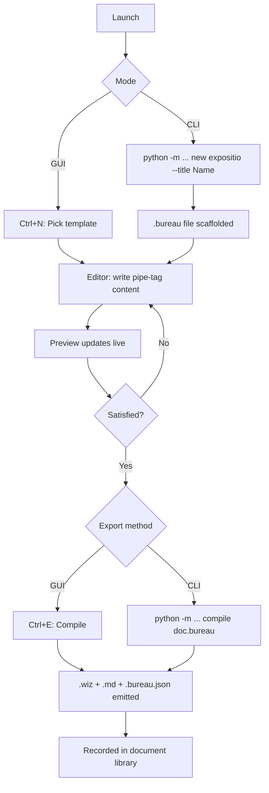

# Departamentum Documentalis
### A document composition tool for the Cogniverse. Write in
### pipe-tag markup (.bureau files), preview live, and compile
### to paired .wiz + .md output from a single source. Includes
### a GUI editor with syntax highlighting and a CLI for batch
### compilation. Five built-in templates cover every standard
### Cogniverse document type.

---

## Keyboard & Shortcut Reference

╭─────────────────┬─────────────────────────────────────────╮
│ Key / Shortcut  │ Action                                  │
├┄┄┄┄┄┄┄┄┄┄┄┄┄┄┄┄┄┼┄┄┄┄┄┄┄┄┄┄┄┄┄┄┄┄┄┄┄┄┄┄┄┄┄┄┄┄┄┄┄┄┄┄┄┄┄┄┄┄┄┤
│ q               │ Exire — quit application                │
│ Ctrl+N          │ Novum — new from template               │
│ Ctrl+O          │ Aperire — open .bureau file             │
│ Ctrl+S          │ Sigillare — save .bureau file           │
│ Ctrl+Shift+S    │ Sigillare Novum — save as               │
│ Ctrl+E          │ Promulgare — compile to .wiz + .md      │
│ Ctrl+T          │ Thema — load GUI theme from Bureau I    │
│ Ctrl+P          │ Specularium — toggle preview panel      │
╰─────────────────┴─────────────────────────────────────────╯

---

## CLI Commands

╭───────────────────────────────────────────┬──────────────────────────────────────╮
│ Command                                   │ Action                               │
├┄┄┄┄┄┄┄┄┄┄┄┄┄┄┄┄┄┄┄┄┄┄┄┄┄┄┄┄┄┄┄┄┄┄┄┄┄┄┄┄┄┄┄┼┄┄┄┄┄┄┄┄┄┄┄┄┄┄┄┄┄┄┄┄┄┄┄┄┄┄┄┄┄┄┄┄┄┄┄┄┄┄┤
│ python -m DepartamentumDocumentalis       │ Launch GUI (no arguments)            │
│ ... compile doc.bureau                    │ Compile to .wiz + .md + .bureau.json │
│ ... compile doc.bureau --outdir ./out     │ Compile with explicit output dir     │
│ ... new expositio --title "Name"          │ Scaffold new .bureau from template   │
│ ... templates                             │ List available template types        │
╰───────────────────────────────────────────┴──────────────────────────────────────╯

---

## Features

╭──────────────────────┬───────────────────────────┬──────────────────────┬─────────╮
│ Feature              │ Description               │ How to Trigger       │ Status  │
├┄┄┄┄┄┄┄┄┄┄┄┄┄┄┄┄┄┄┄┄┄┄┼┄┄┄┄┄┄┄┄┄┄┄┄┄┄┄┄┄┄┄┄┄┄┄┄┄┄┄┼┄┄┄┄┄┄┄┄┄┄┄┄┄┄┄┄┄┄┄┄┄┄┼┄┄┄┄┄┄┄┄┄┤
│ Pipe-Tag Parser      │ YAML header, single tags,  │ Automatic on any     │ Working │
│                      │ block tags, tables, inline │ .bureau content      │         │
├┄┄┄┄┄┄┄┄┄┄┄┄┄┄┄┄┄┄┄┄┄┄┼┄┄┄┄┄┄┄┄┄┄┄┄┄┄┄┄┄┄┄┄┄┄┄┄┄┄┄┼┄┄┄┄┄┄┄┄┄┄┄┄┄┄┄┄┄┄┄┄┄┄┼┄┄┄┄┄┄┄┄┄┤
│ Inline Formatting    │ **bold**, *italic*, `code`, │ Write in editor;     │ Working │
│                      │ {{token|colored spans}}    │ renders in preview   │         │
├┄┄┄┄┄┄┄┄┄┄┄┄┄┄┄┄┄┄┄┄┄┄┼┄┄┄┄┄┄┄┄┄┄┄┄┄┄┄┄┄┄┄┄┄┄┄┄┄┄┄┼┄┄┄┄┄┄┄┄┄┄┄┄┄┄┄┄┄┄┄┄┄┄┼┄┄┄┄┄┄┄┄┄┤
│ Syntax Highlighting  │ Tags, headings, bold,      │ Automatic in editor  │ Working │
│                      │ code, color spans colored  │                      │         │
├┄┄┄┄┄┄┄┄┄┄┄┄┄┄┄┄┄┄┄┄┄┄┼┄┄┄┄┄┄┄┄┄┄┄┄┄┄┄┄┄┄┄┄┄┄┄┄┄┄┄┼┄┄┄┄┄┄┄┄┄┄┄┄┄┄┄┄┄┄┄┄┄┄┼┄┄┄┄┄┄┄┄┄┤
│ Live Preview         │ Rich-text wizdoc-styled     │ Right panel; 300ms   │ Working │
│                      │ preview from AST           │ debounce             │         │
├┄┄┄┄┄┄┄┄┄┄┄┄┄┄┄┄┄┄┄┄┄┄┼┄┄┄┄┄┄┄┄┄┄┄┄┄┄┄┄┄┄┄┄┄┄┄┄┄┄┄┼┄┄┄┄┄┄┄┄┄┄┄┄┄┄┄┄┄┄┄┄┄┄┼┄┄┄┄┄┄┄┄┄┤
│ .md Emitter          │ Markdown with box-drawing   │ Ctrl+E or CLI        │ Working │
│                      │ tables, 80-char wrap       │ compile              │         │
├┄┄┄┄┄┄┄┄┄┄┄┄┄┄┄┄┄┄┄┄┄┄┼┄┄┄┄┄┄┄┄┄┄┄┄┄┄┄┄┄┄┄┄┄┄┄┄┄┄┄┼┄┄┄┄┄┄┄┄┄┄┄┄┄┄┄┄┄┄┄┄┄┄┼┄┄┄┄┄┄┄┄┄┤
│ .wiz Emitter         │ Art-form docx via Node.js   │ Ctrl+E or CLI        │ Working │
│                      │ docx library, wizdoc style │ compile              │         │
├┄┄┄┄┄┄┄┄┄┄┄┄┄┄┄┄┄┄┄┄┄┄┼┄┄┄┄┄┄┄┄┄┄┄┄┄┄┄┄┄┄┄┄┄┄┄┄┄┄┄┼┄┄┄┄┄┄┄┄┄┄┄┄┄┄┄┄┄┄┄┄┄┄┼┄┄┄┄┄┄┄┄┄┤
│ Bureau Writer        │ AST → .bureau round-trip   │ Internal (save)      │ Working │
├┄┄┄┄┄┄┄┄┄┄┄┄┄┄┄┄┄┄┄┄┄┄┼┄┄┄┄┄┄┄┄┄┄┄┄┄┄┄┄┄┄┄┄┄┄┄┄┄┄┄┼┄┄┄┄┄┄┄┄┄┄┄┄┄┄┄┄┄┄┄┄┄┄┼┄┄┄┄┄┄┄┄┄┤
│ Templates            │ 5 built-in: expositio,      │ Ctrl+N or CLI new    │ Working │
│                      │ dux_tome, build_doc,       │                      │         │
│                      │ palette_card, blank        │                      │         │
├┄┄┄┄┄┄┄┄┄┄┄┄┄┄┄┄┄┄┄┄┄┄┼┄┄┄┄┄┄┄┄┄┄┄┄┄┄┄┄┄┄┄┄┄┄┄┄┄┄┄┼┄┄┄┄┄┄┄┄┄┄┄┄┄┄┄┄┄┄┄┄┄┄┼┄┄┄┄┄┄┄┄┄┤
│ Companion JSON       │ .bureau.json sidecar with   │ Automatic on compile │ Working │
│                      │ provenance metadata        │                      │         │
├┄┄┄┄┄┄┄┄┄┄┄┄┄┄┄┄┄┄┄┄┄┄┼┄┄┄┄┄┄┄┄┄┄┄┄┄┄┄┄┄┄┄┄┄┄┄┄┄┄┄┼┄┄┄┄┄┄┄┄┄┄┄┄┄┄┄┄┄┄┄┄┄┄┼┄┄┄┄┄┄┄┄┄┤
│ Document Library     │ SQLite registry of all      │ Automatic on compile │ Working │
│                      │ produced documents         │                      │         │
├┄┄┄┄┄┄┄┄┄┄┄┄┄┄┄┄┄┄┄┄┄┄┼┄┄┄┄┄┄┄┄┄┄┄┄┄┄┄┄┄┄┄┄┄┄┄┄┄┄┄┼┄┄┄┄┄┄┄┄┄┄┄┄┄┄┄┄┄┄┄┄┄┄┼┄┄┄┄┄┄┄┄┄┤
│ GUI Theme Loading    │ Bureau I theme.json for     │ Ctrl+T               │ Working │
│                      │ app chrome styling         │                      │         │
╰──────────────────────┴───────────────────────────┴──────────────────────┴─────────╯

---

## Usage Flowchart



---

## Vision & Purpose

Departamentum Documentalis is the document authority for the
Cogniverse. It exists because a growing ecosystem of tools,
entities, and lore systems needs a uniform way to produce
styled documentation from a single source. The Wizard writes
in pipe-tag markup, the Bureau parses it into an AST, and
two emitters produce the art-form .wiz and the readable .md
simultaneously. Templates for every standard document type
eliminate boilerplate. The result is a consistent, beautiful,
and maintainable documentation pipeline.

---

## File & Folder Map

```
DepartamentumDocumentalis/
├── __init__.py              — package marker
├── __main__.py              — routes to GUI or CLI
├── app.py                   — PyQt6 main window
├── editor.py                — syntax-highlighted editor
├── preview.py               — live rich-text preview
├── bureau_parser.py         — .bureau pipe-tag parser
├── bureau_writer.py         — AST → .bureau round-trip
├── emitter_md.py            — AST → .md (Python)
├── emitter_wiz.py           — Python wrapper for Node emitter
├── emitter_wiz.js           — AST JSON → .wiz (Node.js docx)
├── templates.py             — 5 built-in template skeletons
├── library.py               — SQLite document registry
├── theme_loader.py          — Bureau I theme for GUI chrome
├── schema.py                — AST node types (dataclasses)
├── constants.py             — wizdoc colors, fonts, tag registry
├── cli.py                   — CLI: compile, new, templates
├── storage/
│   └── document_library.db  — created on first run
├── exports/                 — compiled output lands here
└── tests/
    ├── test_parser.py       — parser + inline formatting
    ├── test_emitters.py     — .md emitter, writer, templates
    └── test_integration.py  — end-to-end pipeline
```

---

## Features & Functions

### Pipe-Tag Format (.bureau)

The native markup format. A `.bureau` file begins with a
YAML front matter block between `---` fences defining
title, type, version, author, and theme. Content follows
as pipe-delimited tags.

Single-line tags self-close: `|h1|Section Title|`,
`|bullet|A point|`, `|break|`. Block tags require explicit
closure: `|body| ... |/body|`, `|code|python| ... |/code|`,
`|table| ... |/table|`.

Inline formatting within content: `**bold**`, `*italic*`,
`` `code` ``, `{{c_gold|colored text}}`. Color tokens map
to wizdoc style guide colors in `.wiz` output and render
as bold in `.md` (which has no native color support).

### Parser

`bureau_parser.py` consumes raw `.bureau` text and produces
a `BureauDocument` AST: a `DocumentHeader` (from YAML) plus
a list of `BureauNode` objects. Each node carries its tag,
raw content, parsed inline spans, child nodes (for table
rows), and metadata (e.g. code language). The parser handles
bare text lines as implicit body blocks.

### Bureau Writer (Round-Trip)

`bureau_writer.py` serializes a `BureauDocument` back to
`.bureau` format. This enables loading, modifying, and
resaving without loss — the AST is the interchange format.

### Markdown Emitter

`emitter_md.py` walks the AST and produces Markdown per the
markdown-style-guide. Headings map to `##`/`###`/etc.
Tables render as box-drawing character grids. Code blocks
use fenced syntax. Body text word-wraps at 76 characters.

### WizDoc Emitter

`emitter_wiz.js` (Node.js) receives the AST as a JSON file,
constructs a full docx document using the `docx` library,
and writes a `.wiz` file. Every element follows the wizdoc
style guide: Ebon Sigil title (Georgia fallback), gold body
text on dark background, teal H2, violet H3, ember H4,
amethyst code blocks with teal text, purple-bordered tables
with gold headers.

`emitter_wiz.py` (Python) is the wrapper — it serializes
the AST to a temp JSON file and invokes the Node script via
subprocess.

### Templates

Five built-in skeletons: `expositio` (10-section Expositio
per the Expositio dux tome), `dux_tome` (dux tome format),
`build_doc` (11-section IdeaForge build document),
`palette_card` (token list + compliance summary), `blank`
(empty with header only). `Ctrl+N` in the GUI or `new` in
the CLI scaffolds a `.bureau` file from the selected
template with title and author filled.

### Live Preview (Specularium)

The right panel of the GUI renders an approximate wizdoc-
styled preview using QTextEdit rich text. It rebuilds 300ms
after any editor change. Headings, bullets, code blocks,
tables, and inline formatting all render with wizdoc colors.
The preview is not pixel-identical to the `.wiz` output
(which uses the full docx rendering engine) but provides
accurate structural and tonal feedback.

### Syntax Highlighting

The editor panel applies color highlighting to pipe-tags
(teal), heading content (gold), bold (gold bold), inline
code (teal on amethyst), color spans (violet), and YAML
front matter (green). This makes the markup scannable
without rendering.

### Compilation (Promulgatio)

`Ctrl+E` in the GUI or `compile` in the CLI triggers the
full pipeline: parse → emit `.md` → emit `.wiz` → write
`.bureau.json`. All three outputs land in the `exports/`
directory (or a specified `--outdir`). The document is
recorded in the SQLite library.

### CLI

Three commands: `compile` (parse and emit), `new` (scaffold
from template), `templates` (list available types). The CLI
shares the same parser and emitters as the GUI — there is
no divergence.

---

## Logic

The application has two entry points sharing the same core.
`__main__.py` routes to `app.py` (GUI) when no CLI
arguments are given, or to `cli.py` when arguments are
present.

The core pipeline is: raw text → `bureau_parser.parse_bureau()`
→ `BureauDocument` AST → emitters. The `.md` emitter walks
the AST in Python. The `.wiz` emitter serializes the AST to
JSON via `dataclasses.asdict()`, writes it to a temp file,
and invokes `emitter_wiz.js` via subprocess. The Node script
reads the JSON, constructs docx paragraphs/tables/runs per
the wizdoc style guide, and writes the `.wiz` file.

The GUI editor emits `content_changed` on every keystroke.
The preview debounces at 300ms, re-parses the editor
content, and rebuilds the rich-text display from the fresh
AST. The preview does not share state with the emitters —
it is an independent rendering path optimized for speed
over fidelity.

---

## Input / Output & File Types

```
Input
  ├── .bureau — pipe-tag source files (written or
  │   scaffolded by the Wizard)
  └── theme.json — Bureau I ratified palette (optional,
      GUI chrome only via Ctrl+T)

Output
  ├── exports/{stem}.wiz — art-form docx (wizdoc styled)
  ├── exports/{stem}.md — readable markdown
  ├── exports/{stem}.bureau.json — provenance sidecar
  └── storage/document_library.db — SQLite registry
```
