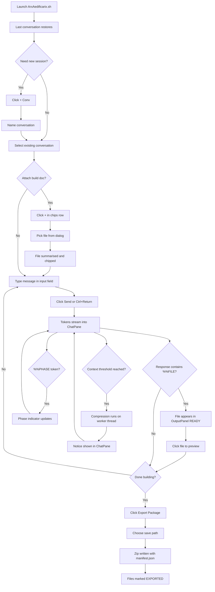

# Arx Aedificarix

Arx Aedificarix is a dedicated PyQt6 desktop client for sustained,
document-grounded code generation sessions with The Builder entity
via ClaudeBox. It is the forge of the Exocognii Suite — the workspace
in which build documents become deliverable code packages. Sessions
are persistent, context is managed deliberately, and every generated
file accumulates into an exportable zip package.

---

## Keyboard & Shortcut Reference

╭────────────────────────────┬────────────────────────────────────────╮
│  Key / Shortcut            │  Action                                │
├┄┄┄┄┄┄┄┄┄┄┄┄┄┄┄┄┄┄┄┄┄┄┄┄┄┄┄┄┼┄┄┄┄┄┄┄┄┄┄┄┄┄┄┄┄┄┄┄┄┄┄┄┄┄┄┄┄┄┄┄┄┄┄┄┄┄┄┄┄┤
│  Ctrl + Return             │  Send message (from input field)       │
╰────────────────────────────┴────────────────────────────────────────╯

---

## Features

╭──────────────────────────────┬─────────────────────────────────────┬──────────────────────────────────┬─────────╮
│  Feature                     │  Description                        │  How to Trigger                  │  Status │
├┄┄┄┄┄┄┄┄┄┄┄┄┄┄┄┄┄┄┄┄┄┄┄┄┄┄┄┄┄┄┼┄┄┄┄┄┄┄┄┄┄┄┄┄┄┄┄┄┄┄┄┄┄┄┄┄┄┄┄┄┄┄┄┄┄┄┄┄┼┄┄┄┄┄┄┄┄┄┄┄┄┄┄┄┄┄┄┄┄┄┄┄┄┄┄┄┄┄┄┄┄┄┄┼┄┄┄┄┄┄┄┄┄┤
│  New conversation            │  Creates a new conversation, optio- │  Click [+ Conv] in ProjectTree   │ Working │
│                              │  nally assigned to a project.       │  toolbar. Name prompt appears.   │         │
├┄┄┄┄┄┄┄┄┄┄┄┄┄┄┄┄┄┄┄┄┄┄┄┄┄┄┄┄┄┄┼┄┄┄┄┄┄┄┄┄┄┄┄┄┄┄┄┄┄┄┄┄┄┄┄┄┄┄┄┄┄┄┄┄┄┄┄┄┼┄┄┄┄┄┄┄┄┄┄┄┄┄┄┄┄┄┄┄┄┄┄┄┄┄┄┄┄┄┄┄┄┄┄┼┄┄┄┄┄┄┄┄┄┤
│  New project                 │  Creates a named project node.      │  Click [+ Proj] in ProjectTree   │ Working │
│                              │  Conversations can be grouped under │  toolbar. Name prompt appears.   │         │
│                              │  a project.                         │                                  │         │
├┄┄┄┄┄┄┄┄┄┄┄┄┄┄┄┄┄┄┄┄┄┄┄┄┄┄┄┄┄┄┼┄┄┄┄┄┄┄┄┄┄┄┄┄┄┄┄┄┄┄┄┄┄┄┄┄┄┄┄┄┄┄┄┄┄┄┄┄┼┄┄┄┄┄┄┄┄┄┄┄┄┄┄┄┄┄┄┄┄┄┄┄┄┄┄┄┄┄┄┄┄┄┄┼┄┄┄┄┄┄┄┄┄┤
│  Delete conversation/project │  Removes the selected item with a   │  Select item, click [Del].       │ Working │
│                              │  confirmation dialog. Conversations │  Confirm dialog appears.         │         │
│                              │  inside a deleted project become    │                                  │         │
│                              │  ungrouped.                         │                                  │         │
├┄┄┄┄┄┄┄┄┄┄┄┄┄┄┄┄┄┄┄┄┄┄┄┄┄┄┄┄┄┄┼┄┄┄┄┄┄┄┄┄┄┄┄┄┄┄┄┄┄┄┄┄┄┄┄┄┄┄┄┄┄┄┄┄┄┄┄┄┼┄┄┄┄┄┄┄┄┄┄┄┄┄┄┄┄┄┄┄┄┄┄┄┄┄┄┄┄┄┄┄┄┄┄┼┄┄┄┄┄┄┄┄┄┤
│  Drag-drop reorder           │  Conversations can be dragged       │  Click and drag a conversation   │ Working │
│                              │  between projects or into the       │  item in ProjectTree.            │         │
│                              │  ungrouped area.                    │                                  │         │
├┄┄┄┄┄┄┄┄┄┄┄┄┄┄┄┄┄┄┄┄┄┄┄┄┄┄┄┄┄┄┼┄┄┄┄┄┄┄┄┄┄┄┄┄┄┄┄┄┄┄┄┄┄┄┄┄┄┄┄┄┄┄┄┄┄┄┄┄┼┄┄┄┄┄┄┄┄┄┄┄┄┄┄┄┄┄┄┄┄┄┄┄┄┄┄┄┄┄┄┄┄┄┄┼┄┄┄┄┄┄┄┄┄┤
│  Send message                │  Sends the input field content to   │  Click [Send] or press           │ Working │
│                              │  The Builder. Response streams into │  Ctrl+Return.                    │         │
│                              │  ChatPane in real time.             │                                  │         │
├┄┄┄┄┄┄┄┄┄┄┄┄┄┄┄┄┄┄┄┄┄┄┄┄┄┄┄┄┄┄┼┄┄┄┄┄┄┄┄┄┄┄┄┄┄┄┄┄┄┄┄┄┄┄┄┄┄┄┄┄┄┄┄┄┄┄┄┄┼┄┄┄┄┄┄┄┄┄┄┄┄┄┄┄┄┄┄┄┄┄┄┄┄┄┄┄┄┄┄┄┄┄┄┼┄┄┄┄┄┄┄┄┄┤
│  Phase indicator             │  Bar at top of ChatPane shows       │  Automatic. The Builder emits    │ Working │
│                              │  DISCUSSION (teal) or BUILDING      │  %%PHASE tokens in responses.    │         │
│                              │  (gold) based on Builder signal.    │                                  │         │
├┄┄┄┄┄┄┄┄┄┄┄┄┄┄┄┄┄┄┄┄┄┄┄┄┄┄┄┄┄┄┼┄┄┄┄┄┄┄┄┄┄┄┄┄┄┄┄┄┄┄┄┄┄┄┄┄┄┄┄┄┄┄┄┄┄┄┄┄┼┄┄┄┄┄┄┄┄┄┄┄┄┄┄┄┄┄┄┄┄┄┄┄┄┄┄┄┄┄┄┄┄┄┄┼┄┄┄┄┄┄┄┄┄┤
│  File extraction             │  %%FILE blocks in Builder responses │  Automatic on response           │ Working │
│                              │  are parsed and registered as       │  complete.                       │         │
│                              │  output files with READY badge.     │                                  │         │
├┄┄┄┄┄┄┄┄┄┄┄┄┄┄┄┄┄┄┄┄┄┄┄┄┄┄┄┄┄┄┼┄┄┄┄┄┄┄┄┄┄┄┄┄┄┄┄┄┄┄┄┄┄┄┄┄┄┄┄┄┄┄┄┄┄┄┄┄┼┄┄┄┄┄┄┄┄┄┄┄┄┄┄┄┄┄┄┄┄┄┄┄┄┄┄┄┄┄┄┄┄┄┄┼┄┄┄┄┄┄┄┄┄┤
│  Syntax-highlighted preview  │  Click a file in OutputPanel to     │  Click any file in the           │ Working │
│                              │  display it with syntax highlighting │  OutputPanel list.               │         │
│                              │  in PreviewPane. Python, JSON,      │                                  │         │
│                              │  YAML, Markdown, Bash supported.    │                                  │         │
├┄┄┄┄┄┄┄┄┄┄┄┄┄┄┄┄┄┄┄┄┄┄┄┄┄┄┄┄┄┄┼┄┄┄┄┄┄┄┄┄┄┄┄┄┄┄┄┄┄┄┄┄┄┄┄┄┄┄┄┄┄┄┄┄┄┄┄┄┼┄┄┄┄┄┄┄┄┄┄┄┄┄┄┄┄┄┄┄┄┄┄┄┄┄┄┄┄┄┄┄┄┄┄┼┄┄┄┄┄┄┄┄┄┤
│  Copy to clipboard           │  Copies the previewed file content  │  Click [Copy] in PreviewPane.    │ Working │
│                              │  to clipboard via xclip.            │                                  │         │
├┄┄┄┄┄┄┄┄┄┄┄┄┄┄┄┄┄┄┄┄┄┄┄┄┄┄┄┄┄┄┼┄┄┄┄┄┄┄┄┄┄┄┄┄┄┄┄┄┄┄┄┄┄┄┄┄┄┄┄┄┄┄┄┄┄┄┄┄┼┄┄┄┄┄┄┄┄┄┄┄┄┄┄┄┄┄┄┄┄┄┄┄┄┄┄┄┄┄┄┄┄┄┄┼┄┄┄┄┄┄┄┄┄┤
│  Export Package              │  Assembles all output files for the │  Click [⬡ Export Package] in     │ Working │
│                              │  conversation into a zip archive    │  the footer. File save dialog    │         │
│                              │  with manifest.json. Marks files    │  opens.                          │         │
│                              │  EXPORTED.                          │                                  │         │
├┄┄┄┄┄┄┄┄┄┄┄┄┄┄┄┄┄┄┄┄┄┄┄┄┄┄┄┄┄┄┼┄┄┄┄┄┄┄┄┄┄┄┄┄┄┄┄┄┄┄┄┄┄┄┄┄┄┄┄┄┄┄┄┄┄┄┄┄┼┄┄┄┄┄┄┄┄┄┄┄┄┄┄┄┄┄┄┄┄┄┄┄┄┄┄┄┄┄┄┄┄┄┄┼┄┄┄┄┄┄┄┄┄┤
│  Attach file                 │  Attaches a file to the current     │  Click [+] in the attachment     │ Working │
│                              │  conversation. Summarised via       │  chips row. File picker opens.   │         │
│                              │  ClaudeBox; summary injected into   │  Chip appears on success.        │         │
│                              │  system block on next send.         │                                  │         │
├┄┄┄┄┄┄┄┄┄┄┄┄┄┄┄┄┄┄┄┄┄┄┄┄┄┄┄┄┄┄┼┄┄┄┄┄┄┄┄┄┄┄┄┄┄┄┄┄┄┄┄┄┄┄┄┄┄┄┄┄┄┄┄┄┄┄┄┄┼┄┄┄┄┄┄┄┄┄┄┄┄┄┄┄┄┄┄┄┄┄┄┄┄┄┄┄┄┄┄┄┄┄┄┼┄┄┄┄┄┄┄┄┄┤
│  Re-attach file              │  Re-injects a previously attached   │  Click [+]; if attachments       │ Working │
│                              │  file into the current turn.        │  exist, dialog lists them with   │         │
│                              │                                     │  checkboxes.                     │         │
├┄┄┄┄┄┄┄┄┄┄┄┄┄┄┄┄┄┄┄┄┄┄┄┄┄┄┄┄┄┄┼┄┄┄┄┄┄┄┄┄┄┄┄┄┄┄┄┄┄┄┄┄┄┄┄┄┄┄┄┄┄┄┄┄┄┄┄┄┼┄┄┄┄┄┄┄┄┄┄┄┄┄┄┄┄┄┄┄┄┄┄┄┄┄┄┄┄┄┄┄┄┄┄┼┄┄┄┄┄┄┄┄┄┤
│  Dismiss attachment chip     │  Removes a file from the current    │  Click ✕ on the chip.            │ Working │
│                              │  turn injection without deleting    │                                  │         │
│                              │  it from the database.              │                                  │         │
├┄┄┄┄┄┄┄┄┄┄┄┄┄┄┄┄┄┄┄┄┄┄┄┄┄┄┄┄┄┄┼┄┄┄┄┄┄┄┄┄┄┄┄┄┄┄┄┄┄┄┄┄┄┄┄┄┄┄┄┄┄┄┄┄┄┄┄┄┼┄┄┄┄┄┄┄┄┄┄┄┄┄┄┄┄┄┄┄┄┄┄┄┄┄┄┄┄┄┄┄┄┄┄┼┄┄┄┄┄┄┄┄┄┤
│  Context compression         │  When the context estimate reaches  │  Automatic. Fires before send    │ Working │
│                              │  70% of the model limit, the oldest │  when threshold exceeded.        │         │
│                              │  turns are summarised and archived. │  Notice appears in ChatPane.     │         │
├┄┄┄┄┄┄┄┄┄┄┄┄┄┄┄┄┄┄┄┄┄┄┄┄┄┄┄┄┄┄┼┄┄┄┄┄┄┄┄┄┄┄┄┄┄┄┄┄┄┄┄┄┄┄┄┄┄┄┄┄┄┄┄┄┄┄┄┄┼┄┄┄┄┄┄┄┄┄┄┄┄┄┄┄┄┄┄┄┄┄┄┄┄┄┄┄┄┄┄┄┄┄┄┼┄┄┄┄┄┄┄┄┄┤
│  Token gauge                 │  Footer bar showing context fill.   │  Always visible. Updates after   │ Working │
│                              │  Gold below 60%, gold-dim 60-85%,  │  each response and on keystroke  │         │
│                              │  crimson above 85%.                 │  in input field.                 │         │
├┄┄┄┄┄┄┄┄┄┄┄┄┄┄┄┄┄┄┄┄┄┄┄┄┄┄┄┄┄┄┼┄┄┄┄┄┄┄┄┄┄┄┄┄┄┄┄┄┄┄┄┄┄┄┄┄┄┄┄┄┄┄┄┄┄┄┄┄┼┄┄┄┄┄┄┄┄┄┄┄┄┄┄┄┄┄┄┄┄┄┄┄┄┄┄┄┄┄┄┄┄┄┄┼┄┄┄┄┄┄┄┄┄┤
│  Session persistence         │  All conversations, messages,       │  Automatic. Restores last        │ Working │
│                              │  output files, and attachments      │  active conversation on launch.  │         │
│                              │  survive restarts.                  │                                  │         │
├┄┄┄┄┄┄┄┄┄┄┄┄┄┄┄┄┄┄┄┄┄┄┄┄┄┄┄┄┄┄┼┄┄┄┄┄┄┄┄┄┄┄┄┄┄┄┄┄┄┄┄┄┄┄┄┄┄┄┄┄┄┄┄┄┄┄┄┄┼┄┄┄┄┄┄┄┄┄┄┄┄┄┄┄┄┄┄┄┄┄┄┄┄┄┄┄┄┄┄┄┄┄┄┼┄┄┄┄┄┄┄┄┄┤
│  Error + retry               │  API failures display an error      │  Automatic on failure.           │ Working │
│                              │  notice in crimson with a Retry     │  Click [↺ Retry] to resend.      │         │
│                              │  button.                            │                                  │         │
├┄┄┄┄┄┄┄┄┄┄┄┄┄┄┄┄┄┄┄┄┄┄┄┄┄┄┄┄┄┄┼┄┄┄┄┄┄┄┄┄┄┄┄┄┄┄┄┄┄┄┄┄┄┄┄┄┄┄┄┄┄┄┄┄┄┄┄┄┼┄┄┄┄┄┄┄┄┄┄┄┄┄┄┄┄┄┄┄┄┄┄┄┄┄┄┄┄┄┄┄┄┄┄┼┄┄┄┄┄┄┄┄┄┤
│  Token ledger                │  Every response writes input and    │  Automatic. Logged to            │ Working │
│                              │  output token counts to the shared  │  ~/.arca/token_log.jsonl with    │         │
│                              │  suite ledger.                      │  app="arx_aedificarix".          │         │
╰──────────────────────────────┴─────────────────────────────────────┴──────────────────────────────────┴─────────╯

---

## Usage Flowchart



---

## Vision & Purpose

Arx Aedificarix is the forge of the Exocognii Suite — the dedicated
workspace where the Wizard commissions code from The Builder. Where
the Dolium turns ideas into build documents, the Arx turns build
documents into deliverable packages. It is built for sustained,
multi-hour construction sessions: persistent history, automatic
context management, structured file output, and a clean path from
streamed response to exported zip.

---

## File & Folder Map

```
Exocognii/ArxAedificarix/
├── __init__.py              — package marker
├── __main__.py              — entry point; bootstraps QApplication
├── ArxAedificarix.sh        — KDE launcher; activates venv-ARX
├── builder_prompt.md        — The Builder system prompt
├── arx.db                   — SQLite database (created on first run)
├── venv-ARX/                — dedicated virtualenv
├── core/
│   ├── __init__.py
│   ├── database.py          — DatabaseManager; schema init; WAL mode
│   ├── config_loader.py     — reads ~/.arca/config.json
│   ├── prompt_loader.py     — loads builder_prompt.md; fallback embed
│   ├── session_store.py     — CRUD for all SQLite tables
│   ├── context_engine.py    — assembles system_block + messages_array
│   ├── compression_engine.py — summarises oldest N turns; archives
│   ├── response_parser.py   — extracts %%FILE blocks and %%PHASE
│   ├── attachment_manager.py — attach files; summarise; failure path
│   └── zip_exporter.py      — assembles zip package; manifest.json
├── ui/
│   ├── __init__.py
│   ├── main_window.py       — three-pane layout; signal wiring
│   ├── chat_pane.py         — streaming display; input; chips
│   ├── project_tree.py      — project/conversation hierarchy
│   ├── output_panel.py      — generated file list; state badges
│   ├── preview_pane.py      — syntax-highlighted file display
│   ├── attachment_dialog.py — re-attach existing attachments
│   ├── token_gauge.py       — context fill bar widget
│   └── arcane_highlighter.py — QSyntaxHighlighter; 5 languages
└── bridge/
    ├── __init__.py
    └── builder_signal_bridge.py — ClaudeBox ↔ Qt signal seam
```

---

## Features & Functions

### ProjectTree

The left pane. Displays all projects as expandable nodes with their
conversations as children. Ungrouped conversations appear below a
dashed separator. Create a new conversation with [+ Conv]; if a
project or one of its conversations is selected, the new conversation
is automatically assigned to that project. Create a new project with
[+ Proj]. Delete either with [Del] — a confirmation dialog appears
before anything is removed. Drag a conversation onto a project node
to reassign it; drag it below the separator to ungroup it. All
changes are written to SQLite immediately.

### ChatPane

The centre pane. Displays the conversation history as role-labelled
bubbles. The phase indicator bar at the top shows DISCUSSION (teal)
or BUILDING (gold) depending on the last %%PHASE token received from
The Builder. The attachment chips row above the input field shows
files that will be re-injected into the current turn; click ✕ on a
chip to dismiss it without deleting the attachment. The input field
accepts plain text; Ctrl+Return submits. A real-time token estimate
of the current draft appears beside the Send button. While a response
is streaming, Send is disabled.

### OutputPanel

The upper-right pane. Lists every %%FILE block extracted from Builder
responses in the current conversation. Each entry shows the filename
and a state badge: READY (parsed, available), EXPORTED (included in a
completed zip). Click any entry to display it in PreviewPane. State
badges persist across restarts — they reflect what is in the
output_files table.

### PreviewPane

The lower-right pane. Displays the content of the selected output
file with syntax highlighting. Languages supported: Python, JSON,
YAML, Markdown, Bash. Copy button writes the file content to the
clipboard via xclip (Qt clipboard fallback if xclip is absent).

### Attach File

Click [+] in the chips row to attach a file. If the current
conversation already has attachments, the AttachmentDialog opens
listing them with checkboxes — check any to re-inject them into the
current turn. If no attachments exist yet, a file picker opens
directly. Selected files are summarised via a ClaudeBox call on a
background thread. The summary is stored in SQLite and injected into
the system block on every subsequent send. If summarisation fails,
the file is stored without a summary; a warning appears in the
status bar and the Wizard can retry.

### Export Package

When the current conversation has READY output files, the Export
Package button in the footer is enabled (teal). Click it to open a
file save dialog. The zip is written atomically to the chosen path
and includes all output files plus a manifest.json describing the
package contents, conversation title, and generation timestamp. All
included files are marked EXPORTED in the database and in the
OutputPanel.

### Context Compression

When ContextEngine estimates the payload will exceed 70% of the
model's context limit (configurable via arx_aedificarix.compression_
threshold in ~/.arca/config.json), compression is triggered
automatically before the send. The oldest 20 uncompressed message
turns (configurable via arx_aedificarix.compression_batch_size) are
summarised via a synchronous ClaudeBox call on a worker thread.
Originals are archived in SQLite and marked compressed; the summary
replaces them in the payload. A notice appears in ChatPane. The send
proceeds after compression completes.

### Token Gauge

The footer bar showing context window fill as a percentage. Updates
with exact counts after every response (from the TOKEN_USAGE event)
and with a heuristic draft estimate on every keystroke in the input
field. Colour thresholds: gold below 60%, gold-dim 60–85%, crimson
above 85%.

### Error & Retry

If the API call fails mid-stream, the incomplete streaming bubble is
removed, an error notice appears in crimson, and a Retry button is
shown. Retry resends the last user message without requiring the
Wizard to retype it. The user message remains in SQLite — it is not
removed on failure.

---

## Logic

### Architecture

The application is three tiers connected by Qt signals. The core
tier (core/) owns all business logic and database access. The bridge
tier (bridge/) converts ClaudeBox event bus callbacks into Qt signals
that can safely cross thread boundaries. The UI tier (ui/) renders
state and emits user actions as signals that MainWindow wires to core
operations.

### Send Pipeline

When the Wizard clicks Send, MainWindow saves the user message to
SQLite and calls ContextEngine.assemble_payload(). The payload
consists of a system_block (builder prompt + project shared
instructions + attachment summaries, assembled as a single string)
and a messages_array (all stored turns, with compressed groups
replaced by their archive summary). If the token estimate exceeds
the compression threshold, CompressionEngine runs on a QRunnable
worker first; then payload is reassembled and sent.

BuilderSignalBridge loads the history portion of messages_array into
a named ClaudeBox session via box._conversation.replace_history(),
then calls box.send_threaded() with the final user message as a plain
string and the system_block as the system parameter. A persistent
box.on("token") listener streams every token to ChatPane via Qt
signal. On response_complete, ResponseParser extracts %%FILE blocks
and %%PHASE tokens; files are saved and registered; the full response
is persisted as an assistant message.

### Response Parsing

ResponseParser scans the full response text for %%FILE blocks
(%%FILE / %%LANG / %%DESC headers followed by content, terminated
by %%END) and %%PHASE tokens. File blocks are removed from the text
before prose is returned; %%PHASE is stripped too. If no prose
remains after stripping, prose is None and ChatPane suppresses the
assistant bubble — the Builder delivered files only.

### Session Restore

On launch, SessionStore.restore_last_active() fetches the
conversation with the most recent last_active_at timestamp.
MainWindow loads its message history into ChatPane, its output files
into OutputPanel, and estimates the current token fill for the gauge.

---

## Input / Output & File Types

```
Input
  ├── ~/.arca/config.json — JSON — API key, model context
  │                                limit, compression settings
  ├── builder_prompt.md — Markdown — The Builder system prompt
  ├── arx.db — SQLite — all session state (read on launch)
  └── User-attached files — any text format — attached via
                            QFileDialog; read as UTF-8 text

Output
  ├── arx.db — SQLite WAL — conversations, messages,
  │                         output_files, attachments,
  │                         compression_archive, projects
  ├── ~/.arca/token_log.jsonl — JSONL — one entry per response;
  │                             app="arx_aedificarix"
  └── *.zip — ZIP — exported package; contains generated files
                    and manifest.json
```

---

*Arx Aedificarix-dux.tome.md · v1.0*
*Exocognii Suite · Arca Cognitorium*
*Ordo Discordia, Cosmos Inania*
