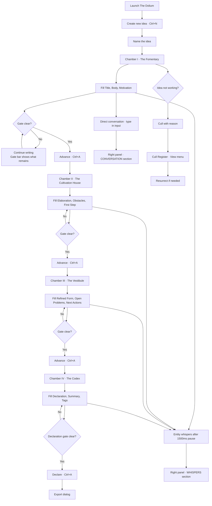

# The Dolium v2
### A four-chamber ideation pipeline with ambient entity presence.
### PyQt6 desktop application · Arca Cognitorium · Exocognii Suite.

---

## Keyboard Shortcuts

╭──────────────────┬────────────────────────────────────╮
│  Key / Shortcut  │  Action                            │
├┄┄┄┄┄┄┄┄┄┄┄┄┄┄┄┄┄┄┼┄┄┄┄┄┄┄┄┄┄┄┄┄┄┄┄┄┄┄┄┄┄┄┄┄┄┄┄┄┄┄┄┄┄┄┄┤
│  Ctrl+N          │  New Idea                          │
├┄┄┄┄┄┄┄┄┄┄┄┄┄┄┄┄┄┄┼┄┄┄┄┄┄┄┄┄┄┄┄┄┄┄┄┄┄┄┄┄┄┄┄┄┄┄┄┄┄┄┄┄┄┄┄┤
│  Ctrl+A          │  Advance current idea              │
├┄┄┄┄┄┄┄┄┄┄┄┄┄┄┄┄┄┄┼┄┄┄┄┄┄┄┄┄┄┄┄┄┄┄┄┄┄┄┄┄┄┄┄┄┄┄┄┄┄┄┄┄┄┄┄┤
│  Ctrl+E          │  Export current idea               │
├┄┄┄┄┄┄┄┄┄┄┄┄┄┄┄┄┄┄┼┄┄┄┄┄┄┄┄┄┄┄┄┄┄┄┄┄┄┄┄┄┄┄┄┄┄┄┄┄┄┄┄┄┄┄┄┤
│  Enter           │  Send conversation message         │
╰──────────────────┴────────────────────────────────────╯

---

## Features

╭─────────────────────────────┬──────────────────────────────────────────────┬────────────────────────────────────┬───────────╮
│  Feature                    │  Description                                 │  How to Trigger                    │  Status   │
├┄┄┄┄┄┄┄┄┄┄┄┄┄┄┄┄┄┄┄┄┄┄┄┄┄┄┄┄┄┼┄┄┄┄┄┄┄┄┄┄┄┄┄┄┄┄┄┄┄┄┄┄┄┄┄┄┄┄┄┄┄┄┄┄┄┄┄┄┄┄┄┄┄┄┄┄┼┄┄┄┄┄┄┄┄┄┄┄┄┄┄┄┄┄┄┄┄┄┄┄┄┄┄┄┄┄┄┄┄┄┄┄┄┼┄┄┄┄┄┄┄┄┄┄┄┤
│  Four-chamber pipeline      │  Ideas flow through Fomentary, Cultivation, │  Create an idea, fill fields,      │  Working  │
│                             │  Vestibule, and Codex via gated advancement  │  advance when gate clears          │           │
├┄┄┄┄┄┄┄┄┄┄┄┄┄┄┄┄┄┄┄┄┄┄┄┄┄┄┄┄┄┼┄┄┄┄┄┄┄┄┄┄┄┄┄┄┄┄┄┄┄┄┄┄┄┄┄┄┄┄┄┄┄┄┄┄┄┄┄┄┄┄┄┄┄┄┄┄┼┄┄┄┄┄┄┄┄┄┄┄┄┄┄┄┄┄┄┄┄┄┄┄┄┄┄┄┄┄┄┄┄┄┄┄┄┼┄┄┄┄┄┄┄┄┄┄┄┤
│  Ambient whisper system     │  Entity observes field changes and generates │  Write in any field — fires        │  Working  │
│                             │  unprompted observations after 1500ms pause  │  automatically after 1500ms        │           │
├┄┄┄┄┄┄┄┄┄┄┄┄┄┄┄┄┄┄┄┄┄┄┄┄┄┄┄┄┄┼┄┄┄┄┄┄┄┄┄┄┄┄┄┄┄┄┄┄┄┄┄┄┄┄┄┄┄┄┄┄┄┄┄┄┄┄┄┄┄┄┄┄┄┄┄┄┼┄┄┄┄┄┄┄┄┄┄┄┄┄┄┄┄┄┄┄┄┄┄┄┄┄┄┄┄┄┄┄┄┄┄┄┄┼┄┄┄┄┄┄┄┄┄┄┄┤
│  Direct conversation        │  Talk to the chamber entity directly.        │  Type in the conversation input    │  Working  │
│                             │  Shares session history with whispers        │  at the bottom of the right panel  │           │
├┄┄┄┄┄┄┄┄┄┄┄┄┄┄┄┄┄┄┄┄┄┄┄┄┄┄┄┄┄┼┄┄┄┄┄┄┄┄┄┄┄┄┄┄┄┄┄┄┄┄┄┄┄┄┄┄┄┄┄┄┄┄┄┄┄┄┄┄┄┄┄┄┄┄┄┄┼┄┄┄┄┄┄┄┄┄┄┄┄┄┄┄┄┄┄┄┄┄┄┄┄┄┄┄┄┄┄┄┄┄┄┄┄┼┄┄┄┄┄┄┄┄┄┄┄┤
│  Gate bar                   │  Live progress display for current chamber   │  Visible at bottom of workspace    │  Working  │
│                             │  exit conditions. Updates on every keystroke │  whenever an idea is loaded        │           │
├┄┄┄┄┄┄┄┄┄┄┄┄┄┄┄┄┄┄┄┄┄┄┄┄┄┄┄┄┄┼┄┄┄┄┄┄┄┄┄┄┄┄┄┄┄┄┄┄┄┄┄┄┄┄┄┄┄┄┄┄┄┄┄┄┄┄┄┄┄┄┄┄┄┄┄┄┼┄┄┄┄┄┄┄┄┄┄┄┄┄┄┄┄┄┄┄┄┄┄┄┄┄┄┄┄┄┄┄┄┄┄┄┄┼┄┄┄┄┄┄┄┄┄┄┄┤
│  Advance dialog             │  Shows gate result before chamber change.    │  Ctrl+A or Advance › button        │  Working  │
│                             │  Green if clear, red checklist if not        │                                    │           │
├┄┄┄┄┄┄┄┄┄┄┄┄┄┄┄┄┄┄┄┄┄┄┄┄┄┄┄┄┄┼┄┄┄┄┄┄┄┄┄┄┄┄┄┄┄┄┄┄┄┄┄┄┄┄┄┄┄┄┄┄┄┄┄┄┄┄┄┄┄┄┄┄┄┄┄┄┼┄┄┄┄┄┄┄┄┄┄┄┄┄┄┄┄┄┄┄┄┄┄┄┄┄┄┄┄┄┄┄┄┄┄┄┄┼┄┄┄┄┄┄┄┄┄┄┄┤
│  Return to earlier chamber  │  Send an idea back to a previous chamber     │  Idea menu → Return to Chamber     │  Working  │
│                             │  without losing any content                  │  or Return ‹ button                │           │
├┄┄┄┄┄┄┄┄┄┄┄┄┄┄┄┄┄┄┄┄┄┄┄┄┄┄┄┄┄┼┄┄┄┄┄┄┄┄┄┄┄┄┄┄┄┄┄┄┄┄┄┄┄┄┄┄┄┄┄┄┄┄┄┄┄┄┄┄┄┄┄┄┄┄┄┤┄┄┄┄┄┄┄┄┄┄┄┄┄┄┄┄┄┄┄┄┄┄┄┄┄┄┄┄┄┄┄┄┄┄┄┄┼┄┄┄┄┄┄┄┄┄┄┄┤
│  Cull                       │  Remove an idea from the active pipeline.    │  Idea menu → Cull Idea             │  Working  │
│                             │  Requires a reason. Reversible               │  or Cull button                    │           │
├┄┄┄┄┄┄┄┄┄┄┄┄┄┄┄┄┄┄┄┄┄┄┄┄┄┄┄┄┄┼┄┄┄┄┄┄┄┄┄┄┄┄┄┄┄┄┄┄┄┄┄┄┄┄┄┄┄┄┄┄┄┄┄┄┄┄┄┄┄┄┄┄┄┄┄┄┼┄┄┄┄┄┄┄┄┄┄┄┄┄┄┄┄┄┄┄┄┄┄┄┄┄┄┄┄┄┄┄┄┄┄┄┄┼┄┄┄┄┄┄┄┄┄┄┄┤
│  Cull register              │  Browse all culled ideas. Resurrect any      │  View menu → Cull Register         │  Working  │
│                             │  of them back into the active pipeline        │                                    │           │
├┄┄┄┄┄┄┄┄┄┄┄┄┄┄┄┄┄┄┄┄┄┄┄┄┄┄┄┄┄┼┄┄┄┄┄┄┄┄┄┄┄┄┄┄┄┄┄┄┄┄┄┄┄┄┄┄┄┄┄┄┄┄┄┄┄┄┄┄┄┄┄┄┄┄┄┄┼┄┄┄┄┄┄┄┄┄┄┄┄┄┄┄┄┄┄┄┄┄┄┄┄┄┄┄┄┄┄┄┄┄┄┄┄┼┄┄┄┄┄┄┄┄┄┄┄┤
│  Declaration                │  Formally complete an idea from the Codex.   │  Ctrl+A in Chamber IV, or          │  Working  │
│                             │  Triggers export. Requires declaration and    │  Advance › button                  │           │
│                             │  summary fields to be filled                 │                                    │           │
├┄┄┄┄┄┄┄┄┄┄┄┄┄┄┄┄┄┄┄┄┄┄┄┄┄┄┄┄┄┼┄┄┄┄┄┄┄┄┄┄┄┄┄┄┄┄┄┄┄┄┄┄┄┄┄┄┄┄┄┄┄┄┄┄┄┄┄┄┄┄┄┄┄┄┄┄┼┄┄┄┄┄┄┄┄┄┄┄┄┄┄┄┄┄┄┄┄┄┄┄┄┄┄┄┄┄┄┄┄┄┄┄┄┼┄┄┄┄┄┄┄┄┄┄┄┤
│  Export                     │  Generate .md .txt .json .docx .wiz from     │  Ctrl+E or Idea menu → Export      │  Working  │
│                             │  any idea at any stage                       │                                    │           │
├┄┄┄┄┄┄┄┄┄┄┄┄┄┄┄┄┄┄┄┄┄┄┄┄┄┄┄┄┄┼┄┄┄┄┄┄┄┄┄┄┄┄┄┄┄┄┄┄┄┄┄┄┄┄┄┄┄┄┄┄┄┄┄┄┄┄┄┄┄┄┄┄┄┄┄┄┼┄┄┄┄┄┄┄┄┄┄┄┄┄┄┄┄┄┄┄┄┄┄┄┄┄┄┄┄┄┄┄┄┄┄┄┄┼┄┄┄┄┄┄┄┄┄┄┄┤
│  Pipeline search            │  Filter ideas in the left panel by title     │  Type in the search field at       │  Working  │
│                             │                                              │  the top of the pipeline panel     │           │
│  Conversation history       │  Whispers and conversation replay on load.   │  Select any idea — history loads   │  Working  │
│                             │  Persists across restarts                    │  automatically                     │           │
╰─────────────────────────────┴──────────────────────────────────────────────┴────────────────────────────────────┴───────────╯

---

## Usage Flowchart



---

## Vision & Purpose

The Dolium exists because ideas need more than a place to live — they
need a process that forces them to become what they actually are. Most
ideas that go nowhere do not fail for lack of potential. They fail
because they were never made to say what they were, name what stood in
their way, or commit to a first act. The Dolium is the instrument that
applies that pressure. The four chambers are not bureaucracy. They are
the minimum work required to know whether an idea is real.

The entity makes the space inhabitable. Without it the Dolium would be
a form. With it the work feels accompanied — there is something present
that notices when the idea changes, when something is left unsaid, when
the body of the thing and the motivation have started to contradict
each other. That presence is not a coach. It does not encourage. It
observes. Whether the observation is useful is between the Wizard and
the work.

---

## File & Folder Map

```
Exocognii/Dolium/
├── main.py                 — entry point
├── app.py                  — application bootstrap, storage resolution
├── models.py               — Idea, ChamberLog, CullRecord, ConversationTurn
├── store.py                — IdeaStore, JSON persistence, corruption recovery
├── chambers.py             — GateEngine, pure gate functions, GateResult
├── prompts.py              — system prompts per chamber, whisper prompt,
│                             build_user_message(), build_whisper_context()
├── manpages.py             — five chamber manpage texts for entity context
├── export.py               — ExportEngine, .md .txt .json .docx .wiz
├── style.py                — Modus Arcanus palette, GLOBAL_STYLE, factories
├── workers.py              — AmbientWorker, ConversationWorker (QThread)
├── wiz_export.js           — Node.js .wiz generator via docx npm package
├── requirements.txt        — PyQt6, python-docx, anthropic
├── test_models.py          — 16 model serialization tests
├── test_store.py           — 28 store CRUD and lifecycle tests
├── test_gates.py           — 30 gate logic tests across all chambers
├── Dolium-Expositio.md     — this application's Expositio document
├── Dolium-dux.tome.md      — this document
├── BUILD_CHRONICLE.md      — build log and session notes
└── ui/
    ├── __init__.py
    ├── main_window.py      — DoliumWindow, QSplitter, signal wiring, menus
    ├── pipeline_panel.py   — left panel, chamber tree, idea list, search
    ├── workspace_panel.py  — centre panel, living fields, debounce, gate bar
    ├── chamber_panel.py    — right panel, whisper stream, conversation
    ├── dialogs.py          — all eight modal dialogs
    └── widgets.py          — ArcaneField, GateBar
```

Storage at runtime:

```
~/Dolium/storage/           — default, override with DOLIUM_STORAGE env var
    ideas.json              — all ideas including culled
    culled.json             — cull records
    exports/                — export output files
```

---

## Features & Functions

### The Pipeline Panel

The left panel. Fixed at 260px. Shows all active ideas grouped by
chamber as a collapsible tree. A search field filters by title in
real time. Selecting an idea loads it into the workspace and chamber
panels simultaneously. The `+ New Idea` button opens the new idea
dialog. The currently selected idea is highlighted in gold.

### The Workspace Panel

The centre panel. The primary writing surface. When an idea is loaded,
the fields appropriate to its current chamber appear as labelled
QTextEdit surfaces. Each field shows a live character counter. Required
fields are marked with ◆. The gate bar at the bottom updates on every
keystroke — it shows how many conditions remain unmet and enables the
Advance button when all are cleared. The debounce timer resets on
every keystroke and fires a whisper request after 1500ms of inactivity
on any field with 60 or more characters, provided no conversation
response is currently streaming.

### The Chamber Panel

The right panel. Two sections divided by a splitter. The upper section
is the whisper stream — ambient entity observations appear here in
italic dim gold, separated by a centred dot between entries. The lower
section is the conversation — the Wizard types in the input at the
bottom and the entity responds above it in the chamber's voice.
Whispers and conversation share the same ClaudeBox session so the
entity's full context is unified. The conversation persists across
restarts and replays on idea load.

### The Gate System

Each chamber has a gate that must be cleared before the idea can
advance. Gates are pure functions — they take an Idea and return a
GateResult with a passed flag and a list of unmet conditions. The gate
bar renders this result live. The advance dialog shows the same
information in a modal before confirming the move. Gate thresholds by
chamber: Fomentary requires 100 chars body, 60 chars motivation.
Cultivation House requires 150 chars elaboration, 60 chars obstacles,
40 chars first step. Vestibule requires 120 chars refined form, 60
chars each for open problems and next actions. Codex declaration
requires 80 chars declaration, 60 chars summary.

### The Cull System

Any idea at any stage can be culled. The cull dialog requires a reason.
Culled ideas are marked in storage but never deleted — they move to the
cull register, accessible from the View menu. Any culled idea can be
resurrected back into the active pipeline from the cull register. The
idea returns to whichever chamber it was in when culled.

### Export

Export can be triggered at any stage — an idea does not need to be
declared to be exported. The ExportEngine generates all available
formats simultaneously and reports which succeeded in a dialog. `.docx`
requires python-docx. `.wiz` requires Node.js and the docx npm package.
Both degrade gracefully if unavailable — the other formats still
generate. Exports land in the storage exports directory.

---

## Logic

The application initialises by resolving the storage directory from the
`DOLIUM_STORAGE` environment variable or defaulting to `~/Dolium/storage/`.
IdeaStore loads ideas.json into memory. If the file is malformed it is
backed up and the store starts empty. ClaudeBox is initialised from
`CLAUDE_API_KEY` via the repo path resolved from `~/.arca/config.json`.
If either is absent the app runs without entity capability.

The three-panel QSplitter layout is assembled in DoliumWindow. Signals
connect the panels: PipelinePanel.idea_selected loads the idea into
both WorkspacePanel and ChamberPanel simultaneously. WorkspacePanel
field changes update the Idea in memory, persist via IdeaStore, and
reset the debounce timer. When the timer fires, WorkspacePanel emits
whisper_requested which ChamberPanel handles by creating an
AmbientWorker. ConversationWorker is created on Send and blocks
AmbientWorker via the `_conv_active` flag until complete. Streaming
tokens from both workers are appended character by character to their
respective QTextEdit surfaces using QTextCursor operations on the main
thread via Qt signals.

All gate logic lives in GateEngine as pure static methods. No UI
dependency, no state. The gate bar and advance dialog both consume
GateResult directly. IdeaStore.advance() does not check the gate —
that is the caller's responsibility. The UI always checks before
calling advance.

---

## Input / Output & File Types

```
Input
  ├── Keyboard — field text, search queries, conversation messages
  ├── CLAUDE_API_KEY env var — authentication for ClaudeBox
  ├── DOLIUM_STORAGE env var — optional storage path override
  └── ~/.arca/config.json — arca_repo_path for ClaudeBox resolution

Output
  ├── storage/ideas.json — all ideas, all chambers, all history
  ├── storage/culled.json — cull records
  └── storage/exports/
      ├── {slug}.md — markdown export
      ├── {slug}.txt — plain text export
      ├── {slug}.json — full idea serialization
      ├── {slug}.docx — Word document (requires python-docx)
      └── {slug}.wiz — styled Word document (requires Node.js + docx npm)
```

---

*The Dolium v2 · Dux Tome · Arca Cognitorium · MMXXVI*
