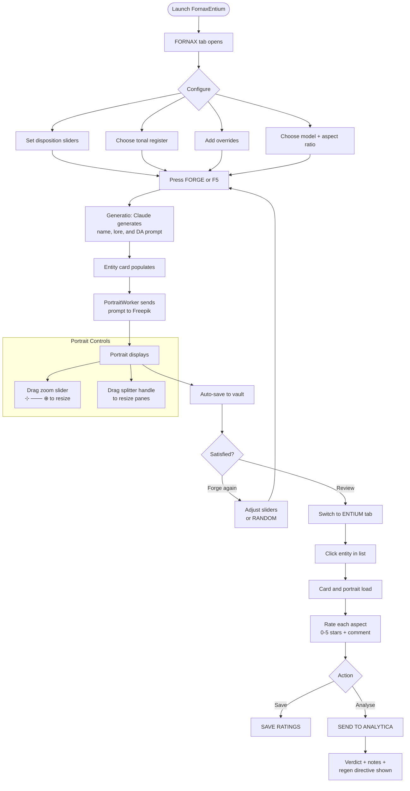

# FornaxEntium
### Entity Forge and Vault browser for the Arca Cognitorium. Generate
### complete Cogniverse entities — including name, lore profile, and
### Freepik portrait — with a single button press. Browse, review, and
### rate saved entities in the Vault. Send ratings to the Analytica for
### structured feedback.

---

## Keyboard Shortcuts

╭────────────────────┬──────────────────────────────────────╮
│ Key / Shortcut     │ Action                               │
├┄┄┄┄┄┄┄┄┄┄┄┄┄┄┄┄┄┄┄┄┼┄┄┄┄┄┄┄┄┄┄┄┄┄┄┄┄┄┄┄┄┄┄┄┄┄┄┄┄┄┄┄┄┄┄┄┄┄┄┤
│ F5                 │ Forge entity                         │
│ Ctrl + Enter       │ Forge entity                         │
╰────────────────────┴──────────────────────────────────────╯

---

## Features

╭──────────────────────────────┬─────────────────────────────────────────────┬────────────────────────────────────────────┬───────────╮
│ Feature                      │ Description                                 │ How to Trigger                             │ Status    │
├┄┄┄┄┄┄┄┄┄┄┄┄┄┄┄┄┄┄┄┄┄┄┄┄┄┄┄┄┄┄┼┄┄┄┄┄┄┄┄┄┄┄┄┄┄┄┄┄┄┄┄┄┄┄┄┄┄┄┄┄┄┄┄┄┄┄┄┄┄┄┄┄┄┄┄┄┼┄┄┄┄┄┄┄┄┄┄┄┄┄┄┄┄┄┄┄┄┄┄┄┄┄┄┄┄┄┄┄┄┄┄┄┄┄┄┄┄┄┄┄┄┼┄┄┄┄┄┄┄┄┄┄┄┤
│ Entity generation            │ Generates complete entity: name, lore,      │ Press FORGE or F5                          │ Working   │
│                              │ role, traits, DA prompt, and portrait        │                                            │           │
├┄┄┄┄┄┄┄┄┄┄┄┄┄┄┄┄┄┄┄┄┄┄┄┄┄┄┄┄┄┄┼┄┄┄┄┄┄┄┄┄┄┄┄┄┄┄┄┄┄┄┄┄┄┄┄┄┄┄┄┄┄┄┄┄┄┄┄┄┄┄┄┄┄┄┄┄┼┄┄┄┄┄┄┄┄┄┄┄┄┄┄┄┄┄┄┄┄┄┄┄┄┄┄┄┄┄┄┄┄┄┄┄┄┄┄┄┄┄┄┄┄┼┄┄┄┄┄┄┄┄┄┄┄┤
│ Tonal register selection     │ Optional DA archetype vocabulary fed to     │ Select from Tonal Register dropdown        │ Working   │
│                              │ Claude as tonal reference                    │                                            │           │
├┄┄┄┄┄┄┄┄┄┄┄┄┄┄┄┄┄┄┄┄┄┄┄┄┄┄┄┄┄┄┼┄┄┄┄┄┄┄┄┄┄┄┄┄┄┄┄┄┄┄┄┄┄┄┄┄┄┄┄┄┄┄┄┄┄┄┄┄┄┄┄┄┄┄┄┄┼┄┄┄┄┄┄┄┄┄┄┄┄┄┄┄┄┄┄┄┄┄┄┄┄┄┄┄┄┄┄┄┄┄┄┄┄┄┄┄┄┄┄┄┄┼┄┄┄┄┄┄┄┄┄┄┄┤
│ Disposition sliders          │ Seven inclinatio axes shaping entity        │ Adjust sliders in sidebar before forging   │ Working   │
│                              │ personality and visual character             │                                            │           │
├┄┄┄┄┄┄┄┄┄┄┄┄┄┄┄┄┄┄┄┄┄┄┄┄┄┄┄┄┄┄┼┄┄┄┄┄┄┄┄┄┄┄┄┄┄┄┄┄┄┄┄┄┄┄┄┄┄┄┄┄┄┄┄┄┄┄┄┄┄┄┄┄┄┄┄┄┼┄┄┄┄┄┄┄┄┄┄┄┄┄┄┄┄┄┄┄┄┄┄┄┄┄┄┄┄┄┄┄┄┄┄┄┄┄┄┄┄┄┄┄┄┼┄┄┄┄┄┄┄┄┄┄┄┤
│ Visual override              │ Free-text field for extra character or      │ Type in Overrides field before forging     │ Working   │
│                              │ visual notes passed to Generatio             │                                            │           │
├┄┄┄┄┄┄┄┄┄┄┄┄┄┄┄┄┄┄┄┄┄┄┄┄┄┄┄┄┄┄┼┄┄┄┄┄┄┄┄┄┄┄┄┄┄┄┄┄┄┄┄┄┄┄┄┄┄┄┄┄┄┄┄┄┄┄┄┄┄┄┄┄┄┄┄┄┼┄┄┄┄┄┄┄┄┄┄┄┄┄┄┄┄┄┄┄┄┄┄┄┄┄┄┄┄┄┄┄┄┄┄┄┄┄┄┄┄┄┄┄┄┼┄┄┄┄┄┄┄┄┄┄┄┤
│ Freepik portrait generation  │ DA prompt sent to Freepik; nine models      │ Fires automatically after entity lore      │ Working   │
│                              │ available                                    │ is generated                               │           │
├┄┄┄┄┄┄┄┄┄┄┄┄┄┄┄┄┄┄┄┄┄┄┄┄┄┄┄┄┄┄┼┄┄┄┄┄┄┄┄┄┄┄┄┄┄┄┄┄┄┄┄┄┄┄┄┄┄┄┄┄┄┄┄┄┄┄┄┄┄┄┄┄┄┄┄┄┼┄┄┄┄┄┄┄┄┄┄┄┄┄┄┄┄┄┄┄┄┄┄┄┄┄┄┄┄┄┄┄┄┄┄┄┄┄┄┄┄┄┄┄┄┼┄┄┄┄┄┄┄┄┄┄┄┤
│ Model + aspect ratio         │ Choose from 9 Freepik models and 4 aspect   │ Select in Portrait section of sidebar      │ Working   │
│                              │ ratios before forging                        │                                            │           │
├┄┄┄┄┄┄┄┄┄┄┄┄┄┄┄┄┄┄┄┄┄┄┄┄┄┄┄┄┄┄┼┄┄┄┄┄┄┄┄┄┄┄┄┄┄┄┄┄┄┄┄┄┄┄┄┄┄┄┄┄┄┄┄┄┄┄┄┄┄┄┄┄┄┄┄┄┼┄┄┄┄┄┄┄┄┄┄┄┄┄┄┄┄┄┄┄┄┄┄┄┄┄┄┄┄┄┄┄┄┄┄┄┄┄┄┄┄┄┄┄┄┼┄┄┄┄┄┄┄┄┄┄┄┤
│ Save default portrait        │ Persists model, aspect ratio, and zoom to   │ Press SAVE DEFAULT PORTRAIT SETTINGS       │ Working   │
│ settings                     │ ~/.arca/fornax_defaults.json; loads on      │ in sidebar                                 │           │
│                              │ next launch                                  │                                            │           │
├┄┄┄┄┄┄┄┄┄┄┄┄┄┄┄┄┄┄┄┄┄┄┄┄┄┄┄┄┄┄┼┄┄┄┄┄┄┄┄┄┄┄┄┄┄┄┄┄┄┄┄┄┄┄┄┄┄┄┄┄┄┄┄┄┄┄┄┄┄┄┄┄┄┄┄┄┼┄┄┄┄┄┄┄┄┄┄┄┄┄┄┄┄┄┄┄┄┄┄┄┄┄┄┄┄┄┄┄┄┄┄┄┄┄┄┄┄┄┄┄┄┼┄┄┄┄┄┄┄┄┄┄┄┤
│ Portrait zoom slider         │ Rescales displayed portrait 20%–200% of     │ Drag slider in action bar (⊹ ─── ⊕)       │ Working   │
│                              │ pane width; non-destructive                  │                                            │           │
├┄┄┄┄┄┄┄┄┄┄┄┄┄┄┄┄┄┄┄┄┄┄┄┄┄┄┄┄┄┄┼┄┄┄┄┄┄┄┄┄┄┄┄┄┄┄┄┄┄┄┄┄┄┄┄┄┄┄┄┄┄┄┄┄┄┄┄┄┄┄┄┄┄┄┄┄┼┄┄┄┄┄┄┄┄┄┄┄┄┄┄┄┄┄┄┄┄┄┄┄┄┄┄┄┄┄┄┄┄┄┄┄┄┄┄┄┄┄┄┄┄┼┄┄┄┄┄┄┄┄┄┄┄┤
│ Portrait / details splitter  │ Vertical handle between portrait and detail  │ Drag the handle between the two panes      │ Working   │
│                              │ panes; resize each freely                    │                                            │           │
├┄┄┄┄┄┄┄┄┄┄┄┄┄┄┄┄┄┄┄┄┄┄┄┄┄┄┄┄┄┄┼┄┄┄┄┄┄┄┄┄┄┄┄┄┄┄┄┄┄┄┄┄┄┄┄┄┄┄┄┄┄┄┄┄┄┄┄┄┄┄┄┄┄┄┄┄┼┄┄┄┄┄┄┄┄┄┄┄┄┄┄┄┄┄┄┄┄┄┄┄┄┄┄┄┄┄┄┄┄┄┄┄┄┄┄┄┄┄┄┄┄┼┄┄┄┄┄┄┄┄┄┄┄┤
│ Entity card display          │ Shows name, glyph, title, portrait, role,   │ Populates automatically during generation  │ Working   │
│                              │ era, purpose, origin, nature, aura,          │                                            │           │
│                              │ keywords, and traits                         │                                            │           │
├┄┄┄┄┄┄┄┄┄┄┄┄┄┄┄┄┄┄┄┄┄┄┄┄┄┄┄┄┄┄┼┄┄┄┄┄┄┄┄┄┄┄┄┄┄┄┄┄┄┄┄┄┄┄┄┄┄┄┄┄┄┄┄┄┄┄┄┄┄┄┄┄┄┄┄┄┼┄┄┄┄┄┄┄┄┄┄┄┄┄┄┄┄┄┄┄┄┄┄┄┄┄┄┄┄┄┄┄┄┄┄┄┄┄┄┄┄┄┄┄┄┼┄┄┄┄┄┄┄┄┄┄┄┤
│ Randomize                    │ Randomises all sliders; clears register      │ Press RANDOM in action bar                 │ Working   │
│                              │ and overrides                                │                                            │           │
├┄┄┄┄┄┄┄┄┄┄┄┄┄┄┄┄┄┄┄┄┄┄┄┄┄┄┄┄┄┄┼┄┄┄┄┄┄┄┄┄┄┄┄┄┄┄┄┄┄┄┄┄┄┄┄┄┄┄┄┄┄┄┄┄┄┄┄┄┄┄┄┄┄┄┄┄┼┄┄┄┄┄┄┄┄┄┄┄┄┄┄┄┄┄┄┄┄┄┄┄┄┄┄┄┄┄┄┄┄┄┄┄┄┄┄┄┄┄┄┄┄┼┄┄┄┄┄┄┄┄┄┄┄┤
│ Copy prompt                  │ Copies assembled DA image prompt to          │ Press COPY PROMPT in action bar            │ Working   │
│                              │ clipboard                                    │                                            │           │
├┄┄┄┄┄┄┄┄┄┄┄┄┄┄┄┄┄┄┄┄┄┄┄┄┄┄┄┄┄┄┼┄┄┄┄┄┄┄┄┄┄┄┄┄┄┄┄┄┄┄┄┄┄┄┄┄┄┄┄┄┄┄┄┄┄┄┄┄┄┄┄┄┄┄┄┄┼┄┄┄┄┄┄┄┄┄┄┄┄┄┄┄┄┄┄┄┄┄┄┄┄┄┄┄┄┄┄┄┄┄┄┄┄┄┄┄┄┄┄┄┄┼┄┄┄┄┄┄┄┄┄┄┄┤
│ Vault auto-save              │ Saves entity.json and portrait.png to a      │ Automatic on portrait completion           │ Working   │
│                              │ timestamped vault directory                  │                                            │           │
├┄┄┄┄┄┄┄┄┄┄┄┄┄┄┄┄┄┄┄┄┄┄┄┄┄┄┄┄┄┄┼┄┄┄┄┄┄┄┄┄┄┄┄┄┄┄┄┄┄┄┄┄┄┄┄┄┄┄┄┄┄┄┄┄┄┄┄┄┄┄┄┄┄┄┄┄┼┄┄┄┄┄┄┄┄┄┄┄┄┄┄┄┄┄┄┄┄┄┄┄┄┄┄┄┄┄┄┄┄┄┄┄┄┄┄┄┄┄┄┄┄┼┄┄┄┄┄┄┄┄┄┄┄┤
│ Vault browser                │ Lists all saved entities newest-first;       │ Switch to ENTIUM tab                       │ Working   │
│                              │ click any entry to load its card             │                                            │           │
├┄┄┄┄┄┄┄┄┄┄┄┄┄┄┄┄┄┄┄┄┄┄┄┄┄┄┄┄┄┄┼┄┄┄┄┄┄┄┄┄┄┄┄┄┄┄┄┄┄┄┄┄┄┄┄┄┄┄┄┄┄┄┄┄┄┄┄┄┄┄┄┄┄┄┄┄┼┄┄┄┄┄┄┄┄┄┄┄┄┄┄┄┄┄┄┄┄┄┄┄┄┄┄┄┄┄┄┄┄┄┄┄┄┄┄┄┄┄┄┄┄┼┄┄┄┄┄┄┄┄┄┄┄┤
│ Per-aspect ratings           │ Rate Name, Portrait, Purpose, Lore, and      │ Use star spinboxes and comment fields      │ Working   │
│                              │ Traits 0–5 stars with optional comment       │ in ENTIUM rating panel                     │           │
├┄┄┄┄┄┄┄┄┄┄┄┄┄┄┄┄┄┄┄┄┄┄┄┄┄┄┄┄┄┄┼┄┄┄┄┄┄┄┄┄┄┄┄┄┄┄┄┄┄┄┄┄┄┄┄┄┄┄┄┄┄┄┄┄┄┄┄┄┄┄┄┄┄┄┄┄┼┄┄┄┄┄┄┄┄┄┄┄┄┄┄┄┄┄┄┄┄┄┄┄┄┄┄┄┄┄┄┄┄┄┄┄┄┄┄┄┄┄┄┄┄┼┄┄┄┄┄┄┄┄┄┄┄┤
│ Save ratings                 │ Writes ratings to ratings.json in the        │ Press SAVE RATINGS in ENTIUM panel         │ Working   │
│                              │ entity's vault directory                     │                                            │           │
├┄┄┄┄┄┄┄┄┄┄┄┄┄┄┄┄┄┄┄┄┄┄┄┄┄┄┄┄┄┄┼┄┄┄┄┄┄┄┄┄┄┄┄┄┄┄┄┄┄┄┄┄┄┄┄┄┄┄┄┄┄┄┄┄┄┄┄┄┄┄┄┄┄┄┄┄┼┄┄┄┄┄┄┄┄┄┄┄┄┄┄┄┄┄┄┄┄┄┄┄┄┄┄┄┄┄┄┄┄┄┄┄┄┄┄┄┄┄┄┄┄┼┄┄┄┄┄┄┄┄┄┄┄┤
│ Analytica review             │ Sends entity and ratings to Claude;          │ Press SEND TO ANALYTICA                    │ Working   │
│                              │ returns verdict, per-aspect notes, and a     │                                            │           │
│                              │ regeneration directive                       │                                            │           │
├┄┄┄┄┄┄┄┄┄┄┄┄┄┄┄┄┄┄┄┄┄┄┄┄┄┄┄┄┄┄┼┄┄┄┄┄┄┄┄┄┄┄┄┄┄┄┄┄┄┄┄┄┄┄┄┄┄┄┄┄┄┄┄┄┄┄┄┄┄┄┄┄┄┄┄┄┼┄┄┄┄┄┄┄┄┄┄┄┄┄┄┄┄┄┄┄┄┄┄┄┄┄┄┄┄┄┄┄┄┄┄┄┄┄┄┄┄┄┄┄┄┼┄┄┄┄┄┄┄┄┄┄┄┤
│ Used names tracking          │ Prevents name repetition across all          │ Automatic — no action required             │ Working   │
│                              │ sessions                                     │                                            │           │
╰──────────────────────────────┴─────────────────────────────────────────────┴────────────────────────────────────────────┴───────────╯

---

## Usage Flowchart



---

## Vision & Purpose

FornaxEntium exists to make entity creation for the Arca Cognitorium a
single action. The full pipeline — generation, naming, lore, and
portrait — fires in one sequence and lands on screen as a complete card.
The Vault gives every generated entity a permanent home where it can be
reviewed, rated, and submitted for structured analysis. The intent is to
build a corpus of Cogniverse inhabitants efficiently, with quality
feedback built into the process rather than appended after the fact.

---

## File & Folder Map

```
EntitexRefined/
├── FornaxEntium.py          — application entry point (single file)
├── vault/                   — generated entity archive
│   └── YYYYMMDD_HHMMSS_slug/
│       ├── entity.json      — full entity data
│       ├── portrait.png     — Freepik portrait
│       └── ratings.json     — ratings, comments, Analytica response
├── temp_portraits/          — transient portrait files during generation
├── fornax_log.json          — generation log (last 200 entries)
└── used_names.json          — registry of all ratified entity names

~/.arca/
└── fornax_defaults.json     — saved model index, aspect ratio, zoom
```

---

## Features & Functions

### Entity Generation

One button press triggers the full sequence. The card populates as data
arrives — the user does not wait for a pipeline to finish before seeing
results.

The Generatio worker builds a prompt from the inclinatio slider values,
the optional tonal vocabulary block, and any text in the Overrides field.
Claude returns a single JSON object containing the entity name, role,
title, glyph, colour hex, purpose, lore blocks, trait values, domain
keywords, and a complete Devoted Absurd image generation prompt. The card
begins populating immediately from these fields.

As soon as the lore data is received, the Portrait worker takes the
assembled image prompt and submits it to the chosen Freepik endpoint.
On completion, the image is written to `temp_portraits/` and displayed
on the card. The entity is then written to the vault.

### Disposition Sliders

Seven sliders define the entity's inclinatio before Claude receives
anything. The axes are Disposition, Register, Presence, Opacity,
Stability, Temporality, and Legibility. Each slider position maps to a
label string that is passed to Claude as directive text. The sliders
inform generation; they do not deterministically constrain it.

### Tonal Register

The optional dropdown selects a Devoted Absurd archetype vocabulary
block and passes it to Claude as tonal reference. Claude synthesises
from it rather than copying it. Selecting Random / Blind omits the block
entirely, leaving generation unconstrained by any archetype.

### Visual Override

A free-text area whose contents are appended to the generation prompt.
Use it for specific details the sliders cannot express: particular props,
clothing, setting notes, or explicit visual constraints.

### Portrait Controls

The portrait pane and the details pane sit inside a vertical QSplitter.
The handle between them has a visible gold border and highlights amber
on hover. Drag it to redistribute vertical space between the two panes.

The zoom slider in the action bar rescales the displayed image from 20%
to 200% of the pane width. The original pixmap is stored in memory on
load; every scale operation re-derives from it, so there is no quality
loss from repeated rescaling.

### Save Default Portrait Settings

The button at the bottom of the sidebar saves the current Freepik model
index, aspect ratio index, and zoom level to
`~/.arca/fornax_defaults.json`. These three values are restored
automatically on the next launch.

### Randomize

Randomises all seven disposition sliders, resets the tonal register to
Random / Blind, and clears the override field. Does not immediately
forge — it only prepares the inputs.

### Vault Browser (ENTIUM Tab)

Switching to ENTIUM refreshes the vault list automatically. All entries
appear newest-first. Clicking an entry loads the entity card and
portrait. If `ratings.json` exists for that entry, the rating spinboxes
and comment fields are pre-populated with the saved values.

### Per-Aspect Ratings

Five aspects can each be rated 0–5 stars with an optional comment: Name,
Portrait, Purpose, Lore Blocks, and Traits. The rating dict updates in
real time as spinboxes and comment fields change. SAVE RATINGS writes the
current state to `ratings.json` in the vault entry directory.

### Analytica Review

SEND TO ANALYTICA submits the entity profile and all ratings to a Claude
instance running the Analytica system prompt. The response contains a
lore-register verdict written as the Tower, per-aspect notes for any
rated aspect, and a single regeneration directive. The response is
embedded in the `ratings.json` file on save.

---

## Logic

### Architecture

FornaxEntium is a single-file PyQt6 application. The two visible tabs
share the `EntityCard` widget class — the same component renders in both
FORNAX and ENTIUM. Three ClaudeBox instances run with independent locks:
one for generation, one for Analytica reviews. A Freepik API call runs
in a third worker. All background work runs in `QThread` workers and
emits signals back to the main thread for all UI updates.

### Generation Sequence

1. `GeneratioWorker` fires. It builds a user message from slider values,
   optional vocabulary, and any override text, then calls `_gen_box`.
2. Claude responds with a JSON block. The parser extracts the entity
   dict and emits it to the main thread.
3. The entity name is recorded in `used_names.json`.
4. The main thread populates the card and immediately fires
   `PortraitWorker` with the `assembled_prompt` field.
5. `PortraitWorker` selects the correct endpoint and payload shape for
   the chosen model, posts to Freepik, polls until complete, decodes the
   base64 image, and writes it to `temp_portraits/`.
6. On portrait completion, `_vault_save()` writes `entity.json` and
   copies the portrait to a new timestamped vault directory.

### Portrait Scaling

`set_portrait()` stores the raw `QPixmap` as `_raw_pixmap`. Every call
to `_apply_portrait_scale()` scales `_raw_pixmap` to
`pane_width * scale / 100` and assigns the result to `portrait_label`.
The raw pixmap is never modified.

### Freepik Integration

`_fp_post()` and `_fp_poll()` are imported from `Entitex.py`. They
prepend `FREEPIK_API_BASE = https://api.freepik.com/v1` to path strings.
The `FREEPIK_MODELS` table in FornaxEntium overrides the one from
Entitex.py and defines all nine models with their correct POST and task
poll paths. Classic Fast is the only synchronous model.

---

## Input / Output & File Types

```
Input
  ├── CLAUDE_API_KEY
  │     environment variable — ClaudeBox authentication
  ├── FREEPIK_API_KEY
  │     environment variable — Freepik API authentication
  └── ~/.arca/fornax_defaults.json
        JSON — saved model index, aspect ratio index, zoom level

Output
  ├── vault/{timestamp}_{slug}/entity.json
  │     JSON — complete entity data
  ├── vault/{timestamp}_{slug}/portrait.png
  │     PNG  — Freepik portrait
  ├── vault/{timestamp}_{slug}/ratings.json
  │     JSON — star ratings, comments, Analytica response
  ├── temp_portraits/portrait_{ms}.png
  │     PNG  — transient working file, overwritten each run
  ├── fornax_log.json
  │     JSON — generation log, last 200 entries
  ├── used_names.json
  │     JSON — list of all ratified entity names
  └── ~/.arca/fornax_defaults.json
        JSON — model index, aspect ratio index, zoom level
```
