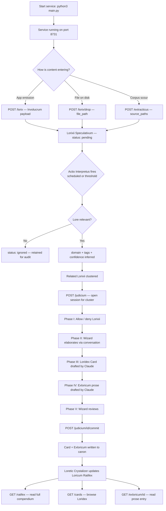

# EXVACUA LORICUM
### Lore canon memory service for the Arca Cognitorium. Accepts emissions from
all Exocognii apps, classifies lore-relevant content via Claude, and presents
it for Wizard ratification through the five-phase Judicium ceremony. Ratified
content is written to the living Loricum Ratifex compendium.

---

╭──────────────────────────────┬───────────────────────────────────────────────╮
│ Key / Shortcut               │ Action                                        │
├┄┄┄┄┄┄┄┄┄┄┄┄┄┄┄┄┄┄┄┄┄┄┄┄┄┄┄┄┄┄┼┄┄┄┄┄┄┄┄┄┄┄┄┄┄┄┄┄┄┄┄┄┄┄┄┄┄┄┄┄┄┄┄┄┄┄┄┄┄┄┄┄┄┄┄┄┄┄┤
│ (No keyboard interface)      │ Service operated entirely via HTTP API        │
╰──────────────────────────────┴───────────────────────────────────────────────╯

---

╭────────────────────────────┬──────────────────────────────────┬──────────────────────────────────────┬────────────╮
│ Feature                    │ Description                      │ How to Trigger                       │ Status     │
├┄┄┄┄┄┄┄┄┄┄┄┄┄┄┄┄┄┄┄┄┄┄┄┄┄┄┄┄┼┄┄┄┄┄┄┄┄┄┄┄┄┄┄┄┄┄┄┄┄┄┄┄┄┄┄┄┄┄┄┄┄┄┄┼┄┄┄┄┄┄┄┄┄┄┄┄┄┄┄┄┄┄┄┄┄┄┄┄┄┄┄┄┄┄┄┄┄┄┄┄┄┄┼┄┄┄┄┄┄┄┄┄┄┄┄┤
│ Involucrum ingestion        │ Accepts app emissions via POST   │ POST /lorix (any Exocognii app)      │ Working    │
│ File drop ingestion         │ Reads a file from disk by path   │ POST /lorix/drop with file_path      │ Working    │
│ Lorixii Extractuum          │ Crawls source paths for content  │ POST /extracticus with source_paths  │ Working    │
│ Actio Interpretus           │ Claude classifies pending Lorixii│ Scheduled; POST /interpretus manual  │ Working    │
│ Lorixii clustering          │ Groups related Lorixii by domain │ Runs inside Actio Interpretus pass   │ Working    │
│ Judicium — Phase I          │ Allow / deny Lorixii in cluster  │ POST /judicium then /advance         │ Working    │
│ Judicium — Phase II         │ Wizard elaboration conversation  │ POST /judicium/{id}/advance          │ Working    │
│ Judicium — Phase III        │ Loridex Card drafted by Claude   │ Advance from Phase II                │ Working    │
│ Judicium — Phase IV         │ Exloricum prose drafted by Claude│ Advance from Phase III               │ Working    │
│ Judicium — Phase V          │ Sacramentum Finalitus — commit   │ POST /judicium/{id}/commit           │ Working    │
│ Loretic Crystalizer         │ Updates Loricum Ratifex on commit│ Fires automatically after commit     │ Working    │
│ Loridex Card storage        │ SQLite + .md file on disk        │ Produced at Sacramentum Finalitus    │ Working    │
│ Exloricum storage           │ SQLite + .md file on disk        │ Produced at Sacramentum Finalitus    │ Working    │
│ Loricum Ratifex             │ Master compendium .md on disk    │ Read via GET /ratifex                │ Working    │
│ Direct Exloricum edit       │ Wizard edits prose body          │ PUT /exloricum/{id}                  │ Working    │
│ Direct Ratifex section edit │ Wizard edits a domain section    │ PUT /ratifex/section/{domain}        │ Working    │
│ Arx Loricuum taxonomy       │ Domain and tag register          │ GET/POST /loricuum                   │ Working    │
│ Actio Revisicus             │ Flag card for revision           │ POST /revisicus/{card_id}            │ Working    │
│ Drift threshold config      │ Tunable via Configuus            │ Edit ~/.arca/config.json             │ Working    │
│ .wiz rendered output        │ Styled document rendering        │ Not yet built                        │ Partial    │
│ Judicium UI                 │ Interactive ratification panel   │ Not yet built — Session B            │ Partial    │
╰────────────────────────────┴──────────────────────────────────┴──────────────────────────────────────┴────────────╯

---



---

## VISION & PURPOSE

Exvacua Loricum exists because the Cogniverse generates lore incidentally and
continuously, and without a system to catch it, it is lost. Every conversation
about the Tower, every name ratified, every cosmological principle decided
leaves a trace — but only if something is watching. Exvacua Loricum watches.
It accumulates without friction and asks the Wizard for judgment only at the
moment that judgment is meaningful: the ratification ceremony. The result is
a living canon that grows from inhabitation rather than from deliberate effort.

---

## FILE & FOLDER MAP

```
Exocognii/ExvacuaLoricum/
├── main.py              — FastAPI app entry point, router registration, lifespan
├── config.py            — Configuus loader, defaults, module-level singleton
├── db.py                — SQLite schema, init_db(), get_db(), row_to_dict()
├── interpretus.py       — Actio Interpretus: Claude classification + clustering
├── scheduler.py         — Background heartbeat + threshold trigger
├── crystalizer.py       — Loretic Crystalizer: Ratifex updater post-commit
├── requirements.txt     — fastapi, uvicorn, pydantic
└── routers/
    ├── __init__.py
    ├── lorixii.py       — /lorix, /lorix/drop, /extracticus, /lorixii, /lorix/{id}
    ├── canon.py         — /cards, /card/{id}, /exlorica, /exloricum/{id}
    ├── ratifex.py       — /ratifex, /ratifex/section/{domain}
    ├── loricuum.py      — /loricuum, /loricuum/domain, /loricuum/tag
    ├── judicium.py      — /judicium, /judicium/{id}/advance, /commit, /revisicus
    └── interpretus.py   — /interpretus, /interpretus/status

~/.arca/
    exvacua_loricum.db          — SQLite database
    exvacua_loricum/
        loricum_ratifex.md      — master lore compendium
        exlorica/
            {uuid}.md           — one .md file per ratified Exloricum
```

---

## FEATURES & FUNCTIONS

### Involucrum Ingestion

Any Exocognii app can emit a Lorix by POSTing an Involucrum envelope to
`/lorix`. The envelope carries the app name, an optional hint, and a body.
The body is stored as raw content in the Lorixii Speculativum with status
`pending`. The service never blocks the emitting app — the call is
fire-and-forget from the app's perspective.

### File Drop & Lorixii Extractuum

Two pathways exist for bringing existing content into the system. A file drop
(`POST /lorix/drop`) reads a single file from a path the Wizard provides and
ingests its content as a single Lorix. The Lorixii Extractuum (`POST
/extracticus`) crawls one or more source paths recursively, reading all
recognised text file types and ingesting each as a separate Lorix. Both run
as background tasks and return immediately.

### Actio Interpretus

The classification engine. Runs on a configurable schedule (default 10
minutes) and fires early when pending Lorixii count crosses the threshold
(default 20). For each pending Lorix, Actio Interpretus sends the raw content
to Claude with a structured prompt asking it to determine lore-relevance,
confidence level, domain, and tags. Content judged not lore-relevant is
marked `ignored` — never deleted. Content judged lore-relevant remains
`pending` with updated classification fields. After classification, the engine
clusters pending Lorixii by inferred domain and updates `related_lorixii`
links between them.

### Judicium Exlorica

The five-phase ratification ceremony. Opened with `POST /judicium` for a
topic cluster, passing the Lorixii IDs to include. Phases advance via `POST
/judicium/{id}/advance` with phase-appropriate payload.

Phase I (Obscuranda Necessitum) — the Wizard allows or denies individual
Lorixii from the cluster. Denied Lorixii are marked rejected at commit.

Phase II (Colloquium Elucidativum) — conversational. The Wizard can elaborate,
correct context, or add information. This conversation feeds into the Claude
drafting passes.

Phase III (Ostensio Loridexii) — Claude drafts a Loridex Card: title, domain,
tags, and one-paragraph summary. The Wizard can edit all fields before
advancing.

Phase IV (Exlorica Methodicum) — Claude drafts the full Exloricum prose from
the allowed Lorixii and the Phase II conversation. The Wizard can replace the
body entirely before advancing.

Phase V (Sacramentum Finalitus) — `POST /judicium/{id}/commit`. Writes the
Loridex Card and Exloricum to canon. Marks allowed Lorixii as consumed.
Triggers the Loretic Crystalizer.

### Loretic Crystalizer

Fires automatically after every Sacramentum Finalitus. Reads the ratified
card's domain, locates the corresponding section in the Loricum Ratifex,
checks for wizard provenance comments (indicating direct Wizard edits), and
surgically updates or appends the new entry. Wizard-authored sections are not
overwritten — the new entry is appended below. Version counter increments on
every change.

### Direct Editing

The Wizard can edit Exloricum prose directly via `PUT /exloricum/{id}` with a
full replacement body. The `.md` file on disk is updated, the card is flagged
for revision awareness, and the Ratifex version counter increments. Domain
sections of the Loricum Ratifex can be edited directly via
`PUT /ratifex/section/{domain}` — edits are annotated with a wizard provenance
comment so the Crystalizer will not silently overwrite them.

### Arx Loricuum Taxonomy

The domain and tag register. Ten domains are seeded at initialisation:
entities, cosmology, tower_mechanics, history, places, artefacts, rituals,
language, factions, wizard. New domains and tags can be proposed by the system
(via Actio Interpretus) or by the Wizard. All entries are Wizard-governable
via `PUT /loricuum/{id}`.

---

## LOGIC

The service initialises by creating the SQLite database (if absent), seeding
the ten default domains into Arx Loricuum, and starting the background
scheduler coroutine. The scheduler runs an async loop, checking pending Lorixii
count every 30 seconds and firing Actio Interpretus when the threshold is
crossed or the interval has elapsed.

All API routes share a single SQLite database via the `get_db()` context
manager, which opens a connection per request, sets WAL journal mode, and
commits or rolls back on exit. JSON fields stored as text are automatically
deserialised by `row_to_dict()`.

Actio Interpretus sends each pending Lorix to Claude individually, strips any
markdown fencing from the response, parses the JSON result, and writes the
classification back to the database. After all classifications, a clustering
pass groups pending Lorixii by inferred domain and updates `related_lorixii`
arrays. A log entry is written for every pass regardless of outcome.

The Judicium ceremony holds all working state in the `phase_data` JSON field
of the session record. Phase payloads merge into this field at each advance
call, so the full session history is always available. The commit operation
runs as a FastAPI background task — the endpoint returns immediately and the
canon write, Exloricum file creation, and Crystalizer pass complete
asynchronously.

---

## INPUT / OUTPUT & FILE TYPES

```
Input
  ├── POST /lorix          — JSON Involucrum envelope from any app
  ├── POST /lorix/drop     — file path; reads .md .txt .py .json .yaml .wiz .rst
  ├── POST /extracticus    — directory paths; crawls recursively for text files
  └── PUT  /exloricum/{id} — Wizard prose body (plain text)

Output
  ├── ~/.arca/exvacua_loricum.db          — SQLite database (all structured data)
  ├── ~/.arca/exvacua_loricum/
  │   ├── loricum_ratifex.md              — master lore compendium (Markdown)
  │   └── exlorica/{uuid}.md              — one file per ratified Exloricum

Config
  └── ~/.arca/config.json
        exvacua_loricum_db       — path to SQLite database
        exvacua_loricum_store    — path to file storage directory
        exvacua_loricum.interpretus_interval   — seconds between passes (default 600)
        exvacua_loricum.interpretus_threshold  — pending count to trigger early (default 20)
        port                     — service port (default 8731)
```
