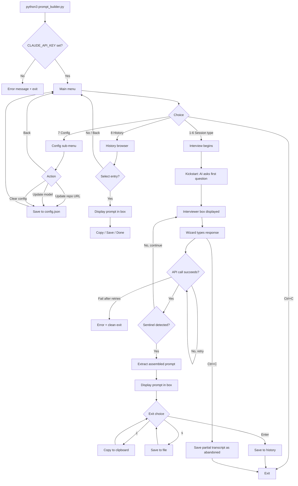

# INCITAMENTUM
### AI-conducted interview tool that constructs Builder session prompts for the Arca Cognitorium

---

## Keyboard & Shortcut Reference

| Key | Action |
|---|---|
| `1` – `6` | Select session type from main menu |
| `7` | Open config sub-menu |
| `8` | Open history browser |
| `Enter` (blank input) | Trigger re-prompt warning in interview; confirm exit at output stage |
| `c` | Copy assembled prompt to clipboard (output stage) |
| `s` | Save assembled prompt to file (output stage) |
| `Ctrl+C` | Cancel at any point — partial transcript saved to history as abandoned |

---

## Features

| Feature | Description | How to Trigger | Status |
|---|---|---|---|
| AI Interviewer | ClaudeBox-powered multi-turn interview. One focused question at a time. | Select any session type | Working |
| Live token streaming | AI responses stream character-by-character to the terminal as they arrive | Automatic during interview | Working |
| Six session types | ::INIT · ::THEORY · ::LORE · ::AUDIT · ::BUILD · ::REVIEW — each tailored to its Builder state | Options 1–6 on main menu | Working |
| Sentinel assembly | AI signals readiness autonomously via `<<<PROMPT_READY>>>` — no Wizard input needed to trigger assembly | Automatic when AI has enough context | Working |
| Config persistence | Repo URL and model stored in `~/.arca/config.json` | Option 7 on main menu | Working |
| Prompt history | Last 50 completed and abandoned prompts with timestamps, stored in `~/.arca/history.json` | Automatic after each session | Working |
| History browser | View, select, and re-use any past prompt | Option 8 on main menu | Working |
| Clipboard copy | Copy assembled prompt via xclip. Degrades gracefully if xclip is absent | `c` at output stage | Working |
| File save | Write assembled prompt to any path | `s` at output stage | Working |
| Cancel recovery | Ctrl+C mid-interview saves partial transcript as abandoned | `Ctrl+C` | Working |
| API retry | Up to 2 retries with backoff on API failure | Automatic | Working |
| Turn limit guard | Forces prompt assembly after 12 turns to prevent runaway interviews | Automatic | Working |

---

## Usage Flowchart



---

## Vision & Purpose

INCITAMENTUM is the AI-powered session prompt constructor for the Arca Cognitorium development environment. Where v1 assembled prompts from template interpolation, v2 puts an AI Interviewer in the conversation. The Wizard selects a session type, and the Interviewer conducts a focused multi-turn dialogue — one question at a time — to extract scope, constraints, and focus, then assembles a complete, unambiguous Builder session prompt ready to paste. It exists because the quality of a Builder session is determined entirely by the quality of its opening prompt, and a vague prompt produces a vague session.

---

## File & Folder Map

```
incitamentum/
├── prompt_builder.py     — entry point, main loop, menu dispatch, config and history handlers
├── interviewer.py        — AI interview engine, ClaudeBox session lifecycle, multi-turn stream loop
├── renderer.py           — all terminal output, ANSI palette, header, boxes, streaming display
├── config.py             — config and history persistence, load/save, defaults, entry construction
├── session_types.py      — session type registry, labels, descriptions, system prompt fragments
├── output.py             — final prompt display, file write, xclip clipboard, exit loop
└── INCITAMENTUM_DOC.md   — this document

~/.arca/
├── config.json           — repo_url, model preference
└── history.json          — array of last 50 prompt entries
```

---

## Features & Functions

### AI Interviewer

The core of INCITAMENTUM. When the Wizard selects a session type, `Interviewer.run()` creates a ClaudeBox instance seeded with a system prompt built from the session type's `system_frag` plus injected config context (repo URL). A silent kickstart message starts the interview; from that point the Wizard only sees questions and answers. The Interviewer asks one focused question at a time and builds understanding across turns without restating what has already been established.

### Live Token Streaming

AI responses arrive through `box.stream()`, a synchronous generator. `renderer.stream_tokens()` consumes the iterator and prints each character immediately to stdout, with soft wrapping at the terminal edge. The effect is a typewriter output inside the Interviewer box.

### Sentinel Assembly

The Interviewer's system prompt instructs the AI to end the interview autonomously by emitting `<<<PROMPT_READY>>>` followed by the assembled prompt wrapped in `<<<PROMPT_START>>>` and `<<<PROMPT_END>>>` markers. The Wizard never signals readiness — the AI decides when it has enough. `_extract_prompt()` strips the markers and returns the clean prompt block. If markers are malformed, the AI is asked to retry once.

### Session Types

Six session types, each stored in `session_types.py` as a dict with a key, label, description, and `system_frag`. The fragment is injected into the Interviewer system prompt to tailor the interview for that state's specific information needs. Types map directly to the Builder's six canonical session states: `::INIT`, `::THEORY`, `::LORE`, `::AUDIT`, `::BUILD`, `::REVIEW`.

### Config Persistence

`config.py` reads and writes `~/.arca/config.json`. On load, missing keys are filled from `DEFAULTS` (repo URL and model). On save failure — permissions, disk error — the session continues with in-memory config and a warning. Corruption is handled the same way: fall back to defaults, warn, continue.

### Prompt History

After every session — completed or abandoned — an entry is appended to `~/.arca/history.json` via `append_history()`. The list is trimmed to 50 entries. Each entry carries a timestamp, session key, session label, the prompt text, and a status of `complete` or `abandoned`. The history browser (option 8) displays the 20 most recent in reverse chronological order with a first-line preview.

### Cancel Recovery

`KeyboardInterrupt` is caught at `Interviewer.run()`'s boundary. If any turns have completed, the partial transcript — alternating role/content pairs from `self.transcript` — is formatted and appended to history as `abandoned`. No traceback. No crash. Clean exit.

### API Retry

On any exception from `box.stream()`, `_stream_turn()` retries up to `MAX_RETRIES` (2) times with `RETRY_BACKOFF_S` (2.0s) linear backoff. After exhaustion, `InterviewerFailed` is raised, caught in `run()`, and surfaced as a clean error message with remediation guidance.

---

## Logic

### Overall Architecture

Six modules with explicit boundaries. `prompt_builder.py` owns the main loop and dispatches to subsystems. It holds no display logic and no AI logic — only orchestration. `renderer.py` owns every terminal write; nothing else calls `print()` directly. `interviewer.py` owns the ClaudeBox instance and the conversation; it calls `renderer` for display but makes no decisions about the final output. `output.py` owns the prompt's three exit paths. `config.py` and `session_types.py` are pure data — no side effects beyond filesystem reads and writes.

### Interview Loop

The loop in `_interview_loop()` is driven by accumulated response strings, not by event callbacks. `_stream_turn()` opens a stream, pipes tokens through `renderer.stream_tokens()`, and returns the full concatenated string. The loop checks that string for `PROMPT_READY_SENTINEL`. If absent, it renders the AI's text in the Interviewer box, collects Wizard input, appends to `self.transcript`, and calls `_stream_turn()` again. ClaudeBox maintains conversation history internally across calls, so only the new user message is passed per turn — not the full history.

### Prompt Extraction

`_extract_prompt()` is a simple string slice: find `PROMPT_BLOCK_START`, find `PROMPT_BLOCK_END`, return everything between them stripped. If either marker is absent or out of order, it returns an empty string and the caller requests a retry.

### Config Load Strategy

`load_config()` starts with a copy of `DEFAULTS`, then updates it with whatever is in `config.json` if the file exists and is valid JSON. This means partial config files work correctly — only the keys present in the file override defaults, all others stay at their default values.

---

## Input / Output & File Types

```
Input
  ├── stdin (keyboard)         — interactive text — Wizard responses to Interviewer questions
  ├── ~/.arca/config.json      — JSON — repo_url, model
  ├── ~/.arca/history.json     — JSON — array of past prompt entries
  └── CLAUDE_API_KEY env var   — string — Anthropic API key

Output
  ├── stdout                   — ANSI terminal — streamed AI responses, menus, assembled prompt
  ├── ~/.arca/config.json      — JSON — updated on config save
  ├── ~/.arca/history.json     — JSON — appended after every session
  ├── user-specified file      — plain text (.txt or any extension) — assembled prompt
  └── clipboard (xclip)        — plain text — assembled prompt

Configuration
  ├── ~/.arca/config.json      — JSON — repo_url (str), model (str)
  └── ~/.arca/history.json     — JSON — list of {timestamp, session_key, session_label, prompt, status}
```
