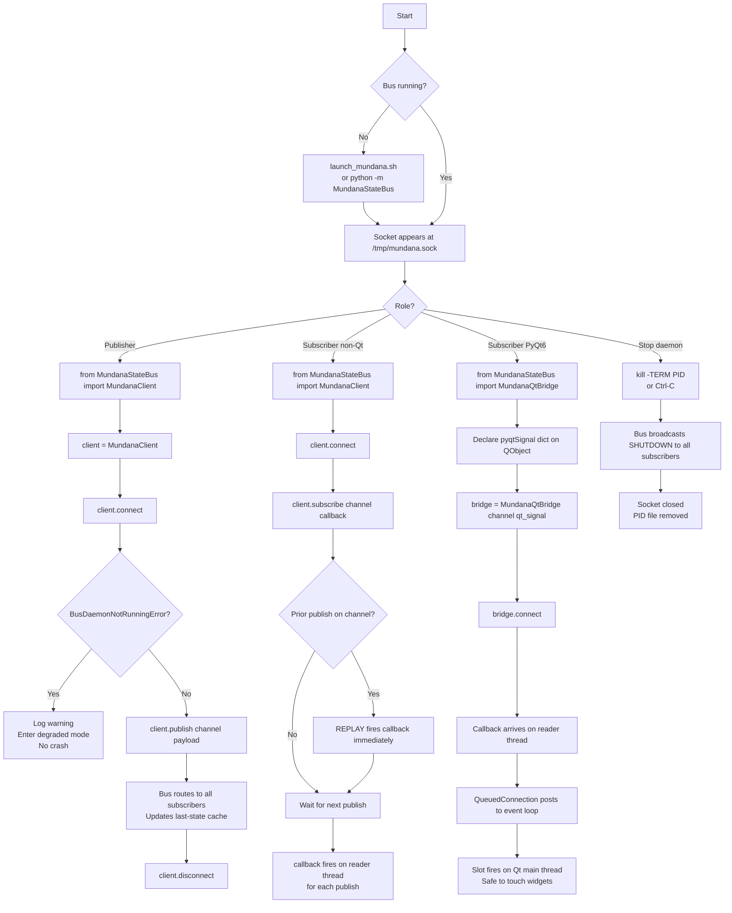

# MundanaStateBus
### The Mundana State Bus is a headless infrastructure daemon and client
### library that connects all Exocognii applications through a Unix
### socket publish/subscribe system. It has no graphical interface. It
### runs in the background, routing live state between processes so that
### applications can share celestial data, token counts, and heartbeats
### without importing each other.

---

## Features

╭──────────────────────────┬─────────────────────────────────────┬────────────────────────────────────────┬───────────╮
│  Feature                 │  Description                        │  How to Trigger                        │  Status   │
├┄┄┄┄┄┄┄┄┄┄┄┄┄┄┄┄┄┄┄┄┄┄┄┄┄┄┼┄┄┄┄┄┄┄┄┄┄┄┄┄┄┄┄┄┄┄┄┄┄┄┄┄┄┄┄┄┄┄┄┄┄┄┄┄┼┄┄┄┄┄┄┄┄┄┄┄┄┄┄┄┄┄┄┄┄┄┄┄┄┄┄┄┄┄┄┄┄┄┄┄┄┄┄┄┄┼┄┄┄┄┄┄┄┄┄┄┄┤
│  Daemon startup          │  Starts the socket server at        │  `python -m MundanaStateBus` or        │  Working  │
│                          │  /tmp/mundana.sock. Writes PID to   │  `bash launch_mundana.sh`              │           │
│                          │  /tmp/mundana.pid.                  │                                        │           │
├┄┄┄┄┄┄┄┄┄┄┄┄┄┄┄┄┄┄┄┄┄┄┄┄┄┄┼┄┄┄┄┄┄┄┄┄┄┄┄┄┄┄┄┄┄┄┄┄┄┄┄┄┄┄┄┄┄┄┄┄┄┄┄┄┼┄┄┄┄┄┄┄┄┄┄┄┄┄┄┄┄┄┄┄┄┄┄┄┄┄┄┄┄┄┄┄┄┄┄┄┄┄┄┄┄┼┄┄┄┄┄┄┄┄┄┄┄┤
│  Publish                 │  Sends a payload dict to a named    │  `client.publish(channel, payload)`    │  Working  │
│                          │  channel. All subscribers on that   │                                        │           │
│                          │  channel receive it.                │                                        │           │
├┄┄┄┄┄┄┄┄┄┄┄┄┄┄┄┄┄┄┄┄┄┄┄┄┄┄┼┄┄┄┄┄┄┄┄┄┄┄┄┄┄┄┄┄┄┄┄┄┄┄┄┄┄┄┄┄┄┄┄┄┄┄┄┄┼┄┄┄┄┄┄┄┄┄┄┄┄┄┄┄┄┄┄┄┄┄┄┄┄┄┄┄┄┄┄┄┄┄┄┄┄┄┄┄┄┼┄┄┄┄┄┄┄┄┄┄┄┤
│  Subscribe               │  Registers a callback for a         │  `client.subscribe(channel, fn)`       │  Working  │
│                          │  channel. Callback fires on every   │                                        │           │
│                          │  publish. Runs on reader thread.    │                                        │           │
├┄┄┄┄┄┄┄┄┄┄┄┄┄┄┄┄┄┄┄┄┄┄┄┄┄┄┼┄┄┄┄┄┄┄┄┄┄┄┄┄┄┄┄┄┄┄┄┄┄┄┄┄┄┄┄┄┄┄┄┄┄┄┄┄┼┄┄┄┄┄┄┄┄┄┄┄┄┄┄┄┄┄┄┄┄┄┄┄┄┄┄┄┄┄┄┄┄┄┄┄┄┄┄┄┄┼┄┄┄┄┄┄┄┄┄┄┄┤
│  Late-join replay        │  A subscriber that connects after   │  Automatic on `subscribe()` if a       │  Working  │
│                          │  the first publish immediately       │  prior publish exists on the channel   │           │
│                          │  receives the last cached payload.  │                                        │           │
├┄┄┄┄┄┄┄┄┄┄┄┄┄┄┄┄┄┄┄┄┄┄┄┄┄┄┼┄┄┄┄┄┄┄┄┄┄┄┄┄┄┄┄┄┄┄┄┄┄┄┄┄┄┄┄┄┄┄┄┄┄┄┄┄┼┄┄┄┄┄┄┄┄┄┄┄┄┄┄┄┄┄┄┄┄┄┄┄┄┄┄┄┄┄┄┄┄┄┄┄┄┄┄┄┄┼┄┄┄┄┄┄┄┄┄┄┄┤
│  Channel manifest        │  All valid channel names declared   │  Import `CHANNELS` from               │  Working  │
│                          │  in `mundana_channels.py`. Unknown  │  `MundanaStateBus`. Unknown names      │           │
│                          │  names raise `BusChannelError`.     │  raise at publish/subscribe call site. │           │
├┄┄┄┄┄┄┄┄┄┄┄┄┄┄┄┄┄┄┄┄┄┄┄┄┄┄┼┄┄┄┄┄┄┄┄┄┄┄┄┄┄┄┄┄┄┄┄┄┄┄┄┄┄┄┄┄┄┄┄┄┄┄┄┄┼┄┄┄┄┄┄┄┄┄┄┄┄┄┄┄┄┄┄┄┄┄┄┄┄┄┄┄┄┄┄┄┄┄┄┄┄┄┄┄┄┼┄┄┄┄┄┄┄┄┄┄┄┤
│  Graceful degradation    │  If the daemon is not running,      │  Automatic. App catches               │  Working  │
│                          │  `connect()` raises                 │  `BusDaemonNotRunningError` and sets   │           │
│                          │  `BusDaemonNotRunningError`.        │  `_bus_active = False`.                │           │
│                          │  App continues with static defaults.│                                        │           │
├┄┄┄┄┄┄┄┄┄┄┄┄┄┄┄┄┄┄┄┄┄┄┄┄┄┄┼┄┄┄┄┄┄┄┄┄┄┄┄┄┄┄┄┄┄┄┄┄┄┄┄┄┄┄┄┄┄┄┄┄┄┄┄┄┼┄┄┄┄┄┄┄┄┄┄┄┄┄┄┄┄┄┄┄┄┄┄┄┄┄┄┄┄┄┄┄┄┄┄┄┄┄┄┄┄┼┄┄┄┄┄┄┄┄┄┄┄┤
│  MundanaQtBridge         │  Wraps MundanaClient for PyQt6      │  Instantiate with channel and          │  Working  │
│                          │  apps. Delivers callbacks on the    │  `qt_signal`. Call `bridge.connect()`. │           │
│                          │  Qt main thread via                 │                                        │           │
│                          │  QueuedConnection.                  │                                        │           │
├┄┄┄┄┄┄┄┄┄┄┄┄┄┄┄┄┄┄┄┄┄┄┄┄┄┄┼┄┄┄┄┄┄┄┄┄┄┄┄┄┄┄┄┄┄┄┄┄┄┄┄┄┄┄┄┄┄┄┄┄┄┄┄┄┼┄┄┄┄┄┄┄┄┄┄┄┄┄┄┄┄┄┄┄┄┄┄┄┄┄┄┄┄┄┄┄┄┄┄┄┄┄┄┄┄┼┄┄┄┄┄┄┄┄┄┄┄┤
│  Clean shutdown          │  SIGTERM or SIGINT broadcasts a     │  `kill -TERM $(cat /tmp/mundana.pid)`  │  Working  │
│                          │  shutdown notice to all subscribers │  or Ctrl-C in foreground.              │           │
│                          │  before the socket closes.         │                                        │           │
├┄┄┄┄┄┄┄┄┄┄┄┄┄┄┄┄┄┄┄┄┄┄┄┄┄┄┼┄┄┄┄┄┄┄┄┄┄┄┄┄┄┄┄┄┄┄┄┄┄┄┄┄┄┄┄┄┄┄┄┄┄┄┄┄┼┄┄┄┄┄┄┄┄┄┄┄┄┄┄┄┄┄┄┄┄┄┄┄┄┄┄┄┄┄┄┄┄┄┄┄┄┄┄┄┄┼┄┄┄┄┄┄┄┄┄┄┄┤
│  Launcher script         │  Shell script for PRAESIDIUM-managed│  `bash launch_mundana.sh`              │  Working  │
│                          │  startup. Guards against double     │                                        │           │
│                          │  launch. Verifies socket on start.  │                                        │           │
╰──────────────────────────┴─────────────────────────────────────┴────────────────────────────────────────┴───────────╯

---

## Usage Flowchart



---

## Vision & Purpose

The Mundana State Bus is the connective tissue of the Exocognii suite.
It exists so that applications can share live state — celestial ticks,
token counts, heartbeats — without knowing each other exists. A
publisher drops a payload and forgets it. Subscribers receive it
regardless of when they started. If the bus is absent, every app
degrades gracefully rather than failing. The bus makes the suite a
coherent organism rather than a collection of isolated processes.

---

## File & Folder Map

```
MundanaStateBus/
├── __init__.py              — public API surface; lazy PyQt6 guard
├── __main__.py              — entry point: installs signals, starts daemon
├── mundana_bus.py           — daemon: socket server, routing, last-state cache
├── mundana_client.py        — client library: MundanaClient class
├── mundana_qt_bridge.py     — PyQt6 thread-safety wrapper: MundanaQtBridge
├── mundana_channels.py      — canonical CHANNELS manifest + BusChannelError
├── requirements.txt         — stdlib only; no third-party deps for core
├── launch_mundana.sh        — shell launcher for PRAESIDIUM-managed start
└── tests/
    ├── __init__.py
    ├── test_channel_manifest.py   — channel validation, BusChannelError
    ├── test_publish_subscribe.py  — end-to-end pub/sub with live daemon
    ├── test_late_join_replay.py   — late subscriber receives last state
    ├── test_client_degraded.py    — BusDaemonNotRunningError, no-op publish
    └── test_qt_bridge.py          — Qt main thread dispatch (requires PyQt6)
```

---

## Features & Functions

### Starting the Daemon

Run `python -m MundanaStateBus` from the `Exocognii/` directory, or
invoke `launch_mundana.sh`. The daemon binds to `/tmp/mundana.sock`,
writes its PID to `/tmp/mundana.pid`, and logs to
`~/.local/share/exocognii/mundana.log`. The launcher script guards
against double-launch and verifies the socket appears within two
seconds.

The daemon does not start automatically when an app calls
`MundanaClient.connect()`. Apps do not start the daemon. PRAESIDIUM
is responsible for starting the daemon when the suite launches.

### Connecting as a Client

Any Exocognii app imports `MundanaClient` and calls `connect()`:

```python
from MundanaStateBus import MundanaClient, BusDaemonNotRunningError

client = MundanaClient()
try:
    client.connect()
except BusDaemonNotRunningError:
    logging.warning("Bus absent — degraded mode")
    self._bus_active = False
```

`connect()` opens the Unix socket and starts a background reader
thread. If the socket does not exist, `BusDaemonNotRunningError` is
raised. The caller must catch it and enter degraded mode.

### Publishing

```python
client.publish("mundana.horologica", {"unix_ts": 1712600000})
```

Validates the channel name against the manifest. Raises
`BusChannelError` immediately on an unknown name. Sends one JSON line
to the daemon; the daemon routes it to all subscribers. `publish()` is
a no-op if `connect()` was never called (e.g. in degraded mode).

### Subscribing (non-Qt)

```python
def on_tick(payload: dict) -> None:
    print(payload["unix_ts"])

client.subscribe("mundana.horologica", on_tick)
```

Registers the callback and sends a SUBSCRIBE message to the daemon.
The daemon immediately sends a REPLAY of the last-known state if one
exists. From then on, the callback fires on the reader thread for each
publish. Do not touch Qt widgets from this callback.

### Subscribing (PyQt6)

```python
class MyWidget(QWidget):
    horologica_tick = pyqtSignal(dict)

    def __init__(self):
        super().__init__()
        self._bridge = MundanaQtBridge(
            channel="mundana.horologica",
            qt_signal=self.horologica_tick,
            parent=self,
        )
        self.horologica_tick.connect(self._on_tick)

    def showEvent(self, event):
        super().showEvent(event)
        try:
            self._bridge.connect()
        except BusDaemonNotRunningError:
            logging.warning("Bus absent")

    def closeEvent(self, event):
        self._bridge.disconnect()
        super().closeEvent(event)

    def _on_tick(self, payload: dict) -> None:
        # Qt main thread — safe to update widgets
        self.label.setText(str(payload["unix_ts"]))
```

`MundanaQtBridge` wraps `MundanaClient`. When the reader thread
receives a message, it emits an internal `_relay` signal via
`QueuedConnection`. The Qt event loop delivers it to the main thread,
which then emits the caller's `qt_signal`. The application slot always
runs on the main thread.

### Channel Manifest

`mundana_channels.py` declares all valid channels:

```
mundana.caelestis      — CAELESTIS celestial engine tick
mundana.resolver       — Celestial Resolver behavioural output
mundana.circadiana     — CIRCADIANA circadian phase
mundana.horologica     — HOROLOGICA system time tick
mundana.meteorologica  — METEOROLOGICA weather state
mundana.solaris        — SOLARIS solar data
mundana.tidalis        — TIDALIS tidal state
mundana.lapsus         — LAPSUS meta-engine drift state
mundana.token_ledger   — Token usage ledger (all apps)
mundana.app_status     — App heartbeat / status
mundana.bus_control    — Bus internal control (shutdown broadcast)
```

Using a name not in this list raises `BusChannelError` at the call
site. New channels require Wizard ratification before being added.

### Graceful Degradation

Every Exocognii app follows this contract:

1. Catch `BusDaemonNotRunningError` on `connect()`.
2. Set `_bus_active = False`.
3. Log one warning line.
4. Gate all publish calls: `if self._bus_active: client.publish(...)`.
5. Display widgets with static defaults.
6. Do not retry. Do not crash. Do not attempt to start the daemon.

### Clean Shutdown

Send SIGTERM to the daemon PID or press Ctrl-C in the foreground
terminal. The daemon broadcasts a `SHUTDOWN` message on
`mundana.bus_control` to all connected subscribers, then closes the
socket and removes the PID file. Subscribers receive the notice via
their reader loop and set `_running = False`.

---

## Logic

The daemon runs a single accept loop in the main process thread. Each
new connection spawns a handler thread that reads newline-delimited
JSON from that socket until the connection closes. The handler calls
`_dispatch()` on each parsed message, which routes to
`_handle_publish()`, `_handle_subscribe()`, or `_handle_unsubscribe()`
according to the `type` field.

`_handle_publish()` acquires `_registry_lock`, updates
`_last_state[channel]`, copies the subscriber socket list, releases
the lock, then calls `_route_message()`. Routing happens outside the
lock to avoid blocking new subscriptions during delivery. Dead sockets
(broken pipe) are collected and removed after the iteration.

`_handle_subscribe()` acquires the lock, appends the socket to the
registry, reads `_last_state[channel]`, releases the lock, sends ACK,
then sends REPLAY if a last state exists.

`MundanaClient` runs a single reader thread after `connect()`. The
reader loop calls `recv(4096)` in a loop, accumulates a string buffer,
splits on `\n`, and dispatches each parsed JSON object. PUBLISH and
REPLAY messages both trigger the registered callbacks for that channel.
ACK messages are silently consumed. SHUTDOWN sets `_running = False`.
SIGTERM is only installed from the main thread in `__main__.py` via
`install_signal_handlers()`. Test fixtures call `bus.stop()` directly.

`MundanaQtBridge` holds one `MundanaClient` and one internal
`pyqtSignal(dict)` wired with `QueuedConnection` to a lambda that
emits the caller's signal. `on_bus_message()` is the callback
registered with the client; it calls `self._relay.emit(payload)` from
the reader thread. Qt posts this to the event queue, the main thread
picks it up, the lambda fires, the caller's signal emits, and the
application slot runs.

---

## Input / Output & File Types

```
Input
  ├── /tmp/mundana.sock        — Unix domain socket — inbound JSON lines from clients
  └── SIGTERM / SIGINT         — OS signal — triggers shutdown sequence

Output
  ├── /tmp/mundana.sock        — Unix domain socket — outbound JSON lines to subscribers
  ├── /tmp/mundana.pid         — plaintext — daemon PID, written on start
  └── ~/.local/share/exocognii/mundana.log  — plaintext — runtime log
```

---

*⟁*

*Ordo Discordia, Cosmos Inania*
*MundanaStateBus-dux.tome.md — v1.0*
