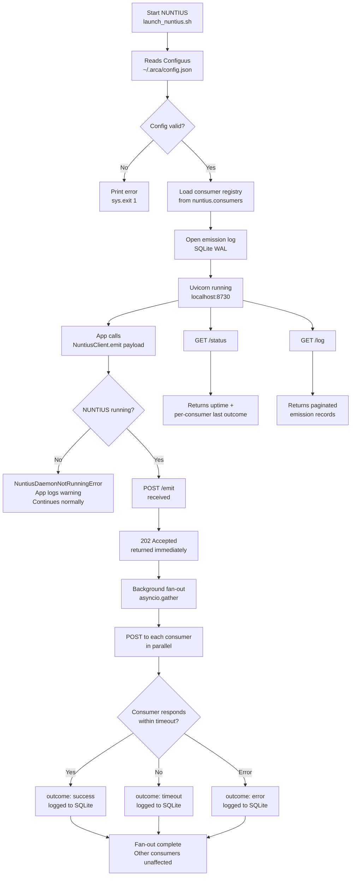

# NUNTIUS
### NUNTIUS is a headless FastAPI message hub that sits between all
### Exocognii desktop applications and their observation consumers.
### Every app in the suite sends one POST to NUNTIUS; NUNTIUS fans
### the payload out to every registered consumer in parallel, records
### the outcome, and returns immediately. No app holds a direct
### reference to any downstream service.

---

## Features

╭──────────────────────────────┬──────────────────────────────────────────┬─────────────────────────────────────┬─────────╮
│ Feature                      │ Description                              │ How to Trigger                      │ Status  │
├┄┄┄┄┄┄┄┄┄┄┄┄┄┄┄┄┄┄┄┄┄┄┄┄┄┄┄┄┄┄┼┄┄┄┄┄┄┄┄┄┄┄┄┄┄┄┄┄┄┄┄┄┄┄┄┄┄┄┄┄┄┄┄┄┄┄┄┄┄┄┄┄┄┼┄┄┄┄┄┄┄┄┄┄┄┄┄┄┄┄┄┄┄┄┄┄┄┄┄┄┄┄┄┄┄┄┄┄┄┄┄┼┄┄┄┄┄┄┄┄┄┤
│ Involucrum ingestion         │ Receives Involucrum JSON payloads from   │ Any app calls                       │ Working │
│                              │ any Exocognii app via POST /emit.        │ NuntiusClient.emit()                │         │
├┄┄┄┄┄┄┄┄┄┄┄┄┄┄┄┄┄┄┄┄┄┄┄┄┄┄┄┄┄┄┼┄┄┄┄┄┄┄┄┄┄┄┄┄┄┄┄┄┄┄┄┄┄┄┄┄┄┄┄┄┄┄┄┄┄┄┄┄┄┄┄┄┄┼┄┄┄┄┄┄┄┄┄┄┄┄┄┄┄┄┄┄┄┄┄┄┄┄┄┄┄┄┄┄┄┄┄┄┄┄┄┼┄┄┄┄┄┄┄┄┄┤
│ Async parallel fan-out       │ Forwards payload to all registered       │ Automatic on every /emit            │ Working │
│                              │ consumers simultaneously via             │                                     │         │
│                              │ asyncio.gather. One consumer failing     │                                     │         │
│                              │ does not affect the others.              │                                     │         │
├┄┄┄┄┄┄┄┄┄┄┄┄┄┄┄┄┄┄┄┄┄┄┄┄┄┄┄┄┄┄┼┄┄┄┄┄┄┄┄┄┄┄┄┄┄┄┄┄┄┄┄┄┄┄┄┄┄┄┄┄┄┄┄┄┄┄┄┄┄┄┄┄┄┼┄┄┄┄┄┄┄┄┄┄┄┄┄┄┄┄┄┄┄┄┄┄┄┄┄┄┄┄┄┄┄┄┄┄┄┄┄┼┄┄┄┄┄┄┄┄┄┤
│ Per-consumer timeout         │ Each consumer has an independent         │ Automatic. Configurable via         │ Working │
│                              │ timeout (default 2s). A slow or          │ nuntius.consumer_timeout_seconds    │         │
│                              │ absent consumer is logged and            │ in Configuus.                       │         │
│                              │ isolated — does not stall others.        │                                     │         │
├┄┄┄┄┄┄┄┄┄┄┄┄┄┄┄┄┄┄┄┄┄┄┄┄┄┄┄┄┄┄┼┄┄┄┄┄┄┄┄┄┄┄┄┄┄┄┄┄┄┄┄┄┄┄┄┄┄┄┄┄┄┄┄┄┄┄┄┄┄┄┄┄┄┼┄┄┄┄┄┄┄┄┄┄┄┄┄┄┄┄┄┄┄┄┄┄┄┄┄┄┄┄┄┄┄┄┄┄┄┄┄┼┄┄┄┄┄┄┄┄┄┤
│ SQLite emission log          │ Every emission and its per-consumer      │ Automatic on every /emit.           │ Working │
│                              │ delivery outcome is written to a         │ Readable via GET /log.              │         │
│                              │ WAL-mode SQLite ring buffer.             │                                     │         │
├┄┄┄┄┄┄┄┄┄┄┄┄┄┄┄┄┄┄┄┄┄┄┄┄┄┄┄┄┄┄┼┄┄┄┄┄┄┄┄┄┄┄┄┄┄┄┄┄┄┄┄┄┄┄┄┄┄┄┄┄┄┄┄┄┄┄┄┄┄┄┄┄┄┼┄┄┄┄┄┄┄┄┄┄┄┄┄┄┄┄┄┄┄┄┄┄┄┄┄┄┄┄┄┄┄┄┄┄┄┄┄┼┄┄┄┄┄┄┄┄┄┤
│ Configuus-driven consumer    │ Consumers are declared in               │ Edit nuntius.consumers in           │ Working │
│ registry                     │ ~/.arca/config.json. No code change      │ ~/.arca/config.json. Restart        │         │
│                              │ required to add a new consumer.          │ NUNTIUS to apply.                   │         │
├┄┄┄┄┄┄┄┄┄┄┄┄┄┄┄┄┄┄┄┄┄┄┄┄┄┄┄┄┄┄┼┄┄┄┄┄┄┄┄┄┄┄┄┄┄┄┄┄┄┄┄┄┄┄┄┄┄┄┄┄┄┄┄┄┄┄┄┄┄┄┄┄┄┼┄┄┄┄┄┄┄┄┄┄┄┄┄┄┄┄┄┄┄┄┄┄┄┄┄┄┄┄┄┄┄┄┄┄┄┄┄┼┄┄┄┄┄┄┄┄┄┤
│ /status endpoint             │ Returns NUNTIUS uptime and each          │ GET http://localhost:8730/status    │ Working │
│                              │ consumer's last-seen timestamp and       │ Consumed by PRAESIDIUM widget.      │         │
│                              │ last delivery outcome.                   │                                     │         │
├┄┄┄┄┄┄┄┄┄┄┄┄┄┄┄┄┄┄┄┄┄┄┄┄┄┄┄┄┄┄┼┄┄┄┄┄┄┄┄┄┄┄┄┄┄┄┄┄┄┄┄┄┄┄┄┄┄┄┄┄┄┄┄┄┄┄┄┄┄┄┄┄┄┼┄┄┄┄┄┄┄┄┄┄┄┄┄┄┄┄┄┄┄┄┄┄┄┄┄┄┄┄┄┄┄┄┄┄┄┄┄┼┄┄┄┄┄┄┄┄┄┤
│ /log endpoint                │ Returns paginated emission records       │ GET http://localhost:8730/log       │ Working │
│                              │ with consumer outcomes. Payload          │ Optional: ?page=N&limit=N           │         │
│                              │ body excluded from results.              │                                     │         │
├┄┄┄┄┄┄┄┄┄┄┄┄┄┄┄┄┄┄┄┄┄┄┄┄┄┄┄┄┄┄┼┄┄┄┄┄┄┄┄┄┄┄┄┄┄┄┄┄┄┄┄┄┄┄┄┄┄┄┄┄┄┄┄┄┄┄┄┄┄┄┄┄┄┼┄┄┄┄┄┄┄┄┄┄┄┄┄┄┄┄┄┄┄┄┄┄┄┄┄┄┄┄┄┄┄┄┄┄┄┄┄┼┄┄┄┄┄┄┄┄┄┤
│ NuntiusClient library        │ Single import for all Exocognii apps.    │ from Nuntius import NuntiusClient   │ Working │
│                              │ One .emit() call replaces the            │ client = NuntiusClient()            │         │
│                              │ dual-POST pattern. Raises                │ client.emit(payload)                │         │
│                              │ NuntiusDaemonNotRunningError when        │                                     │         │
│                              │ NUNTIUS is absent.                       │                                     │         │
├┄┄┄┄┄┄┄┄┄┄┄┄┄┄┄┄┄┄┄┄┄┄┄┄┄┄┄┄┄┄┼┄┄┄┄┄┄┄┄┄┄┄┄┄┄┄┄┄┄┄┄┄┄┄┄┄┄┄┄┄┄┄┄┄┄┄┄┄┄┄┄┄┄┼┄┄┄┄┄┄┄┄┄┄┄┄┄┄┄┄┄┄┄┄┄┄┄┄┄┄┄┄┄┄┄┄┄┄┄┄┄┼┄┄┄┄┄┄┄┄┄┤
│ Graceful degradation         │ If NUNTIUS is not running, apps that     │ Automatic. App catches              │ Working │
│                              │ use NuntiusClient continue without       │ NuntiusDaemonNotRunningError        │         │
│                              │ crashing. Observation is dropped;        │ and logs a warning.                 │         │
│                              │ app function is never blocked.           │                                     │         │
╰──────────────────────────────┴──────────────────────────────────────────┴─────────────────────────────────────┴─────────╯

---

## Usage Flowchart



---

## Vision & Purpose

NUNTIUS exists to decouple Exocognii applications from the services
that consume their observations. Before NUNTIUS, every app that emitted
an Involucrum payload had to know about Exvacua Loricum and Perpetuum
Aedificare directly and POST to both. Adding a new consumer meant
touching every app. NUNTIUS collapses that fan-out responsibility into
one place. Apps emit once, know nothing about downstream routing, and
stay functional whether NUNTIUS is running or not.

---

## File & Folder Map

```
Nuntius/
├── __init__.py              — package marker; exports NuntiusClient
├── __main__.py              — entry point; loads config, starts uvicorn
├── nuntius_app.py           — FastAPI app; /emit, /status, /log routes
├── nuntius_client.py        — NuntiusClient; imported by all Exocognii apps
├── nuntius_registry.py      — consumer list loaded from Configuus at startup
├── nuntius_log.py           — SQLite WAL emission log; ring buffer
├── nuntius_config.py        — Configuus loader; NuntiusConfig dataclass
├── requirements.txt         — fastapi, uvicorn[standard], httpx
├── launch_nuntius.sh        — activates venv-NUNTIUS and runs the service
└── tests/
    ├── __init__.py
    ├── test_emit_returns_202.py      — /emit returns 202; 422 on bad payload
    ├── test_fanout_parallel.py       — both consumers receive payload
    ├── test_consumer_timeout.py      — slow consumer times out; others pass
    ├── test_degraded_mode.py         — NuntiusDaemonNotRunningError on absent
    ├── test_emission_log.py          — log writes, retrieves, ring buffer
    └── test_registry_from_configuus.py — consumers parsed correctly
```

---

## Features & Functions

### Involucrum Ingestion — POST /emit

Accepts an Involucrum JSON payload from any Exocognii app. The payload
must contain source_app, source_version, timestamp, and body. The hint
field is optional. Pydantic validates the payload on arrival — a missing
required field returns 422 immediately with no log write and no fan-out.
On a valid payload, NUNTIUS returns 202 Accepted before fan-out begins.
The calling app is never blocked by consumer delivery.

### Async Fan-Out

After returning 202, NUNTIUS runs the fan-out as a background task.
asyncio.gather dispatches one POST per registered consumer in parallel.
Each consumer receives the full Involucrum payload unmodified. NUNTIUS
does not transform, filter, or annotate the payload in transit.

### Per-Consumer Timeout

Each consumer POST is wrapped in asyncio.wait_for with the configured
timeout (default: 2 seconds). If a consumer does not respond within
the timeout, its delivery is recorded as timed out and the gather
continues. A slow or absent consumer cannot stall the others.

### Emission Log

Every fan-out produces one SQLite row per consumer. Each row records
the source app, timestamp, consumer name and URL, outcome
(success / timeout / error), HTTP status code, and error detail where
applicable. The full Involucrum payload is stored in the row but
excluded from /log API responses. The log is a ring buffer — when the
row count exceeds log_max_rows (default: 10,000), the oldest rows are
purged in the same transaction as the new insert.

### /status

Returns NUNTIUS uptime in seconds and a list of all registered
consumers with their last-seen timestamp and last delivery outcome,
read from the emission log. If a consumer has never received an
emission, last_seen and last_outcome are null. Intended for consumption
by a PRAESIDIUM widget.

### /log

Returns paginated emission records ordered newest-first. Accepts page
and limit query parameters (limit capped at 200). Payload body is
excluded from results. Total count is included for pagination.

### NuntiusClient

The sole canonical Exocognii emit client. Instantiated with an optional
config_path (defaults to ~/.arca/config.json). On instantiation it
reads the NUNTIUS endpoint from Configuus — it does not connect.
emit(payload_dict) fires a synchronous POST to /emit. If NUNTIUS is
unreachable (connection refused or timeout), it raises
NuntiusDaemonNotRunningError. The calling app is expected to catch
this and continue. Observation loss is acceptable; app function is not
permitted to depend on NUNTIUS availability.

### Graceful Degradation

NuntiusClient raises NuntiusDaemonNotRunningError on any connection
failure. The canonical app-side pattern is a try/except that logs a
warning and continues. No app in the Exocognii suite may gate its
primary function on NUNTIUS being available.

---

## Logic

NUNTIUS is a single-process FastAPI application running under uvicorn.
All state is held in three module-level singletons injected by
__main__ before uvicorn starts: the ConsumerRegistry, the EmissionLog,
and the NuntiusConfig. FastAPI's BackgroundTasks mechanism is used to
schedule fan-out after the 202 response is sent — the fan-out runs in
the same event loop as the server, so it is non-blocking relative to
incoming requests.

The ConsumerRegistry is loaded once at startup from Configuus and is
read-only for the lifetime of the process. Adding or removing a
consumer requires a Configuus edit and a NUNTIUS restart.

The EmissionLog opens a SQLite connection per operation with WAL mode
enabled. WAL mode allows concurrent reads during writes and is
mandatory given that fan-out writes multiple rows simultaneously with
asyncio.gather. The ring buffer purge runs in the same transaction as
the insert to keep the operation atomic.

NuntiusClient uses synchronous httpx by design — Exocognii apps are
PyQt6 applications running their emit calls from worker threads or
main threads that are not async contexts. A sync client fits the usage
pattern without requiring the app to manage an event loop for a single
fire-and-forget POST.

---

## Input / Output & File Types

```
Input
  ├── POST /emit — JSON (Involucrum) — observation payload from Exocognii app
  ├── GET  /status — no body
  └── GET  /log — query params: page (int), limit (int)

Output
  ├── POST /emit — JSON — {"status": "accepted"}, HTTP 202
  ├── GET  /status — JSON — uptime, consumer list with last outcomes
  └── GET  /log — JSON — paginated emission records

Configuration
  └── ~/.arca/config.json — JSON — nuntius_api block (host, port)
                                    nuntius block (consumers, timeout, log_max_rows)

Database
  └── ~/.arca/nuntius_emissions.db — SQLite WAL — emission log ring buffer
```
