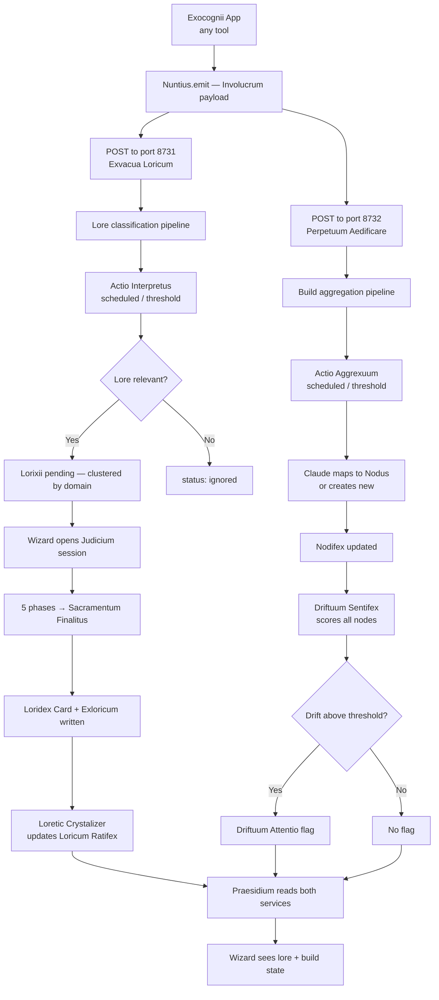

# COGNOSIS
### The ambient memory layer of the Exocognii suite. Three local FastAPI
services — Exvacua Loricum (lore canon), Perpetuum Aedificare (build
continuity), and Praesidium (advisory interface) — connected by Nuntius,
a shared client library that routes every app emission to both memory
services simultaneously.

---

╭──────────────────────────────┬───────────────────────────────────────────────╮
│ Key / Shortcut               │ Action                                        │
├┄┄┄┄┄┄┄┄┄┄┄┄┄┄┄┄┄┄┄┄┄┄┄┄┄┄┄┄┄┄┼┄┄┄┄┄┄┄┄┄┄┄┄┄┄┄┄┄┄┄┄┄┄┄┄┄┄┄┄┄┄┄┄┄┄┄┄┄┄┄┄┄┄┄┄┄┄┄┤
│ (No keyboard interface)      │ Suite operated entirely via HTTP API          │
╰──────────────────────────────┴───────────────────────────────────────────────╯

---

╭────────────────────────────┬──────────────────────────────────┬──────────────────────────────────────┬────────────╮
│ Feature                    │ Description                      │ How to Trigger                       │ Status     │
├┄┄┄┄┄┄┄┄┄┄┄┄┄┄┄┄┄┄┄┄┄┄┄┄┄┄┄┄┼┄┄┄┄┄┄┄┄┄┄┄┄┄┄┄┄┄┄┄┄┄┄┄┄┄┄┄┄┄┄┄┄┄┄┼┄┄┄┄┄┄┄┄┄┄┄┄┄┄┄┄┄┄┄┄┄┄┄┄┄┄┄┄┄┄┄┄┄┄┄┄┄┄┼┄┄┄┄┄┄┄┄┄┄┄┄┤
│ Dual-service emission       │ Nuntius fires to both services   │ Import Nuntius; call emit()          │ Partial    │
│ Lore classification         │ Exvacua Loricum pipeline         │ Emissions reach port 8731            │ Working    │
│ Build aggregation           │ Perpetuum Aedificare pipeline    │ Emissions reach port 8732            │ Working    │
│ Judicium ratification       │ Five-phase lore ceremony         │ POST /judicium on port 8731          │ Working    │
│ Loricum Ratifex             │ Living lore compendium           │ GET /ratifex on port 8731            │ Working    │
│ Nodus Momentuum graph       │ Active build work graph          │ GET /nodi on port 8732               │ Working    │
│ Driftuum Attentio           │ Stale node drift signals         │ Automatic in Actio Aggrexuum         │ Working    │
│ Nota Brevis capture         │ Quick Wizard note to build mem   │ POST /acquiuum/nota on port 8732     │ Working    │
│ File drop (lore)            │ Ingest file into lore pipeline   │ POST /lorix/drop on port 8731        │ Working    │
│ Corpus scour (lore)         │ Crawl repo files for lore        │ POST /extracticus on port 8731       │ Working    │
│ Corpus scour (build)        │ Crawl exports for build state    │ POST /acquiuum/oratio on port 8732   │ Working    │
│ Praesidium read layer       │ Wizard-facing advisory UI        │ Not yet built                        │ Partial    │
│ Nuntius client library      │ Shared dual-POST emit utility    │ Not yet built                        │ Partial    │
╰────────────────────────────┴──────────────────────────────────┴──────────────────────────────────────┴────────────╯

---



---

## VISION & PURPOSE

Cognosis is the answer to a question that recurs at the start of every build
session: what was the state of this, where did we leave off, what was decided.
Rather than asking the Wizard to maintain a log, Cognosis asks the apps to
emit what they already know — which is everything — and handles the rest.
Lore goes to Exvacua Loricum. Build state goes to Perpetuum Aedificare.
The Wizard interacts with the outputs, not the infrastructure.

---

## FILE & FOLDER MAP

```
Exocognii/
├── ExvacuaLoricum/      — lore canon service (port 8731)
│   ├── main.py
│   ├── config.py
│   ├── db.py
│   ├── interpretus.py
│   ├── scheduler.py
│   ├── crystalizer.py
│   ├── requirements.txt
│   └── routers/
│       ├── lorixii.py
│       ├── canon.py
│       ├── ratifex.py
│       ├── loricuum.py
│       ├── judicium.py
│       └── interpretus.py
│
├── PerpetumAedificare/  — build continuity service (port 8732)
│   ├── main.py
│   ├── config.py
│   ├── db.py
│   ├── aggrexuum.py
│   ├── scheduler.py
│   ├── requirements.txt
│   └── routers/
│       ├── acquiuum.py
│       ├── nodi.py
│       ├── exnodica.py
│       ├── arca.py
│       └── aggrexuum.py
│
└── Shared/
    └── nuntius.py       — shared Involucrum client (not yet built)

~/.arca/config.json      — Configuus — ports, paths, thresholds for both services
~/.arca/exvacua_loricum.db
~/.arca/perpetuum_aedificare.db
~/.arca/exvacua_loricum/
    loricum_ratifex.md
    exlorica/{uuid}.md
```

---

## FEATURES & FUNCTIONS

### Starting the Suite

Each service starts independently. Run both before wiring any app to emit.

```bash
# Terminal 1
cd ~/ArcaCognitorium/Exocognii/ExvacuaLoricum
python3 main.py

# Terminal 2
cd ~/ArcaCognitorium/Exocognii/PerpetumAedificare
python3 main.py
```

Both services confirm startup with their health endpoint at `/health`.
Verify: `curl http://127.0.0.1:8731/health` and
`curl http://127.0.0.1:8732/health`.

### Nuntius — App-Side Emission

Once built, Nuntius is the single import for any app that wants to emit to
Cognosis. The import pattern follows the standard Exocognii ClaudeBox pattern
— path resolved from `~/.arca/config.json`.

```python
from nuntius import Nuntius

nuntius = Nuntius(source_app="MyApp", source_version="1.0.0")
nuntius.emit(body="The thing that happened", hint="optional context")
```

Nuntius fires two POST calls simultaneously — one to each service — and
returns. The emitting app never waits on a response.

### Exvacua Loricum — Lore Pipeline

Receives lore-candidate content. Actio Interpretus classifies on schedule.
Lore-relevant content accumulates in the Lorixii Speculativum and waits for
the Wizard to open a Judicium session. The full Judicium API is documented
in the Exvacua Loricum Dux Tome.

### Perpetuum Aedificare — Build Pipeline

Receives build event content. Actio Aggrexuum maps captures to Nodi on
schedule. The Nodus Momentuum graph reflects the current shape of active
work. Driftuum flags signal when nodes are stale relative to their
connected work. The full Nodus API is documented in the Perpetuum Aedificare
Dux Tome.

### Configuus

Both services read configuration from `~/.arca/config.json`. The minimum
required keys are already seeded when either service first starts. Tunable
values for both pipelines:

```json
{
  "exvacua_loricum": {
    "interpretus_interval":  600,
    "interpretus_threshold": 20
  },
  "perpetuum_aedificare": {
    "aggrexuum_interval":  300,
    "aggrexuum_threshold": 10,
    "drift_threshold":     0.65
  }
}
```

---

## LOGIC

Both services are independent FastAPI applications sharing only the Involucrum
write format and the Nuntius client library. Neither service is aware of the
other at the code level. Both use the same pattern: SQLite for storage,
ClaudeBox for inference, a background scheduler with threshold-triggered early
firing, and a REST API as the external interface.

The write path is fire-and-forget. Nuntius sends both POST calls without
waiting for responses. If either service is down, the other continues
receiving writes unaffected. There is no shared ingest layer and no routing
dependency.

The read path goes through Praesidium (once built). Praesidium queries both
services independently and assembles the advisory view. It is permanently
outside the write path.

---

## INPUT / OUTPUT & FILE TYPES

```
Input (to either service)
  ├── Involucrum POST         — JSON envelope from any Exocognii app via Nuntius
  ├── Nota Brevis POST        — plain text quick note (Perpetuum Aedificare only)
  ├── File drop               — file path on disk
  └── Corpus scour            — directory paths, crawled recursively

Output
  ├── ~/.arca/exvacua_loricum.db          — lore SQLite database
  ├── ~/.arca/perpetuum_aedificare.db     — build SQLite database
  ├── ~/.arca/exvacua_loricum/
  │   ├── loricum_ratifex.md              — master lore compendium
  │   └── exlorica/{uuid}.md              — ratified Exlorica

Config
  └── ~/.arca/config.json     — ports, db paths, store paths, distillation
                                tuning for both services
```
