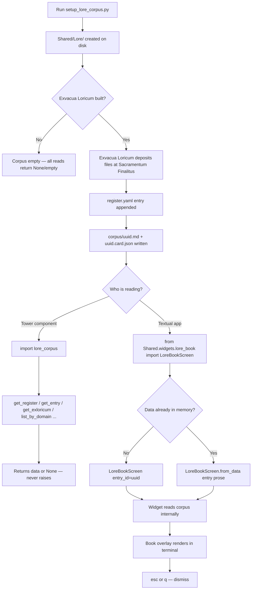

# Lore Corpus
### The shared read layer for ratified Cogniverse lore. A structured file
store, a reader module, and a Textual display widget — consumed by the Tower
and Exocognii suite. Not a standalone application; a substrate that sits
beneath everything else and asks nothing of the systems that use it.

---

## Keyboard & Shortcut Reference

╭──────────────────────┬──────────────────────────────────────╮
│  Key / Shortcut      │  Action                              │
├┄┄┄┄┄┄┄┄┄┄┄┄┄┄┄┄┄┄┄┄┄┄┼┄┄┄┄┄┄┄┄┄┄┄┄┄┄┄┄┄┄┄┄┄┄┄┄┄┄┄┄┄┄┄┄┄┄┄┄┄┄┤
│  esc                 │  Dismiss the Book overlay            │
│  q                   │  Dismiss the Book overlay            │
╰──────────────────────┴──────────────────────────────────────╯

---

## Features

╭─────────────────────────┬──────────────────────────────────────┬──────────────────────────────────┬─────────╮
│  Feature                │  Description                         │  How to Trigger                  │  Status │
├┄┄┄┄┄┄┄┄┄┄┄┄┄┄┄┄┄┄┄┄┄┄┄┄┄┼┄┄┄┄┄┄┄┄┄┄┄┄┄┄┄┄┄┄┄┄┄┄┄┄┄┄┄┄┄┄┄┄┄┄┄┄┄┄┼┄┄┄┄┄┄┄┄┄┄┄┄┄┄┄┄┄┄┄┄┄┄┄┄┄┄┄┄┄┄┄┄┄┄┼┄┄┄┄┄┄┄┄┄┤
│  Register read          │  Fetch the full list of ratified     │  lore_corpus.get_register()      │ Working │
│                         │  entries from register.yaml          │                                  │         │
├┄┄┄┄┄┄┄┄┄┄┄┄┄┄┄┄┄┄┄┄┄┄┄┄┄┼┄┄┄┄┄┄┄┄┄┄┄┄┄┄┄┄┄┄┄┄┄┄┄┄┄┄┄┄┄┄┄┄┄┄┄┄┄┄┼┄┄┄┄┄┄┄┄┄┄┄┄┄┄┄┄┄┄┄┄┄┄┄┄┄┄┄┄┄┄┄┄┄┄┼┄┄┄┄┄┄┄┄┄┤
│  Entry lookup           │  Retrieve a single register entry    │  lore_corpus.get_entry(id)       │ Working │
│                         │  by UUID                             │                                  │         │
├┄┄┄┄┄┄┄┄┄┄┄┄┄┄┄┄┄┄┄┄┄┄┄┄┄┼┄┄┄┄┄┄┄┄┄┄┄┄┄┄┄┄┄┄┄┄┄┄┄┄┄┄┄┄┄┄┄┄┄┄┄┄┄┄┼┄┄┄┄┄┄┄┄┄┄┄┄┄┄┄┄┄┄┄┄┄┄┄┄┄┄┄┄┄┄┄┄┄┄┼┄┄┄┄┄┄┄┄┄┤
│  Prose retrieval        │  Read the .md body of an Exloricum   │  lore_corpus.get_exloricum(id)   │ Working │
├┄┄┄┄┄┄┄┄┄┄┄┄┄┄┄┄┄┄┄┄┄┄┄┄┄┼┄┄┄┄┄┄┄┄┄┄┄┄┄┄┄┄┄┄┄┄┄┄┄┄┄┄┄┄┄┄┄┄┄┄┄┄┄┄┼┄┄┄┄┄┄┄┄┄┄┄┄┄┄┄┄┄┄┄┄┄┄┄┄┄┄┄┄┄┄┄┄┄┄┼┄┄┄┄┄┄┄┄┄┤
│  Card retrieval         │  Read the .card.json metadata for    │  lore_corpus.get_card(id)        │ Working │
│                         │  a lore entry                        │                                  │         │
├┄┄┄┄┄┄┄┄┄┄┄┄┄┄┄┄┄┄┄┄┄┄┄┄┄┼┄┄┄┄┄┄┄┄┄┄┄┄┄┄┄┄┄┄┄┄┄┄┄┄┄┄┄┄┄┄┄┄┄┄┄┄┄┄┼┄┄┄┄┄┄┄┄┄┄┄┄┄┄┄┄┄┄┄┄┄┄┄┄┄┄┄┄┄┄┄┄┄┄┼┄┄┄┄┄┄┄┄┄┤
│  Domain filter          │  List all entries in a given         │  lore_corpus.list_by_domain(d)   │ Working │
│                         │  domain                              │                                  │         │
├┄┄┄┄┄┄┄┄┄┄┄┄┄┄┄┄┄┄┄┄┄┄┄┄┄┼┄┄┄┄┄┄┄┄┄┄┄┄┄┄┄┄┄┄┄┄┄┄┄┄┄┄┄┄┄┄┄┄┄┄┄┄┄┄┼┄┄┄┄┄┄┄┄┄┄┄┄┄┄┄┄┄┄┄┄┄┄┄┄┄┄┄┄┄┄┄┄┄┄┼┄┄┄┄┄┄┄┄┄┤
│  Tag filter             │  List all entries carrying a         │  lore_corpus.list_by_tag(tag)    │ Working │
│                         │  given tag                           │                                  │         │
├┄┄┄┄┄┄┄┄┄┄┄┄┄┄┄┄┄┄┄┄┄┄┄┄┄┼┄┄┄┄┄┄┄┄┄┄┄┄┄┄┄┄┄┄┄┄┄┄┄┄┄┄┄┄┄┄┄┄┄┄┄┄┄┄┼┄┄┄┄┄┄┄┄┄┄┄┄┄┄┄┄┄┄┄┄┄┄┄┄┄┄┄┄┄┄┄┄┄┄┼┄┄┄┄┄┄┄┄┄┤
│  Status filter          │  List entries by ratification        │  lore_corpus.list_by_status(s)   │ Working │
│                         │  status                              │                                  │         │
├┄┄┄┄┄┄┄┄┄┄┄┄┄┄┄┄┄┄┄┄┄┄┄┄┄┼┄┄┄┄┄┄┄┄┄┄┄┄┄┄┄┄┄┄┄┄┄┄┄┄┄┄┄┄┄┄┄┄┄┄┄┄┄┄┼┄┄┄┄┄┄┄┄┄┄┄┄┄┄┄┄┄┄┄┄┄┄┄┄┄┄┄┄┄┄┄┄┄┄┼┄┄┄┄┄┄┄┄┄┤
│  Taxonomy read          │  List all seeded domains from        │  lore_corpus.list_all_domains()  │ Working │
│                         │  domains.yaml                        │                                  │         │
├┄┄┄┄┄┄┄┄┄┄┄┄┄┄┄┄┄┄┄┄┄┄┄┄┄┼┄┄┄┄┄┄┄┄┄┄┄┄┄┄┄┄┄┄┄┄┄┄┄┄┄┄┄┄┄┄┄┄┄┄┄┄┄┄┼┄┄┄┄┄┄┄┄┄┄┄┄┄┄┄┄┄┄┄┄┄┄┄┄┄┄┄┄┄┄┄┄┄┄┼┄┄┄┄┄┄┄┄┄┤
│  Health check           │  Report corpus state: readable,      │  lore_corpus.corpus_status()     │ Working │
│                         │  entry count, domain count           │                                  │         │
├┄┄┄┄┄┄┄┄┄┄┄┄┄┄┄┄┄┄┄┄┄┄┄┄┄┼┄┄┄┄┄┄┄┄┄┄┄┄┄┄┄┄┄┄┄┄┄┄┄┄┄┄┄┄┄┄┄┄┄┄┄┄┄┄┼┄┄┄┄┄┄┄┄┄┄┄┄┄┄┄┄┄┄┄┄┄┄┄┄┄┄┄┄┄┄┄┄┄┄┼┄┄┄┄┄┄┄┄┄┤
│  Book overlay           │  Display an Exloricum as a styled    │  push_screen(                    │ Working │
│                         │  manuscript modal in the terminal    │    LoreBookScreen(id))           │         │
├┄┄┄┄┄┄┄┄┄┄┄┄┄┄┄┄┄┄┄┄┄┄┄┄┄┼┄┄┄┄┄┄┄┄┄┄┄┄┄┄┄┄┄┄┄┄┄┄┄┄┄┄┄┄┄┄┄┄┄┄┄┄┄┄┼┄┄┄┄┄┄┄┄┄┄┄┄┄┄┄┄┄┄┄┄┄┄┄┄┄┄┄┄┄┄┄┄┄┄┼┄┄┄┄┄┄┄┄┄┤
│  Pre-loaded book        │  Open the Book overlay with data     │  push_screen(                    │ Working │
│                         │  already in memory — skips file read │    LoreBookScreen.from_data())   │         │
├┄┄┄┄┄┄┄┄┄┄┄┄┄┄┄┄┄┄┄┄┄┄┄┄┄┼┄┄┄┄┄┄┄┄┄┄┄┄┄┄┄┄┄┄┄┄┄┄┄┄┄┄┄┄┄┄┄┄┄┄┄┄┄┄┼┄┄┄┄┄┄┄┄┄┄┄┄┄┄┄┄┄┄┄┄┄┄┄┄┄┄┄┄┄┄┄┄┄┄┼┄┄┄┄┄┄┄┄┄┤
│  Corpus initialisation  │  Create directory structure and      │  python setup_lore_corpus.py     │ Working │
│                         │  seed files on disk                  │                                  │         │
╰─────────────────────────┴──────────────────────────────────────┴──────────────────────────────────┴─────────╯

---

## Usage Flowchart



---

## Vision & Purpose

The Lore Corpus is the place where ratified Cogniverse lore lands after the
work of making it is done. Exvacua Loricum does the hard labour of ingestion,
inference, and ratification; the Corpus receives the finished product and holds
it for anyone who needs it. It exists so that every other system in the suite
can draw on canonical lore without caring about how that lore was produced or
where the production machinery lives. The Book widget exists because lore
deserves to be read in something that feels like a document, not a data dump —
and because the Tower is a terminal instrument that should never need to open
a browser to show the Wizard something written about its own world.

---

## File & Folder Map

```
ArcaCognitorium/
├── Shared/
│   ├── lore_corpus.py           — read-only corpus reader module
│   ├── Lore/
│   │   ├── register.yaml        — master index of all ratified entries
│   │   ├── corpus/
│   │   │   ├── {uuid}.md        — Exloricum prose (written by Exvacua Loricum)
│   │   │   └── {uuid}.card.json — Loridex Card metadata
│   │   └── taxonomy/
│   │       └── domains.yaml     — seeded domain taxonomy
│   └── widgets/
│       ├── __init__.py          — package marker
│       └── lore_book.py         — Textual LoreBookScreen modal widget
└── setup_lore_corpus.py         — one-time initialisation script
```

---

## Features & Functions

### Register Read

`get_register()` parses `register.yaml` and returns its entries list as a list
of dicts. Called first by anything that needs to know what lore exists. On any
file system error or YAML parse failure, returns an empty list and logs a
warning. Never raises.

### Entry Lookup

`get_entry(id)` iterates the register and returns the first entry whose `id`
field matches the given UUID string. Returns None if not found. The primary
lookup method — callers get a single dict with all register metadata for that
entry, including the relative paths to its `.md` and `.card.json` files.

### Prose Retrieval

`get_exloricum(id)` resolves the `.md` path from the entry's register record
and returns its full text as a string. Returns None if the entry is not found
or the file is missing. This is the function the Book widget calls internally
when given only a UUID.

### Card Retrieval

`get_card(id)` resolves the `.card.json` path from the register entry and
returns its parsed contents as a dict. Returns None on any failure. Provides
access to Loridex metadata: domain, tags, ratification date, linked cards.

### Domain Filter

`list_by_domain(domain)` filters the full register by exact domain match.
Returns a list of matching entries. Used by systems that want to pull all lore
in a given category — for example, all entries in the `entities` domain.

### Tag Filter

`list_by_tag(tag)` filters the register by tag membership. Returns all entries
carrying that tag anywhere in their tags list. Tags are emergent and governed
by Exvacua Loricum's Arx Loricuum.

### Status Filter

`list_by_status(status)` filters by the `status` field. In practice this will
almost always be `ratified` — the corpus should not hold anything else — but
the filter exists for cases where `flagged_for_revision` entries are present.

### Taxonomy Read

`list_all_domains()` reads `taxonomy/domains.yaml` and returns the name of
every declared domain as a list of strings. `get_domain_info(domain)` returns
the full record for a single domain including its description and tag list.

### Health Check

`corpus_status()` returns a dict reporting whether the register is readable,
how many entries it contains, and how many domains the taxonomy declares. Used
by the Praesidium read layer for diagnostics.

### Book Overlay

`LoreBookScreen` is a Textual `ModalScreen`. Push it onto the app's screen
stack with a UUID and it retrieves and renders the corresponding Exloricum. The
overlay shows a gold header band containing the entry title, domain, and tags;
a scrollable parchment body with the prose; and a dim footer with the
ratification date and dismiss hint. `esc` or `q` dismisses it.

`LoreBookScreen.from_data(entry, prose)` is an alternate constructor for
callers that already hold the entry dict and prose string — skips the internal
corpus read entirely. Intended for use by the Scribae and other Tower
components that may have loaded the data as part of a larger operation.

### Corpus Initialisation

`setup_lore_corpus.py` is a one-time setup script. Run it once on a new
machine or after a clean clone to create the full `Shared/Lore/` directory
structure and write the seed files. Idempotent — existing files are not
overwritten. Supports `--check` for a dry run that reports what would be
created without writing anything.

---

## Logic

`lore_corpus.py` resolves its working path at call time, not at import time.
Every public function calls `_corpus_root()` internally, which reads
`~/.arca/config.json` for `arca_repo_path` and constructs the `Shared/Lore/`
path from it. If the config is absent or malformed the fallback is
`~/ArcaCognitorium`. This means the module works correctly on any machine with
a valid config and degrades gracefully on any machine without one.

All reads are file-level. There is no in-memory cache, no connection pool, and
no background process. `get_register()` opens and parses `register.yaml` on
every call. At current corpus scale this is negligible. If the corpus grows
large enough that repeated register parses become a concern, a calling component
can call `get_register()` once and hold the result for the duration of its
session.

PyYAML is a soft dependency. If it is not installed, `_require_yaml()` logs a
warning and returns False, causing all YAML-dependent functions to return empty
results. JSON card files do not require PyYAML and read independently.

`LoreBookScreen` performs all file reads in `on_mount()` on the Textual main
thread. Exloricum files are expected to be small prose documents — no
async read is warranted. If the corpus is not available or the entry is missing,
the widget renders a dim placeholder message rather than crashing.

The prose renderer `_render_prose()` is a line-by-line pass. It strips YAML
frontmatter if present, converts Markdown headings to Rich colour markup,
handles bold and italic inline patterns via regex, and converts horizontal
rules to a gold-toned line of box-drawing characters. It does not parse tables
or code blocks — Exloricum prose is not expected to contain them by register.

---

## Input / Output & File Types

```
Input
  ├── Shared/Lore/register.yaml       — YAML — master entry index
  ├── Shared/Lore/corpus/{uuid}.md    — Markdown — Exloricum prose body
  ├── Shared/Lore/corpus/{uuid}.card.json — JSON — Loridex Card metadata
  └── Shared/Lore/taxonomy/domains.yaml  — YAML — domain taxonomy

Configuration
  └── ~/.arca/config.json             — JSON — repo path resolution

Output
  └── None — lore_corpus.py is read-only.
      LoreBookScreen renders to the terminal via Textual — no files written.

Setup output (setup_lore_corpus.py only)
  ├── Shared/Lore/register.yaml       — created if absent
  ├── Shared/Lore/taxonomy/domains.yaml — created if absent
  └── Shared/widgets/__init__.py      — created if absent
```
