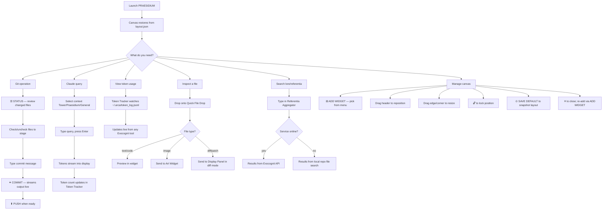

# PRAESIDIUM
### Ambient command centre for the Arca Cognitorium workflow. Runs on a
### dedicated secondary monitor as a persistent, free-floating widget canvas.
### Each widget is an independent instrument. The canvas remembers everything.

---

## Keyboard & Shortcut Reference

╭──────────────────────────┬─────────────────────────────────────────╮
│ Key / Shortcut           │ Action                                  │
├┄┄┄┄┄┄┄┄┄┄┄┄┄┄┄┄┄┄┄┄┄┄┄┄┄┄┼┄┄┄┄┄┄┄┄┄┄┄┄┄┄┄┄┄┄┄┄┄┄┄┄┄┄┄┄┄┄┄┄┄┄┄┄┄┄┄┄┄┤
│ Enter (commit input)     │ Stage all + commit with typed message   │
│ Enter (chat input)       │ Send message to Claude                  │
│ Enter (todo input)       │ Add item to current tab                 │
│ Enter (referentia input) │ Execute lore/file search                │
│ Enter (diff ref fields)  │ Refresh diff between typed refs         │
╰──────────────────────────┴─────────────────────────────────────────╯

---

## Features Table

╭──────────────────────────┬──────────────────────────────────────┬──────────────────────────────────────┬─────────╮
│ Feature                  │ Description                          │ How to Trigger                       │ Status  │
├┄┄┄┄┄┄┄┄┄┄┄┄┄┄┄┄┄┄┄┄┄┄┄┄┄┄┼┄┄┄┄┄┄┄┄┄┄┄┄┄┄┄┄┄┄┄┄┄┄┄┄┄┄┄┄┄┄┄┄┄┄┄┄┄┄┼┄┄┄┄┄┄┄┄┄┄┄┄┄┄┄┄┄┄┄┄┄┄┄┄┄┄┄┄┄┄┄┄┄┄┄┄┄┄┼┄┄┄┄┄┄┄┄┄┤
│ Widget canvas            │ Free-floating, absolute-positioned   │ Always present on launch             │ Working │
│                          │ widget surface on secondary monitor  │                                      │         │
├┄┄┄┄┄┄┄┄┄┄┄┄┄┄┄┄┄┄┄┄┄┄┄┄┄┄┼┄┄┄┄┄┄┄┄┄┄┄┄┄┄┄┄┄┄┄┄┄┄┄┄┄┄┄┄┄┄┄┄┄┄┄┄┄┄┼┄┄┄┄┄┄┄┄┄┄┄┄┄┄┄┄┄┄┄┄┄┄┄┄┄┄┄┄┄┄┄┄┄┄┄┄┄┄┼┄┄┄┄┄┄┄┄┄┤
│ Layout persistence       │ Widget positions, sizes, visibility, │ Automatic on every move/resize       │ Working │
│                          │ lock and font size survive restart   │                                      │         │
├┄┄┄┄┄┄┄┄┄┄┄┄┄┄┄┄┄┄┄┄┄┄┄┄┄┄┼┄┄┄┄┄┄┄┄┄┄┄┄┄┄┄┄┄┄┄┄┄┄┄┄┄┄┄┄┄┄┄┄┄┄┄┄┄┄┼┄┄┄┄┄┄┄┄┄┄┄┄┄┄┄┄┄┄┄┄┄┄┄┄┄┄┄┄┄┄┄┄┄┄┄┄┄┄┼┄┄┄┄┄┄┄┄┄┤
│ Save default layout      │ Snapshot current arrangement as      │ ⊙ SAVE DEFAULT in top bar            │ Working │
│                          │ fallback for new sessions            │                                      │         │
├┄┄┄┄┄┄┄┄┄┄┄┄┄┄┄┄┄┄┄┄┄┄┄┄┄┄┼┄┄┄┄┄┄┄┄┄┄┄┄┄┄┄┄┄┄┄┄┄┄┄┄┄┄┄┄┄┄┄┄┄┄┄┄┄┄┼┄┄┄┄┄┄┄┄┄┄┄┄┄┄┄┄┄┄┄┄┄┄┄┄┄┄┄┄┄┄┄┄┄┄┄┄┄┄┼┄┄┄┄┄┄┄┄┄┤
│ Add widget               │ Spawn any registered widget onto     │ ⊞ ADD WIDGET → pick from menu        │ Working │
│                          │ the canvas at a staggered position   │                                      │         │
├┄┄┄┄┄┄┄┄┄┄┄┄┄┄┄┄┄┄┄┄┄┄┄┄┄┄┼┄┄┄┄┄┄┄┄┄┄┄┄┄┄┄┄┄┄┄┄┄┄┄┄┄┄┄┄┄┄┄┄┄┄┄┄┄┼┄┄┄┄┄┄┄┄┄┄┄┄┄┄┄┄┄┄┄┄┄┄┄┄┄┄┄┄┄┄┄┄┄┄┄┄┄┄┼┄┄┄┄┄┄┄┄┄┤
│ Widget drag              │ Reposition any widget by its header  │ Click and drag widget header bar     │ Working │
├┄┄┄┄┄┄┄┄┄┄┄┄┄┄┄┄┄┄┄┄┄┄┄┄┄┄┼┄┄┄┄┄┄┄┄┄┄┄┄┄┄┄┄┄┄┄┄┄┄┄┄┄┄┄┄┄┄┄┄┄┄┄┄┄┼┄┄┄┄┄┄┄┄┄┄┄┄┄┄┄┄┄┄┄┄┄┄┄┄┄┄┄┄┄┄┄┄┄┄┄┄┄┄┼┄┄┄┄┄┄┄┄┄┤
│ Widget resize            │ Resize by dragging any edge or       │ Hover edge/corner, drag              │ Working │
│                          │ corner; cursor changes to indicate   │                                      │         │
├┄┄┄┄┄┄┄┄┄┄┄┄┄┄┄┄┄┄┄┄┄┄┄┄┄┄┼┄┄┄┄┄┄┄┄┄┄┄┄┄┄┄┄┄┄┄┄┄┄┄┄┄┄┄┄┄┄┄┄┄┄┄┄┄┼┄┄┄┄┄┄┄┄┄┄┄┄┄┄┄┄┄┄┄┄┄┄┄┄┄┄┄┄┄┄┄┄┄┄┄┄┄┄┼┄┄┄┄┄┄┄┄┄┤
│ Widget lock              │ Freeze position and size; prevents   │ 🔓 button in widget header           │ Working │
│                          │ accidental repositioning             │                                      │         │
├┄┄┄┄┄┄┄┄┄┄┄┄┄┄┄┄┄┄┄┄┄┄┄┄┄┄┼┄┄┄┄┄┄┄┄┄┄┄┄┄┄┄┄┄┄┄┄┄┄┄┄┄┄┄┄┄┄┄┄┄┄┄┄┄┼┄┄┄┄┄┄┄┄┄┄┄┄┄┄┄┄┄┄┄┄┄┄┄┄┄┄┄┄┄┄┄┄┄┄┄┄┄┄┼┄┄┄┄┄┄┄┄┄┤
│ Animated collapse        │ Blind-effect minimise with InOutQuad │ ─ button in widget header            │ Working │
│                          │ easing at 180ms                      │                                      │         │
├┄┄┄┄┄┄┄┄┄┄┄┄┄┄┄┄┄┄┄┄┄┄┄┄┄┄┼┄┄┄┄┄┄┄┄┄┄┄┄┄┄┄┄┄┄┄┄┄┄┄┄┄┄┄┄┄┄┄┄┄┄┄┄┄┼┄┄┄┄┄┄┄┄┄┄┄┄┄┄┄┄┄┄┄┄┄┄┄┄┄┄┄┄┄┄┄┄┄┄┄┄┄┄┼┄┄┄┄┄┄┄┄┄┤
│ Per-widget font resize   │ Scale text in any widget up or down  │ − / + buttons in widget header       │ Working │
│                          │ from 8–18pt; persists to layout      │                                      │         │
├┄┄┄┄┄┄┄┄┄┄┄┄┄┄┄┄┄┄┄┄┄┄┄┄┄┄┼┄┄┄┄┄┄┄┄┄┄┄┄┄┄┄┄┄┄┄┄┄┄┄┄┄┄┄┄┄┄┄┄┄┄┄┄┄┼┄┄┄┄┄┄┄┄┄┄┄┄┄┄┄┄┄┄┄┄┄┄┄┄┄┄┄┄┄┄┄┄┄┄┄┄┄┄┼┄┄┄┄┄┄┄┄┄┤
│ Widget close             │ Hide widget; persists as hidden in   │ ✕ button in widget header            │ Working │
│                          │ layout; re-add via ADD WIDGET        │                                      │         │
├┄┄┄┄┄┄┄┄┄┄┄┄┄┄┄┄┄┄┄┄┄┄┄┄┄┄┼┄┄┄┄┄┄┄┄┄┄┄┄┄┄┄┄┄┄┄┄┄┄┄┄┄┄┄┄┄┄┄┄┄┄┄┄┄┼┄┄┄┄┄┄┄┄┄┄┄┄┄┄┄┄┄┄┄┄┄┄┄┄┄┄┄┄┄┄┄┄┄┄┄┄┄┄┼┄┄┄┄┄┄┄┄┄┤
│ Git — status             │ Branch, clean/dirty, changed file    │ Auto-polls every 15 seconds          │ Working │
│                          │ count, last commit + age             │                                      │         │
├┄┄┄┄┄┄┄┄┄┄┄┄┄┄┄┄┄┄┄┄┄┄┄┄┄┄┼┄┄┄┄┄┄┄┄┄┄┄┄┄┄┄┄┄┄┄┄┄┄┄┄┄┄┄┄┄┄┄┄┄┄┄┄┄┼┄┄┄┄┄┄┄┄┄┄┄┄┄┄┄┄┄┄┄┄┄┄┄┄┄┄┄┄┄┄┄┄┄┄┄┄┄┄┼┄┄┄┄┄┄┄┄┄┤
│ Git — file picker        │ Checklist of changed/untracked files │ ☰ STATUS button in Git widget        │ Working │
│                          │ before staging; select all / none    │                                      │         │
├┄┄┄┄┄┄┄┄┄┄┄┄┄┄┄┄┄┄┄┄┄┄┄┄┄┄┼┄┄┄┄┄┄┄┄┄┄┄┄┄┄┄┄┄┄┄┄┄┄┄┄┄┄┄┄┄┄┄┄┄┄┄┄┄┼┄┄┄┄┄┄┄┄┄┄┄┄┄┄┄┄┄┄┄┄┄┄┄┄┄┄┄┄┄┄┄┄┄┄┄┄┄┄┼┄┄┄┄┄┄┄┄┄┤
│ Git — commit             │ Type message; stages all or selected │ ✦ COMMIT or Enter in message field   │ Working │
│                          │ files; streams output live           │                                      │         │
├┄┄┄┄┄┄┄┄┄┄┄┄┄┄┄┄┄┄┄┄┄┄┄┄┄┄┼┄┄┄┄┄┄┄┄┄┄┄┄┄┄┄┄┄┄┄┄┄┄┄┄┄┄┄┄┄┄┄┄┄┄┄┄┄┼┄┄┄┄┄┄┄┄┄┄┄┄┄┄┄┄┄┄┄┄┄┄┄┄┄┄┄┄┄┄┄┄┄┄┄┄┄┄┼┄┄┄┄┄┄┄┄┄┤
│ Git — push / pull        │ Push or pull with live streamed      │ ⬆ PUSH / ⬇ PULL buttons              │ Working │
│                          │ output; non-blocking UI              │                                      │         │
├┄┄┄┄┄┄┄┄┄┄┄┄┄┄┄┄┄┄┄┄┄┄┄┄┄┄┼┄┄┄┄┄┄┄┄┄┄┄┄┄┄┄┄┄┄┄┄┄┄┄┄┄┄┄┄┄┄┄┄┄┄┄┄┄┼┄┄┄┄┄┄┄┄┄┄┄┄┄┄┄┄┄┄┄┄┄┄┄┄┄┄┄┄┄┄┄┄┄┄┄┄┄┄┼┄┄┄┄┄┄┄┄┄┤
│ Git — lock detection     │ Detects index.lock; auto-removes     │ Fires before any mutating git op     │ Working │
│                          │ stale locks; reports to output panel │                                      │         │
├┄┄┄┄┄┄┄┄┄┄┄┄┄┄┄┄┄┄┄┄┄┄┄┄┄┄┼┄┄┄┄┄┄┄┄┄┄┄┄┄┄┄┄┄┄┄┄┄┄┄┄┄┄┄┄┄┄┄┄┄┄┄┄┄┼┄┄┄┄┄┄┄┄┄┄┄┄┄┄┄┄┄┄┄┄┄┄┄┄┄┄┄┄┄┄┄┄┄┄┄┄┄┄┼┄┄┄┄┄┄┄┄┄┤
│ Git — workflow reference │ Inline panel showing the full        │ ? FLOW button in Git widget          │ Working │
│                          │ work→stage→commit→push sequence      │                                      │         │
├┄┄┄┄┄┄┄┄┄┄┄┄┄┄┄┄┄┄┄┄┄┄┄┄┄┄┼┄┄┄┄┄┄┄┄┄┄┄┄┄┄┄┄┄┄┄┄┄┄┄┄┄┄┄┄┄┄┄┄┄┄┄┄┄┼┄┄┄┄┄┄┄┄┄┄┄┄┄┄┄┄┄┄┄┄┄┄┄┄┄┄┄┄┄┄┄┄┄┄┄┄┄┄┼┄┄┄┄┄┄┄┄┄┤
│ Claude chat              │ Streaming conversation with Claude   │ Chat widget; type and press Enter    │ Working │
│                          │ via ClaudeBox; tokens stream live    │ or ⚗ SEND                            │         │
├┄┄┄┄┄┄┄┄┄┄┄┄┄┄┄┄┄┄┄┄┄┄┄┄┄┄┼┄┄┄┄┄┄┄┄┄┄┄┄┄┄┄┄┄┄┄┄┄┄┄┄┄┄┄┄┄┄┄┄┄┄┄┄┄┼┄┄┄┄┄┄┄┄┄┄┄┄┄┄┄┄┄┄┄┄┄┄┄┄┄┄┄┄┄┄┄┄┄┄┄┄┄┄┼┄┄┄┄┄┄┄┄┄┤
│ Context selector         │ Switch system prompt between Tower,  │ Dropdown in Chat widget button row   │ Working │
│                          │ Praesidium, or General contexts      │                                      │         │
├┄┄┄┄┄┄┄┄┄┄┄┄┄┄┄┄┄┄┄┄┄┄┄┄┄┄┼┄┄┄┄┄┄┄┄┄┄┄┄┄┄┄┄┄┄┄┄┄┄┄┄┄┄┄┄┄┄┄┄┄┄┄┄┄┼┄┄┄┄┄┄┄┄┄┄┄┄┄┄┄┄┄┄┄┄┄┄┄┄┄┄┄┄┄┄┄┄┄┄┄┄┄┄┼┄┄┄┄┄┄┄┄┄┤
│ Token tracker            │ Session + daily totals, cost, per-   │ Token Tracker widget; watches        │ Working │
│                          │ app breakdown; watches log file live │ ~/.arca/token_log.jsonl              │         │
├┄┄┄┄┄┄┄┄┄┄┄┄┄┄┄┄┄┄┄┄┄┄┄┄┄┄┼┄┄┄┄┄┄┄┄┄┄┄┄┄┄┄┄┄┄┄┄┄┄┄┄┄┄┄┄┄┄┄┄┄┄┄┄┄┼┄┄┄┄┄┄┄┄┄┄┄┄┄┄┄┄┄┄┄┄┄┄┄┄┄┄┄┄┄┄┄┄┄┄┄┄┄┄┼┄┄┄┄┄┄┄┄┄┤
│ Todo board               │ Tabbed lists; add/rename/delete tabs;│ Todo widget; type and Enter or       │ Working │
│                          │ check to complete; ✕ to delete       │ + ADD; tabs via + button             │         │
├┄┄┄┄┄┄┄┄┄┄┄┄┄┄┄┄┄┄┄┄┄┄┄┄┄┄┼┄┄┄┄┄┄┄┄┄┄┄┄┄┄┄┄┄┄┄┄┄┄┄┄┄┄┄┄┄┄┄┄┄┄┄┄┄┼┄┄┄┄┄┄┄┄┄┄┄┄┄┄┄┄┄┄┄┄┄┄┄┄┄┄┄┄┄┄┄┄┄┄┄┄┄┄┼┄┄┄┄┄┄┄┄┄┤
│ App launcher             │ Configurable buttons that launch     │ App Launcher widget; click button    │ Working │
│                          │ Exocognii tools as detached procs    │                                      │         │
├┄┄┄┄┄┄┄┄┄┄┄┄┄┄┄┄┄┄┄┄┄┄┄┄┄┄┼┄┄┄┄┄┄┄┄┄┄┄┄┄┄┄┄┄┄┄┄┄┄┄┄┄┄┄┄┄┄┄┄┄┄┄┄┄┼┄┄┄┄┄┄┄┄┄┄┄┄┄┄┄┄┄┄┄┄┄┄┄┄┄┄┄┄┄┄┄┄┄┄┄┄┄┄┼┄┄┄┄┄┄┄┄┄┤
│ Display panel            │ Universal renderer: plain, markdown, │ Display Panel widget; drop a file   │ Working │
│                          │ diff, image; file drop; mode picker  │ or call set_content()                │         │
├┄┄┄┄┄┄┄┄┄┄┄┄┄┄┄┄┄┄┄┄┄┄┄┄┄┄┼┄┄┄┄┄┄┄┄┄┄┄┄┄┄┄┄┄┄┄┄┄┄┄┄┄┄┄┄┄┄┄┄┄┄┄┄┄┼┄┄┄┄┄┄┄┄┄┄┄┄┄┄┄┄┄┄┄┄┄┄┄┄┄┄┄┄┄┄┄┄┄┄┄┄┄┄┼┄┄┄┄┄┄┄┄┄┤
│ Diff viewer              │ Colour-coded unified diff; git modes │ Diff Viewer widget; select mode      │ Working │
│                          │ (unstaged/staged/HEAD~1/refs) + file │ or drop two files                    │         │
│                          │ drop for arbitrary file diff         │                                      │         │
├┄┄┄┄┄┄┄┄┄┄┄┄┄┄┄┄┄┄┄┄┄┄┄┄┄┄┼┄┄┄┄┄┄┄┄┄┄┄┄┄┄┄┄┄┄┄┄┄┄┄┄┄┄┄┄┄┄┄┄┄┄┄┄┄┼┄┄┄┄┄┄┄┄┄┄┄┄┄┄┄┄┄┄┄┄┄┄┄┄┄┄┄┄┄┄┄┄┄┄┄┄┄┄┼┄┄┄┄┄┄┄┄┄┤
│ Repo activity            │ Recent commit feed + file change     │ Repo Activity widget; auto-polls     │ Working │
│                          │ events via QFileSystemWatcher        │ every 30s; also triggered by changes │         │
├┄┄┄┄┄┄┄┄┄┄┄┄┄┄┄┄┄┄┄┄┄┄┄┄┄┄┼┄┄┄┄┄┄┄┄┄┄┄┄┄┄┄┄┄┄┄┄┄┄┄┄┄┄┄┄┄┄┄┄┄┄┄┄┄┼┄┄┄┄┄┄┄┄┄┄┄┄┄┄┄┄┄┄┄┄┄┄┄┄┄┄┄┄┄┄┄┄┄┄┄┄┄┄┼┄┄┄┄┄┄┄┄┄┤
│ Quick file drop          │ Drop zone; previews text/code; copy  │ Quick File Drop widget; drag a file  │ Working │
│                          │ path; send to Display Panel; open    │ onto the drop zone                   │         │
│                          │ containing folder                    │                                      │         │
├┄┄┄┄┄┄┄┄┄┄┄┄┄┄┄┄┄┄┄┄┄┄┄┄┄┄┼┄┄┄┄┄┄┄┄┄┄┄┄┄┄┄┄┄┄┄┄┄┄┄┄┄┄┄┄┄┄┄┄┄┄┄┄┄┼┄┄┄┄┄┄┄┄┄┄┄┄┄┄┄┄┄┄┄┄┄┄┄┄┄┄┄┄┄┄┄┄┄┄┄┄┄┄┼┄┄┄┄┄┄┄┄┄┤
│ Referentia aggregator    │ Search lore/build files; local repo  │ Referentia widget; type and Enter    │ Partial │
│                          │ search always available; Exocognii   │ or ⚙ SEARCH                          │         │
│                          │ service search when API is online    │                                      │         │
├┄┄┄┄┄┄┄┄┄┄┄┄┄┄┄┄┄┄┄┄┄┄┄┄┄┄┼┄┄┄┄┄┄┄┄┄┄┄┄┄┄┄┄┄┄┄┄┄┄┄┄┄┄┄┄┄┄┄┄┄┄┄┄┄┼┄┄┄┄┄┄┄┄┄┄┄┄┄┄┄┄┄┄┄┄┄┄┄┄┄┄┄┄┄┄┄┄┄┄┄┄┄┄┼┄┄┄┄┄┄┄┄┄┤
│ Art widget               │ Image viewer for PNG, JPEG, GIF,     │ Art widget; drag and drop images     │ Working │
│                          │ BMP, WEBP, SVG; fit/fill/actual;     │ onto the widget; wheel to zoom       │         │
│                          │ wheel zoom; prev/next navigation     │                                      │         │
├┄┄┄┄┄┄┄┄┄┄┄┄┄┄┄┄┄┄┄┄┄┄┄┄┄┄┼┄┄┄┄┄┄┄┄┄┄┄┄┄┄┄┄┄┄┄┄┄┄┄┄┄┄┄┄┄┄┄┄┄┄┄┄┄┼┄┄┄┄┄┄┄┄┄┄┄┄┄┄┄┄┄┄┄┄┄┄┄┄┄┄┄┄┄┄┄┄┄┄┄┄┄┄┼┄┄┄┄┄┄┄┄┄┤
│ Glyph browser            │ Unicode glyph sheets; click to copy  │ Glyph Browser widget; select sheet;  │ Working │
│                          │ via xclip; built-in sheets + loads   │ click any glyph; filter with input   │         │
│                          │ Glyptorum JSON sets if present       │                                      │         │
├┄┄┄┄┄┄┄┄┄┄┄┄┄┄┄┄┄┄┄┄┄┄┄┄┄┄┼┄┄┄┄┄┄┄┄┄┄┄┄┄┄┄┄┄┄┄┄┄┄┄┄┄┄┄┄┄┄┄┄┄┄┄┄┄┼┄┄┄┄┄┄┄┄┄┄┄┄┄┄┄┄┄┄┄┄┄┄┄┄┄┄┄┄┄┄┄┄┄┄┄┄┄┄┼┄┄┄┄┄┄┄┄┄┤
│ Style reference          │ Chromata Arcana palette swatches and │ Style Reference widget; scroll to    │ Working │
│                          │ typography spec; read-only           │ browse                               │         │
├┄┄┄┄┄┄┄┄┄┄┄┄┄┄┄┄┄┄┄┄┄┄┄┄┄┄┼┄┄┄┄┄┄┄┄┄┄┄┄┄┄┄┄┄┄┄┄┄┄┄┄┄┄┄┄┄┄┄┄┄┄┄┄┄┼┄┄┄┄┄┄┄┄┄┄┄┄┄┄┄┄┄┄┄┄┄┄┄┄┄┄┄┄┄┄┄┄┄┄┄┄┄┄┼┄┄┄┄┄┄┄┄┄┤
│ Status legend            │ Aggregated status dots for GIT,      │ Status Legend widget; updated        │ Working │
│                          │ CHAT, TOKEN, EXOCOGNII               │ automatically by widget signals      │         │
╰──────────────────────────┴──────────────────────────────────────┴──────────────────────────────────────┴─────────╯

---

## Usage Flowchart



---

## Vision & Purpose

PRAESIDIUM is the ambient nervous system of the Arca Cognitorium. It lives on a
dedicated secondary monitor and runs without interruption — a canvas of
instruments that surface the state of the workflow and permit immediate action
without context-switching away from the primary work surface. It does not demand
attention. It rewards it. Every widget is one job, done well, always present.

---

## File & Folder Map

```
Exocognii/Praesidium/
├── run.py                        — entry point; QApplication bootstrap
├── praesidium_app.py             — QMainWindow; canvas; topbar; status bar
├── widget_base.py                — ArcaneWidget base class; drag/resize/lock/
│                                   font/animated blind
├── widget_registry.py            — widget manifest and instantiation factory
├── layout_manager.py             — layout.json persistence; save_as_default
├── configuus.py                  — ~/.arca/config.json loader
├── theme.py                      — Chromata Arcana constants; style factories
├── token_logger.py               — shared cross-app token ledger writer
├── dependencies.sh               — pip install commands
├── Praesidium.sh                 — launch script
├── __init__.py
├── storage/
│   ├── layout.json               — current widget geometry/state (auto-saved)
│   ├── layout_default.json       — user-saved default layout
│   └── widget_state/
│       ├── todo_General.json     — General tab todo items
│       ├── todo_Build.json       — Build tab todo items
│       ├── todo_Lore.json        — Lore tab todo items
│       └── todo_meta.json        — tab names and order
└── widgets/
    ├── git_widget.py             — git status + commit/push/pull/fetch
    ├── chat_widget.py            — Claude chat via ClaudeBox
    ├── token_tracker.py          — cross-app token ledger display
    ├── todo_board.py             — tabbed todo lists
    ├── app_launcher.py           — configurable app launch buttons
    ├── style_reference.py        — Chromata Arcana palette reference
    ├── status_legend.py          — aggregated widget status display
    ├── display_panel.py          — universal renderer (plain/md/diff/image)
    ├── diff_viewer.py            — git diff + two-file diff viewer
    ├── repo_activity.py          — commit feed + file watcher events
    ├── quick_file_drop.py        — file ingest drop zone
    ├── referentia_aggregator.py  — lore/file search surface
    ├── art_widget.py             — image viewer (PNG/JPEG/GIF/SVG/WEBP)
    └── glyph_browser.py          — Unicode glyph sheet browser
```

---

## Features & Functions

### Widget Canvas

The canvas is a bare QWidget that fills the space between the 42px top bar and
the 28px status bar. All widgets are parented directly to it with absolute
positioning — no Qt layout manager. Widgets are dragged by their header bar,
resized by edge and corner hit detection with a 6px grip margin, locked via
the 🔓 button (disables drag and resize), collapsed via animated blind effect
(InOutQuad easing, 180ms), and font-scaled via − / + header buttons (8–18pt
range). All state persists to `storage/layout.json` automatically.

### Layout Persistence

`layout.json` is written atomically (tmp → rename) 500ms after the last
geometry change, debounced by QTimer. It records x, y, w, h, visibility, lock
state, and font size per widget. On launch, LayoutManager reads this file and
restores all widgets to their exact last state. If the file is absent or
corrupt, it falls back to `layout_default.json`, then to the hardcoded default.
⊙ SAVE DEFAULT writes the current arrangement to `layout_default.json`.

### Git Widget

Polls the configured repository every 15 seconds via subprocess. Displays
current branch, clean/dirty status with changed file count, and last commit
message with relative age. Mutating operations (commit, push, pull, fetch) run
in a QThread with Popen line-by-line stdout reading — output streams live into
the inline output panel; the UI never freezes. Before every mutating op,
index.lock is checked and auto-removed if stale. ☰ STATUS opens a scrollable
checklist of changed and untracked files — check individual files, use ✦ ALL
or ✕ NONE to bulk select, then ⬆ STAGE to stage selectively. ✦ COMMIT without
using the picker falls back to git add -A. ? FLOW shows the full git workflow
sequence inline.

### Chat Widget

Streaming Claude conversation via ClaudeBox. The widget registers a persistent
bus.on("token", handler) before calling send_threaded() — this fires for every
token chunk, unlike the internal bus.once() that send_threaded() uses. Tokens
are marshalled from the ClaudeBox background thread to the Qt main thread via
a _Relay QObject with pyqtSignal. The context selector rebuilds the system
prompt and session when switched. Usage is written to ~/.arca/token_log.jsonl
after every response via token_logger.

### Token Tracker

Watches ~/.arca/token_log.jsonl with QFileSystemWatcher. Updates session
totals, daily totals (all apps combined), and per-app breakdown in real time
whenever any Exocognii tool appends a record. Shows progress bars against
configurable limits (10k session, 100k daily, $1.00 daily cost). ↺ RESET
SESSION clears session counters without affecting the file.

### Todo Board

Three default tabs (General, Build, Lore). Each tab is an independent todo
list stored in a separate JSON file. Add tabs with +, rename with ✎, delete
with ✕ (minimum one tab). Tabs are draggable for reordering. Items added via
input field or Enter key; completed by clicking ☐; deleted by ✕. Completed
items show strikethrough. Pending count shown in status dot.

### Display Panel

Universal renderer supporting four modes: plain text (preserves all whitespace,
monospace font), markdown (basic heading/bold/italic/code rendering via inline
HTML), diff (colour-coded unified diff — green additions, red removals, teal
hunks), image (scaled to widget with aspect ratio preserved). Mode is selected
via dropdown or inferred from file extension on drop. Accepts file drops for
any mode.

### Diff Viewer

Git diff in five modes: unstaged (git diff), staged (git diff --cached), HEAD~1
(diff between last two commits), refs (arbitrary ref pair via text inputs), and
files (drop two files for `diff -u`). Output is colour-coded unified diff.
Files mode accumulates dropped files — first drop records file A and prompts
for file B; second drop triggers the diff.

### Repo Activity

Polls git log every 30 seconds for recent commits (up to 40 entries), displaying
SHA, message, relative age, and author. Also watches .git/HEAD and
.git/COMMIT_EDITMSG via QFileSystemWatcher to detect pushes and commits in
real time. Events from the watcher appear inline with the commit feed,
colour-differentiated. ✕ CLEAR wipes the feed without affecting the repo.

### Quick File Drop

A bordered drop zone that accepts any file. Text and code files are previewed
inline (first 8KB). Images show name and size. Three action buttons appear on
drop: ⎗ COPY PATH copies the full file path to clipboard via xclip, ⊞ SEND TO
DISPLAY routes the file to any DisplayPanel widget, ⊙ OPEN FOLDER opens the
containing directory via xdg-open.

### Referentia Aggregator

Search surface for project lore and reference files. Attempts the Exocognii
FastAPI service at praesidium_api/lore/search first (3 second timeout). If
the service is offline, falls back to local file search across
repo/Referentia/, repo/entities/, and repo/memory/ for .md, .txt, .yaml,
.json, and .wiz files. Results are shown as clickable cards with title, snippet,
source indicator (service or local), and file path for local results.

### Art Widget

Image viewer supporting PNG, JPEG, GIF, BMP, WEBP (via QPixmap) and SVG (via
QSvgWidget). Multiple images can be dropped at once; prev/next navigation
appears when more than one is loaded. Three scale modes: FIT (aspect-ratio
preserving scale to widget), FILL (aspect-ratio preserving fill), 1:1 (actual
pixel size). Wheel zoom applies to raster images, scaling from 0.1x to 4.0x.
SVG files render natively without pixelation.

### Glyph Browser

Scrollable grid of Unicode glyphs organised into named sheets. Six built-in
sheets ship with the widget (Box Drawing, Block Elements, Arrows, Geometric,
Misc Symbols, Braille). The widget also automatically loads any JSON glyph sets
found in tools/Glyptorum/Storage/Glyph-Sets/ at startup. Click any glyph to
copy it via xclip (Qt clipboard fallback). A filter input narrows the grid to
matching glyphs. The last copied glyph is shown with its Unicode code point.

### Status Legend and Style Reference

StatusLegend displays aggregated status dots for four system slots (GIT, CHAT,
TOKEN, EXOCOGNII), updated via signals from other widgets. StyleReference is
a scrollable read-only reference panel showing the full Chromata Arcana colour
palette with swatches and the typography specification.

---

## Logic

### Architecture

PraesidiumApp (QMainWindow) owns three zones: TopBar (42px QFrame), Canvas
(bare QWidget, absolute positioning), and StatusBar (28px QFrame). On launch,
WidgetRegistry constructs widget instances using Configuus for path resolution,
LayoutManager restores their geometry from layout.json, and PraesidiumApp
wires all inter-widget signals. The event loop then runs without further
orchestration — widgets are autonomous.

### Geometry Persistence

ArcaneWidget emits position_changed and size_changed on every move and resize.
LayoutManager receives these signals and updates its in-memory record, starting
a 500ms debounce timer on each. When the timer fires, the full record is
serialised to layout.json atomically. Visibility and lock changes are written
immediately (no debounce) since they are discrete events.

### Threading Model

ClaudeBox send_threaded() spawns a daemon thread. Token callbacks fire in that
thread. A _Relay QObject with pyqtSignal bridges the thread boundary back to
the Qt main thread — Qt signal connections across threads use the queued
connection mechanism automatically, making it safe to update widgets from the
relay's slots. Git operations use QThread with Popen and line-by-line reading;
each line is emitted as a signal to the output panel in the main thread.

### Token Logging Architecture

After each Claude response, ChatWidget calls token_logger.log_usage() which
appends a JSON line to ~/.arca/token_log.jsonl under a threading.Lock. This
file is also written by Tower (via a patched router.py) and Dolium (via a
patched conversation.py). TokenTracker watches the file's parent directory with
QFileSystemWatcher and re-reads new lines on every change event, accumulating
session and daily totals with per-app breakdowns.

---

## Input / Output & File Types

```
Input
  ├── ~/.arca/config.json         — JSON — application configuration
  ├── storage/layout.json         — JSON — widget geometry and state
  ├── storage/layout_default.json — JSON — user-saved default layout
  ├── storage/widget_state/       — JSON — per-tab todo lists
  ├── ~/.arca/token_log.jsonl     — JSONL — cross-app token usage records
  ├── git repository              — subprocess — all git operations
  ├── Anthropic Claude API        — HTTP — via ClaudeBox
  ├── Exocognii FastAPI           — HTTP — optional; Referentia search
  ├── File drops                  — any — Display Panel, Diff Viewer,
  │                                        Quick File Drop, Art Widget
  └── Glyptorum glyph sets        — JSON — auto-loaded by Glyph Browser

Output
  ├── storage/layout.json         — JSON — widget geometry (continuous)
  ├── storage/layout_default.json — JSON — on ⊙ SAVE DEFAULT
  ├── storage/widget_state/       — JSON — todo items (on every mutation)
  ├── ~/.arca/token_log.jsonl     — JSONL — one record per Claude response
  ├── xclip / Qt clipboard        — text — glyph copy, path copy
  └── xdg-open                    — system — open folder (Quick File Drop)

Configuration
  ├── ~/.arca/config.json
  │     arca_repo_path            — Path to ArcaCognitorium repo root
  │     praesidium_api            — Exocognii FastAPI base URL
  │     exvacua_loricum_api       — Exvacua Loricum service URL
  │     perpetuum_aedificare_api  — Perpetuum Aedificare service URL
  │     launcher_apps             — Optional list of {label, cmd, cwd}
  └── Environment
        CLAUDE_API_KEY            — Anthropic API key for ClaudeBox
```

---

*PRAESIDIUM · Dux Tome · v1.4 · Vigilia Perpetua · Arca Cognitorium · ＭＭＸＸＶＩ*
