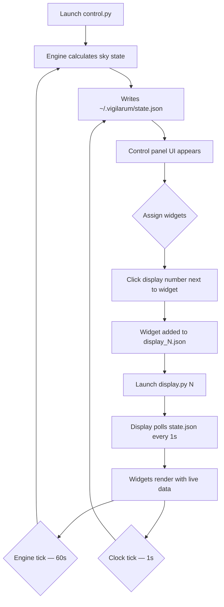

# Vigilarum Omnia v2
### A real-time Vedic sidereal astronomical display system. Renders pyswisseph
data as interactive PyQt6 widget cards across multiple configurable display
windows, managed from a single control panel.

---

## Keyboard & Shortcut Reference

This application has no keyboard shortcuts. All interaction is mouse-driven via
the control panel's assignment buttons.

---

## Features Table

╭───────────────────────────┬───────────────────────────────────────────┬──────────────────────────────────────────────────┬───────────────╮
│ | Feature               | │ | Description                           | │ | How to Trigger                               | │ | Status    | │
├┄┄┄┄┄┄┄┄┄┄┄┄┄┄┄┄┄┄┄┄┄┄┄┄┄┄┄┼┄┄┄┄┄┄┄┄┄┄┄┄┄┄┄┄┄┄┄┄┄┄┄┄┄┄┄┄┄┄┄┄┄┄┄┄┄┄┄┄┄┄┄┼┄┄┄┄┄┄┄┄┄┄┄┄┄┄┄┄┄┄┄┄┄┄┄┄┄┄┄┄┄┄┄┄┄┄┄┄┄┄┄┄┄┄┄┄┄┄┄┄┄┄┼┄┄┄┄┄┄┄┄┄┄┄┄┄┄┄┤
│ | Control Panel         | │ | Assign widgets to display windows.    | │ | python3 control.py                           | │ | Working   | │
│ | Display Windows       | │ | Render assigned widgets. Up to 9.     | │ | python3 display.py N                         | │ | Working   | │
│ | Bare Mode             | │ | Display with no chrome. Single widget | │ | python3 display.py N --bare                  | │ | Working   | │
│ | Widget Assignment     | │ | Click [N] to assign widget to display | │ | Click numbered buttons in control panel      | │ | Working   | │
│ | Column Config         | │ | Set 2, 3, or 4 columns per display    | │ | Cols: [2] [3] [4] buttons in control panel   | │ | Working   | │
│ | Live Engine           | │ | Recalculates full sky state each 60s  | │ | Automatic on control panel launch            | │ | Working   | │
│ | Clock Tick            | │ | Updates time display every second     | │ | Automatic                                    | │ | Working   | │
│ | State IPC             | │ | Shared JSON file between processes    | │ | ~/.vigilarum/state.json — written by control | │ | Working   | │
│ | 38 Widget Types       | │ | Text and visual cards for all data    | │ | Assign from control panel list               | │ | Working   | │
│ | Moon Disc             | │ | Painted ellipse with terminator       | │ | Assign moon_disc widget                      | │ | Working   | │
│ | Zodiac Wheel          | │ | Circular chart, planets at position   | │ | Assign zodiac_wheel widget                   | │ | Working   | │
│ | Nakshatra Ring        | │ | 27-segment annular ring               | │ | Assign nakshatra_ring widget                 | │ | Working   | │
│ | Tithi Dial            | │ | 30-division circular dial             | │ | Assign tithi_dial widget                     | │ | Working   | │
│ | Eclipse Gauge         | │ | Node proximity gauge                  | │ | Assign eclipse_gauge widget                  | │ | Working   | │
│ | Planet Strip          | │ | Horizontal lane chart per planet      | │ | Assign planet_strip widget                   | │ | Working   | │
│ | Moon Arc              | │ | Cycle progress gauge with phases      | │ | Assign moon_arc widget                       | │ | Working   | │
│ | Placeholder State     | │ | Graceful "Awaiting data" on no state  | │ | Automatic when state.json absent             | │ | Working   | │
╰───────────────────────────┴───────────────────────────────────────────┴──────────────────────────────────────────────────┴───────────────╯

---

## Usage Flowchart



---

## Vision & Purpose

Vigilarum Omnia exists to make the sky visible as a living instrument panel.
It translates pyswisseph's sidereal astronomical calculations into readable,
watchable widget cards that sit on secondary monitors and update continuously.
It is a demonstrative and contemplative tool — a lens on celestial time, not a
productivity application.

---

## File & Folder Map

```
Exocognii/Vigilarum/
├── control.py          — entry point; engine, state writer, assignment UI
├── display.py          — display window; reads state, renders widgets
├── widgets.py          — all QWidget subclasses (38 widget types)
├── painters.py         — pure QPainter drawing functions for visual widgets
├── engine.py           — pyswisseph calculation engine (unchanged from v1)
├── data.py             — lookup tables, constants, widget registry (unchanged)
├── state.py            — file IPC layer (unchanged from v1)
├── dependencies.sh     — pip install commands
├── Vigilarum.sh        — launcher script
└── Referentia/
    └── Vigilarum-dux.tome.md   — this document
```

Runtime files (not in repo):
```
~/.vigilarum/
├── state.json           — shared sky state; written by control, read by displays
└── displays/
    ├── display_1.json   — widget list + column count for display 1
    └── display_N.json   — one file per display ID (up to 9)
```

---

## Features & Functions

### Control Panel

The control panel is the sole writer of sky state. On launch it runs the
calculation engine immediately and then on a 60-second interval. A 1-second
timer updates the current time within the last calculated state without
rerunning the full engine. The panel presents a scrollable list of all 38
widgets, each with numbered assignment buttons [1]–[9]. Clicking a number
assigns that widget to that display; clicking an active button unassigns it.
Display column counts (2, 3, or 4) are configurable per display from the
right panel.

### Display Window

Each display window runs independently and polls `state.json` every second.
When the widget assignment changes, the grid remounts automatically. Widgets
receive `update_data(state)` on every poll; each widget is responsible for
updating its own labels or triggering a repaint. Normal mode includes a
celestial summary bar at the top and a status bar at the bottom. Bare mode
(`--bare`) removes all chrome — the widget grid fills the entire window,
suitable for single-widget monitor fills.

### Widget Cards

All widgets inherit from `ArcaneCard`. The panel background and gold border
are painted by the base class. Text widgets (`TextCard` subclasses) manage
`QLabel` children. Visual widgets (`VisualCard` subclasses) delegate their
entire content area to painter functions in `painters.py`. All widgets handle
`None` state gracefully, showing "Awaiting data…" until the control panel
writes a valid state file.

### Painter Functions

`painters.py` contains pure functions — each takes a `QPainter`, a `QRectF`,
and the data it needs. No widget logic. Functions: `draw_moon_disc`,
`draw_zodiac_wheel`, `draw_moon_arc`, `draw_nakshatra_ring`, `draw_tithi_dial`,
`draw_eclipse_gauge`, `draw_planet_strip`, `draw_moon_distance_gauge`.

### Engine

`engine.py` is unchanged from v1. `calculate_all()` returns a flat dict of
JSON-serialisable values covering all planetary positions, moon phase, panchang
elements, planetary hours, eclipse proximity, aspects, and seasonal data.
All calculations use Vedic sidereal mode with Lahiri ayanamsha.

---

## Logic

The control/display split is the architectural backbone. One control process
owns the write path; N display processes own the read path. They share a JSON
file rather than a network socket, which means displays degrade gracefully when
the control panel is not running and the control panel never needs to know how
many displays exist or what they show.

Widget assignment state lives in `~/.vigilarum/displays/display_N.json`. Each
file holds a widget list and a column count. The control panel reads and writes
these files on click. Display windows read them on every 1-second poll and
remount their grid if the list changes.

The engine runs in a `QThread` (not the main thread) to prevent UI freezes
during pyswisseph calculations. The finished signal delivers the state dict
back to the main thread, which writes it and updates the status bar.

---

## Input / Output & File Types

```
Output
  ├── ~/.vigilarum/state.json          — JSON, full sky state dict, written every second
  └── ~/.vigilarum/displays/           — JSON, one file per display ID
      └── display_N.json               — widget list + column count config
```

No network. No external API calls. No database.

