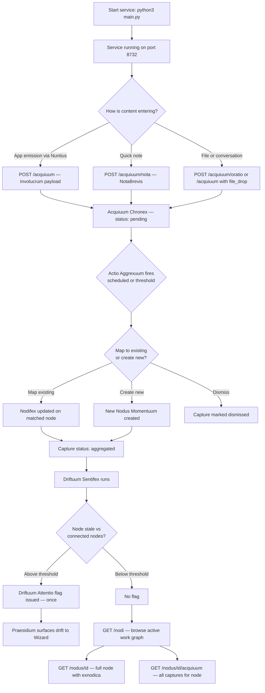

# PERPETUUM AEDIFICARE
### Build continuity memory service for the Arca Cognitorium. Captures ambient
build events from all Exocognii apps, aggregates them into a graph of active
work units via Claude, detects drift in stale nodes, and surfaces the current
shape of the project through the Praesidium read layer.

---

╭──────────────────────────────┬───────────────────────────────────────────────╮
│ Key / Shortcut               │ Action                                        │
├┄┄┄┄┄┄┄┄┄┄┄┄┄┄┄┄┄┄┄┄┄┄┄┄┄┄┄┄┄┄┼┄┄┄┄┄┄┄┄┄┄┄┄┄┄┄┄┄┄┄┄┄┄┄┄┄┄┄┄┄┄┄┄┄┄┄┄┄┄┄┄┄┄┄┄┄┄┄┤
│ (No keyboard interface)      │ Service operated entirely via HTTP API        │
╰──────────────────────────────┴───────────────────────────────────────────────╯

---

╭────────────────────────────┬──────────────────────────────────┬──────────────────────────────────────┬────────────╮
│ Feature                    │ Description                      │ How to Trigger                       │ Status     │
├┄┄┄┄┄┄┄┄┄┄┄┄┄┄┄┄┄┄┄┄┄┄┄┄┄┄┄┄┼┄┄┄┄┄┄┄┄┄┄┄┄┄┄┄┄┄┄┄┄┄┄┄┄┄┄┄┄┄┄┄┄┄┄┼┄┄┄┄┄┄┄┄┄┄┄┄┄┄┄┄┄┄┄┄┄┄┄┄┄┄┄┄┄┄┄┄┄┄┄┄┄┄┼┄┄┄┄┄┄┄┄┄┄┄┄┤
│ Involucrum ingestion        │ Accepts app emissions            │ POST /acquiuum (any Exocognii app)   │ Working    │
│ Nota Brevis ingestion       │ Quick Wizard note capture        │ POST /acquiuum/nota                  │ Working    │
│ Oratio Extracticum          │ Scours conversation exports      │ POST /acquiuum/oratio                │ Working    │
│ File drop ingestion         │ Reads a file from disk by path   │ POST /acquiuum (file_drop type)      │ Working    │
│ Actio Aggrexuum             │ Claude maps captures to nodes    │ Scheduled; POST /aggrexuum manual    │ Working    │
│ Nodus Momentuum CRUD        │ Create, read, update, abandon    │ POST/GET/PUT/DELETE /nodus           │ Working    │
│ Node listing + filtering    │ Filter by nodicum, status        │ GET /nodi                            │ Working    │
│ Exnodica graph              │ Create directed relationships    │ POST /exnodica                       │ Working    │
│ Relationship editing        │ Update type and confidence       │ PUT /exnodica/{id}                   │ Working    │
│ Arca Absoluticum refs       │ Attach Tower construct references│ POST /nodus/{id}/arca                │ Working    │
│ Driftuum Sentifex           │ Scores node drift after aggreg.  │ Fires inside Actio Aggrexuum pass    │ Working    │
│ Driftuum Attentio flags     │ One-time drift signal per node   │ Automatic when threshold crossed     │ Working    │
│ Manual node assignment      │ Wizard assigns capture to node   │ PUT /acquiuum/{id}/node              │ Working    │
│ Aggrexuum status            │ Last run + pending capture count │ GET /aggrexuum/status                │ Working    │
│ Praesidium read layer       │ Advisory interface for Wizard    │ Not yet wired                        │ Partial    │
│ Nuntius wiring to all apps  │ Automatic emission from all apps │ Not yet wired                        │ Partial    │
╰────────────────────────────┴──────────────────────────────────┴──────────────────────────────────────┴────────────╯

---



---

## VISION & PURPOSE

Perpetuum Aedificare exists because the shape of active work is always known
implicitly — it lives in build sessions, in app output, in the decisions made
and deferred — but it evaporates between sessions. The intent is to make the
implicit explicit without requiring the Wizard to maintain a separate log.
Every meaningful build event already carries enough information to update a
work graph. Actio Aggrexuum does that mapping. What remains for the Wizard
is awareness, not record-keeping.

---

## FILE & FOLDER MAP

```
Exocognii/PerpetumAedificare/
├── main.py              — FastAPI app entry point, router registration, lifespan
├── config.py            — Configuus loader, defaults, drift_threshold default
├── db.py                — SQLite schema, init_db(), get_db(), row_to_dict()
├── aggrexuum.py         — Actio Aggrexuum engine + Driftuum Sentifex scoring
├── scheduler.py         — Background heartbeat + threshold trigger
├── requirements.txt     — fastapi, uvicorn, pydantic
└── routers/
    ├── __init__.py
    ├── acquiuum.py      — /acquiuum, /acquiuum/nota, /acquiuum/oratio
    ├── nodi.py          — /nodus, /nodi, /nodus/{id}, /nodus/{id}/acquiuum
    ├── exnodica.py      — /exnodica, /nodus/{id}/exnodica
    ├── arca.py          — /nodus/{id}/arca
    └── aggrexuum.py     — /aggrexuum, /aggrexuum/status

~/.arca/
    perpetuum_aedificare.db     — SQLite database
    perpetuum_aedificare/       — file storage directory (reserved)
```

---

## FEATURES & FUNCTIONS

### Capture Pathways

Four ways for content to enter the system. Indicatum Machina — app emissions
via Nuntius, the primary pathway; every Exocognii app sends an Involucrum
envelope to `/acquiuum` on every meaningful event. Nota Brevis — the Wizard
posts a quick note to `/acquiuum/nota`; lowest friction, designed for
thoughts that arise mid-session. Oratio Extracticum — conversation export
files or other build documents crawled by posting source paths to
`/acquiuum/oratio`; runs as a background task. File drop — a single file
ingested via a standard Involucrum payload with `source_type: file_drop`.

### Actio Aggrexuum

The aggregation engine. Fires on a configurable schedule (default 5 minutes)
and when pending capture count crosses the threshold (default 10). For each
pending capture, sends content and a summary of current active Nodi to Claude
and asks it to map the capture to an existing node, create a new one, or
dismiss it as noise. On a map action, the node's Nodifex is updated with a
new one-to-two sentence current state description. After all captures are
processed, the Driftuum Sentifex pass runs against all active Nodi.

### Nodus Momentuum

The atomic unit of tracked work. Created by Actio Aggrexuum when a new work
unit is first detected, or manually by the Wizard via `POST /nodus`. Each
node carries: a title, a Nodicum type, a Nodifex current-state description,
open questions, a decisions log, Arca Absoluticum Tower references, a drift
score, and a lifecycle status. The Wizard can update any field directly via
`PUT /nodus/{id}` — including overriding the Nodicum to `wizard_set`
confidence, marking a node resolved or abandoned, and editing open questions
and the decisions list.

### Exnodica Relationship Graph

Directed edges between Nodi. Created via `POST /exnodica` with `from_node`,
`to_node`, and a relationship label. Common labels: `spawned_from`, `blocks`,
`informs`, `supersedes`. Confidence is either `inferred` (system-detected) or
`wizard_set`. The full graph for any node is fetched alongside the node in
`GET /nodus/{id}`. Edges can be updated or removed.

### Driftuum Sentifex

Runs inside every Actio Aggrexuum pass. For each active Nodus, calculates
a Driftuum Metrica score from two factors: days since last touched (rising
linearly to 1.0 at 30 days) and recently active connected nodes (each adds
0.10 to the score). When a node's score crosses the configured threshold
(default 0.65) and has not yet been flagged, a Driftuum Attentio record is
written and the node's `driftuum_attentio` flag is set. The flag does not
fire again until the Wizard resets it via the Praesidium Driftuum Agnosco
endpoint. The threshold is tunable in Configuus at key
`perpetuum_aedificare.drift_threshold`.

### Arca Absoluticum

Tower reference layer on each Nodus. Read-only. The Wizard attaches
references to Tower constructs — FOLIUM (project), FILUM (thread), or
grimoire snapshots — via `POST /nodus/{id}/arca`. These are stored as a
JSON array on the Nodus. Perpetuum Aedificare never reads from or writes
to Tower storage directly.

---

## LOGIC

The service initialises by creating the SQLite database, seeding the seven
default Nodica types, and starting the background scheduler. The scheduler
runs an async loop, checking pending capture count every 30 seconds and
firing Actio Aggrexuum when threshold or interval conditions are met.

Actio Aggrexuum fetches all pending captures and the current active Nodi list,
then calls Claude once per capture with a structured prompt. The prompt
includes a summary of up to 30 active Nodi (title, nodicum, current nodifex)
to give Claude enough context to map accurately without overloading the
context window. After each classification, the relevant database records are
updated immediately rather than in a batch, so partial progress is preserved
if the pass is interrupted.

The Driftuum scoring pass after aggregation iterates all active Nodi,
computes a score from staleness and connected node activity, and writes flags
where threshold is crossed. Flags are written to a separate `driftuum_log`
table with the IDs of the nodes whose recent activity triggered the flag.

---

## INPUT / OUTPUT & FILE TYPES

```
Input
  ├── POST /acquiuum         — JSON Involucrum envelope from any app
  ├── POST /acquiuum/nota    — plain text note from the Wizard
  ├── POST /acquiuum/oratio  — file paths; crawls .md .txt .json .yaml
  └── PUT  /nodus/{id}       — Wizard updates to node fields

Output
  └── ~/.arca/perpetuum_aedificare.db   — SQLite database (all data)

Config
  └── ~/.arca/config.json
        perpetuum_aedificare_db          — path to SQLite database
        perpetuum_aedificare_store       — file storage directory
        perpetuum_aedificare.aggrexuum_interval   — seconds (default 300)
        perpetuum_aedificare.aggrexuum_threshold  — pending count (default 10)
        perpetuum_aedificare.drift_threshold      — 0.0–1.0 (default 0.65)
        port                             — service port (default 8732)
```
