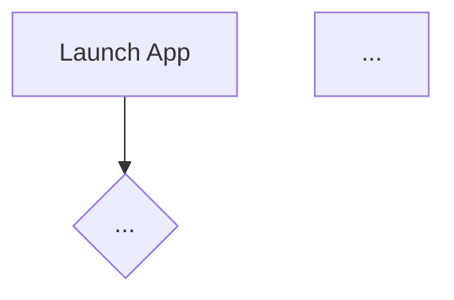

# APP_DOC_GUIDE.md
## Claude's Guide to Producing Application Documentation

This document defines the standard for app documentation in this project suite.
It is written for Claude. Follow it whenever building or completing an application
for LordFingers.

---

## When to Produce the Doc

At the conclusion of any application build — whether a full app or a significant
feature addition — pause and ask:

> "Shall I generate the application doc for this?"

Wait for confirmation before producing it. Do not generate it silently.

---

## Naming Convention

The doc file takes the app's name suffixed with `_DOC`:

```
AppName_DOC.md
```

Examples:
```
LuxArcana_DOC.md
ESTUPIDO_DOC.md
Sonorum_DOC.md
Fenestrium_DOC.md
```

Place it in the project root alongside the main entry point.

---

## Document Structure

Produce the sections in this exact order.

---

### 1. Header Block

```
# AppName
### One-line description of what this application is
```

---

### 2. Keyboard & Shortcut Reference Table

A table of every keyboard shortcut, hotkey, or input gesture the app recognises.
If the app has no shortcuts, omit this section entirely — do not include a placeholder.

| Key / Shortcut | Action |
|----------------|--------|
| ...            | ...    |

---

### 3. Features Table

A table of every implemented feature in the application.
**Only include features that are built and functional or partially functional.**
Do not list planned, intended, or future features. The doc reflects what the app
actually does right now.

| Feature | Description | How to Trigger | Status |
|---------|-------------|----------------|--------|
| ...     | ...         | ...            | Working / Partial |

**Status values:**
- `Working` — fully functional
- `Partial` — implemented but incomplete or with known limitations

---

### 4. Usage Flowchart

A Mermaid flowchart showing how to use the application.

**Complexity rule — match the app:**
- Simple apps (few features, linear flow): one top-level flowchart covering
  launch → main actions → exit.
- Complex apps (multiple modes, branching interactions): a master flow showing
  the top-level path, plus per-feature sub-flows branching from it.

Use Mermaid syntax:



---

### 5. Vision & Purpose

A short plain-English statement of what this application is for and why it exists.
Two to four sentences. No bullet points. Write it as if explaining to someone
encountering the app for the first time.

---

### 6. File & Folder Map

An indented tree of the project's files and directories. Annotate each entry
briefly. Only include files that are part of the application — omit virtualenvs,
`__pycache__`, `.git`, and other non-essential artefacts.

```
AppName/
├── main.py              — entry point
├── config/
│   └── settings.json    — user configuration
├── modules/
│   ├── engine.py        — core logic
│   └── ui.py            — interface layer
└── AppName_DOC.md       — this document
```

---

### 7. Features & Functions

A written account of every feature and function in the application. For each
feature, describe:

- What it does
- How it works (brief logic)
- How the user interacts with it

Use a heading per feature. Keep each entry factual and direct. No speculation
about future behaviour.

---

### 8. Logic

An explanation of how the application works internally. Cover:

- The overall architecture (how the parts connect)
- Any significant algorithms, data flows, or state management
- How user input is processed and what happens as a result

Keep this section honest to the implementation. Do not describe how things
*should* work — describe how they *do* work.

---

### 9. Input / Output & File Types

*Include this section only if the app reads from or writes to files, external
APIs, databases, devices, or other I/O sources.*

Use an indented outline:

```
Input
  ├── [source] — [format / filetype] — [what it contains]
  └── ...

Output
  ├── [destination] — [format / filetype] — [what it contains]
  └── ...
```

If the app uses configuration files, list them here as well with their format
and location.

---

## Style Rules

- Write for the user running the software, not for a developer.
- Use plain English. Avoid jargon unless the app itself uses it as a term.
- Do not pad sections. If a section does not apply, omit it.
- Do not include aspirational content — only what exists and works.
- Keep the doc in sync with the app. If a feature is removed or changed,
  update the doc to match.
