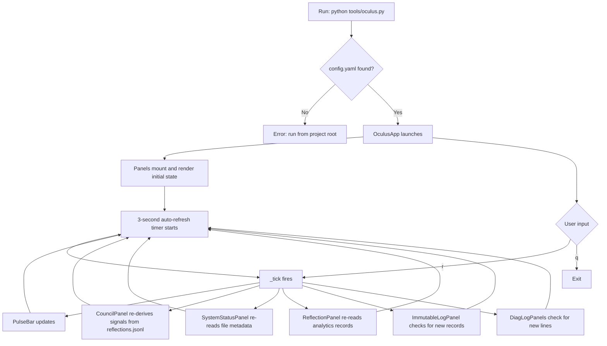

# Oculus
### Standalone system debug monitor for the Arca Cognitorium — read-only, live-refreshing, safe to run concurrently with the Tower

---

## Keyboard & Shortcut Reference

| Key | Action |
|-----|--------|
| `r` | Force an immediate refresh of all panels |
| `q` | Quit the Oculus |

---

## Features Table

| Feature | Description | How to Trigger | Status |
|---------|-------------|----------------|--------|
| Council panel | Displays all Council entities with emerged/dormant status, signal strength bars, and interruption presence weights | Automatic on launch | Working |
| Emergence signal bars | Re-derives entity signal strengths from `reflections.jsonl` using the same algorithm as the EmergenceEngine | Automatic; refreshes every 3 seconds | Working |
| Reflection engine panel | Shows the latest routing signal record (topics, code presence, question count) and the last 4 self-analytics suggestions | Automatic on launch | Working |
| System state panel | Reports Grimoire entry count, Chronicle vector estimate, conversation count, all log file sizes and modification times, last reflection timestamp, last Assessor and Archivist diagnostic entries | Automatic on launch | Working |
| Immutable log tail | Live-tails `immutable.jsonl`, rendering role, model, conversation ID, content preview, and token count per record | Automatic; appends new records without full redraw | Working |
| Assessor diagnostic tail | Live-tails `assessor_diag.log` with colour-coded output (errors, warnings, fired/emerged events, skips) | Automatic on launch | Working |
| Archivist diagnostic tail | Live-tails `archivist_diag.log` with the same colour coding scheme | Automatic on launch | Working |
| Pulse bar | Top-of-screen indicator showing current time, tick counter, and entity memory file size; updates every tick | Automatic | Working |
| Auto-refresh | All panels poll for file changes and update on a 3-second interval | Automatic | Working |
| Project root detection | Detects whether the script is run from the project root or from `tools/`; adjusts working directory accordingly | Automatic on launch | Working |

---

## Usage Flowchart



---

## Vision & Purpose

The Oculus is a passive observation instrument for the Arca Cognitorium. It reads the same files the Tower writes — logs, memory stores, council persistence — and renders them as a live three-column display in a separate terminal window. No imports from the Tower's codebase are required; the Oculus reads files directly and re-derives computed state (such as emergence signals) from first principles. It exists so that the systems running silently inside the Tower — the Background Assessor, the Archivist, the EmergenceEngine, the Reflection cycle — can be watched as they work, without disturbing them.

---

## File & Folder Map

```
ArcaCognitorium/
└── tools/
    ├── oculus.py           — the Oculus application (single file)
    └── Oculus_DOC.md       — this document
```

The Oculus reads from the following paths (all relative to the project root):

```
storage/
├── logs/
│   ├── assessor_diag.log       — read
│   ├── archivist_diag.log      — read
│   ├── emergence_diag.log      — read (reserved; not yet displayed)
│   ├── interruption_diag.log   — read (reserved; not yet displayed)
│   ├── entity_memory_diag.log  — size reported in pulse bar
│   ├── immutable.jsonl         — read (live tail)
│   └── reflections.jsonl       — read (signals + analytics)
├── council/
│   └── emerged.json            — read (emerged entity set)
├── vectors/
│   └── vectors.pkl             — size read for vector count estimate
├── conversations/              — entry count read
└── grimoire.json               — entry count read
```

---

## Features & Functions

### Council Panel

Renders every entity in the Tower's Council as a single line. Each line shows:
- An emerged/dormant dot (green filled or grey hollow), sourced live from `storage/council/emerged.json`
- The entity's jewel-tone color and Unicode sigil
- The entity name
- A signal strength bar (12 characters wide, color-coded by level) and numeric value
- The interruption presence weight defined in the InterruptionEngine

Signal strengths are re-computed by reading `reflections.jsonl` and running the same accumulation and decay logic as `EmergenceEngine.check_emergence()`. This makes the displayed values accurate without requiring any live connection to the running application. The emergence threshold (`1.0 / 3.0 max`) is visually indicated by the bar turning bright green.

Luminarious is always shown as emerged; it has no signal bar or presence weight because it is the anchor entity and does not pass through the interruption gates.

### Reflection Engine Panel

Two sub-sections. The upper section shows the most recent routing signal record extracted from `reflections.jsonl` — the dominant topics, average user message length, whether code was detected, and question count. This is the data the reflection system derives each turn and that the EmergenceEngine reads to compute signals.

The lower section shows the last four self-analytics records: the suggestions the reflection system produced, with timestamps. Each record displays up to two suggestion lines to keep the panel compact.

### System State Panel

Three groups of information. The first covers memory stores: Grimoire entry count (from `storage/grimoire.json`), a Chronicle vector estimate (derived from `vectors.pkl` file size using a 1.5 KB per vector heuristic), and the total number of stored conversations. The second lists every monitored log file with its current size and last modification time. The third shows the last reflection timestamp and the most recent line from each of the Assessor and Archivist diagnostic logs.

### Immutable Log Tail

Reads the last 80 records from `immutable.jsonl` and renders each as a single line: timestamp, role (user/assistant, color-coded), truncated conversation ID, model name (shortened), content preview, and output token count. On each refresh tick, it checks whether the record count has changed; if it has, it re-renders the full panel and scrolls to the bottom. If the count is unchanged, no redraw occurs.

### Assessor Diagnostic Tail

Reads `assessor_diag.log` and renders each line with context-sensitive color: errors and failures in red, warnings in yellow, fire and emergence events in green, skip and suppression notices dimmed. New lines appended to the file since the last tick are added to the bottom without a full redraw. The panel scrolls to show the latest entries.

### Archivist Diagnostic Tail

Identical behaviour to the Assessor diagnostic tail, targeting `archivist_diag.log`.

### Pulse Bar

A single line pinned to the top of the screen. Updates on every tick with the current wall-clock time, tick counter, and the file size of `entity_memory_diag.log`. The indicator character alternates between `◉` and `○` to give a visible heartbeat. It does not reflect any live connection to the Tower — it is a local clock and file-size reporter.

---

## Logic

The Oculus is a single-file Textual application. It has no imports from the Tower's codebase and makes no API calls. All data comes from reading files on disk.

**Architecture.** The app is composed of independent panel widgets arranged in three columns. Each panel owns its own read and render logic. The app mounts a single `set_interval` timer at 3 seconds. On each tick, `_tick()` calls `refresh_data()` on every panel. Panels decide internally whether to perform a full redraw or an incremental update based on whether the underlying file has changed (by line count).

**Signal derivation.** `_parse_emergence_signals()` is a self-contained function that re-implements the EmergenceEngine's accumulation loop. It loads all records from `reflections.jsonl`, iterates them in order, applies keyword matching against each entity's domain set, accumulates signal strength with the same weights and decay constants as the live engine, and returns the final per-entity values. This is a stateless re-derivation on each tick, not a cached value.

**Log tailing.** `_read_plain_log()` reads the full log file into memory and returns the last N lines. `DiagLogPanel.refresh_data()` compares the new line count against the stored count; if lines were added, it writes only the new lines to the RichLog widget. `ImmutableLogPanel` uses the same pattern on JSONL records. Neither panel holds a file handle open between ticks.

**No state shared with the Tower.** The Oculus does not import from any Tower module. It derives what it needs from files. This means it can safely run in any terminal alongside a live Tower session, restart independently, and will not crash if the Tower is not running — it simply shows empty panels or dashes for missing files.

---

## Input / Output & File Types

```
Input
  ├── storage/logs/immutable.jsonl         — JSONL      — all logged messages, roles, models, tokens
  ├── storage/logs/reflections.jsonl       — JSONL      — routing signals and self-analytics records
  ├── storage/logs/assessor_diag.log       — plain text — Assessor background cycle diagnostics
  ├── storage/logs/archivist_diag.log      — plain text — Archivist background cycle diagnostics
  ├── storage/logs/entity_memory_diag.log  — plain text — entity memory operation log (size only)
  ├── storage/council/emerged.json         — JSON        — persisted emerged entity set
  ├── storage/grimoire.json                — JSON        — Grimoire entries (count only)
  ├── storage/vectors/vectors.pkl          — binary      — Chronicle vectors (file size only)
  └── storage/conversations/              — directory   — stored conversations (count only)

Output
  └── (none — the Oculus writes nothing)
```
